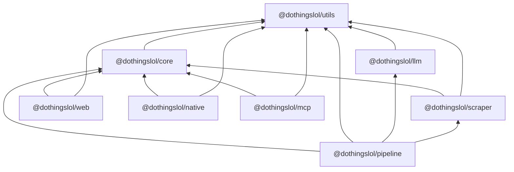

# Eventyr monorepo plan

Status: **revision 4. Awaiting your agreement.** It includes your answers of 2026-09-25, rounds 1–3.
No source files have been moved. Discovery was done against `main` at `99b3b62`.

The goal is to turn this single-package repo into a pnpm workspace with a clean, acyclic package
graph, so that a React Native (Expo) app can reach full parity with the website (fetch, display,
filter, personalise, notify) while sharing its logic with the web instead of keeping a copy.

The work lands as **three pull requests**:

- **PR 0: Byron fix (0.1).** Byron gets its real time zone, DST-aware parsing, and a slot in the weekly run. It's small, it lands first, and it gives PR 1's parity goldens a correct baseline.
- **PR 1: monorepo refactor (1.1–1.13).** Workspace tooling. The shared packages (`core`, `utils`, `llm`, `scraper`). Moving web, pipeline and MCP into `apps/`. Restructuring the pipeline around a config file and exported stage functions. **No functional change** (D1) apart from deleting the dead WhatsApp code. Parity harnesses prove that model requests and scraper output are identical.
- **PR 2: React Native + Expo app (2.1–2.9).** It also carries the web and pipeline changes the app depends on: React 19, the public data feed with collection metadata, device-time display, taste model v2, and a Settings page.

Each `phase-N.MM-*.md` file starts with a handoff block you can paste into a fresh Claude Code
session. A sub-phase session reads only this file and its own sub-phase file.
`config-inventory.md` lists every pipeline constant, with the proposed config/code split, for you to decide on (D18).

---

## 0. Decisions

| # | Topic | Decision | Lands in |
|---|---|---|---|
| D1 | LLM providers | Gemini stays for most work, because it's cheaper. **The refactor doesn't change functionality**: every stage keeps its model, prompt and parameters. D11 makes switching a config edit. | 1.6, 1.7 parity harness |
| D2 | WhatsApp | Remove it | 1.10 |
| D3 | Server push | None. Only local notifications, for events the user has liked | 2.8 |
| D4 | Platforms | iOS and Android together, as `lol.dothings.app` | 2.9 |
| D5 | Byron | Added to the weekly run | **PR 0** |
| D6 | Native storage identity | `eventHash`. Web keeps `eventId`. Core takes a `keyOf` function | 1.4, 2.5+ |
| D7 | Time zone | Always show times in the device's time zone | 2.3, 2.5 (§8) |
| D8 | Analytics and donations in the app | Neither | 2.9 |
| D9 | PR structure | Monorepo PR, then native PR, each split into sub-phases. Plus PR 0 for the Byron bug fix, which shouldn't hide inside a refactor. | §4 |
| D10 | Settings | **Web and native** (confirmed). It has a notifications toggle with an explanation, a tri-state preference per tag, vibe and category, a theme setting, an auto-learn opt-out, and a privacy note. | §7. Web in 2.3, native in 2.8 |
| D11 | Package split | `utils`, `llm` (`ask()` across providers), `scraper` (`scrape()` plus `/parsers`) and `pipeline` (stage functions plus `config/`). No relative imports between packages. | §2, 1.5–1.8, 1.11 |
| D12 | Byron time zone | **Fix it** (confirmed). `sources/byron.yml` says `Australia/Brisbane`, and `src/adapters/dates.ts:23` hard-codes +10. Byron Bay is in NSW, which starts daylight saving on 4 Oct 2026. | **PR 0** |
| D13 | Taste preferences (your clarification) | One number per tag, vibe or category. Auto-learning adds weighted counts, as today. The user never sees numbers, only **off / unset / on**. Setting one by hand writes −1, 0 or +1 and pins it, so learning never overrides a choice the user made. | §7, 2.3 |
| D14 | `prompts[]` means batching | `ask(string)` returns `string`, and `ask(string[])` returns `string[]`. **By default the array runs as concurrent individual calls**, which is exactly what happens today. `{ batch: true }` uses the provider's native batch API: Gemini Batch Mode, Anthropic Message Batches or OpenAI Batch, each at 50% of standard price. Perplexity has none. **No stage switches to batch in PR 1**, because batch jobs have a 24-hour turnaround and the digest job times out after 20 minutes (§2.4). | 1.6 (built, unused), follow-up (adoption) |
| D15 | Typed results | `EventData` is the canonical event type in `core` (this also avoids clashing with the DOM's `Event`). `ScrapeResult` carries fetch and parse metadata plus `events: EventData[]`. `LLMResponse` carries `inputTokens`, `outputTokens`, `totalTokens`, `estimatedCostUsd` and more. The pipeline's `SearchCollectResult` carries aggregated LLM usage plus `events: EventData[]`. | §2.4–2.6, 1.2, 1.6, 1.8, 1.11 |
| D16 | Collection metadata | **`data/index.json` becomes `data/manifest.json`** (renamed with `git mv`), and its existing per-city fields gain a `collection` block: when the last collection started and finished, status, next scheduled run, providers, source and event counts, and LLM token and cost totals. It also gets a top-level `schedule` block. The per-stage detail lives in `data/{city}/run.json`, one writer per file, flushed as each stage finishes. `publish/pages` (today's `pages.ts`, the manifest's only writer) aggregates those into the manifest. The public feed index `/data/v1/index.json` exposes the non-cost subset for app Settings. | §8a, 2.2 |
| D17 | Merge method | **Squash** (you don't need merge commits). The cost: `git log --follow` loses continuity for files that were split heavily. Full per-commit history stays on the PR branch, which the plan says not to delete. | §4.3 |
| D18 | Config scope | Only operator tunables go to YAML. `config-inventory.md` lists every constant (CONFIG / DECIDE / CORE / CODE) for you to decide, and 1.11 applies your decisions. | 1.11 |

## 1. Discovery summary

### 1.1 Corrections to the original brief

| The brief said | The code says |
|---|---|
| LLM curation uses the Claude API | Curation, ranking, dedupe, venue matching, extraction and annotation all run on **Gemini** (`src/providers/gemini.ts`). `@anthropic-ai/sdk` is only an optional search provider, and it is off by default (`PROVIDERS=google,perplexity`). |
| WhatsApp notifications | `src/messaging.ts` works, but the `digest.yml` step is `if: false`. The only notifications users get today are browser-local PWA reminders. |
| JSON that the site reads | The site **never fetches JSON at runtime**. Astro `readFileSync`s `data/*.json` at build time into island props. The only public JSON is `/ai/*`, and it is lossy (no tags, score, vibes, `venue_name` or image). **There is no URL a native app can fetch today** (fixed in 2.2). |
| Brisbane only | Four cities. `byron` isn't in `weekly.yml`, so its data is stale, and its time zone is wrong (D12). |

### 1.2 Modules, the import graph, and why it's spaghetti

About 13.7k lines of TS/TSX, with a single `package.json`. Pipeline scripts run with `tsx` +
`tsconfig.scripts.json` (NodeNext). The site uses `tsconfig.json` (bundler resolution, alias
`@react/*` → `app/*`).

| Hub or knot | Evidence | Resolution |
|---|---|---|
| `src/common.ts` (33 importers) | Mixes filesystem/YAML config, the path layout (`PROJECT_ROOT` = `dirname(import.meta.url)/..`), the `INTERESTS` prompt, pure date helpers (353–383), fuzzy dedupe (482), and a re-export of `shared.ts` | Dissolved in 1.11 into `pipeline/config/*`, `config/interests.md`, `core`, `utils` |
| `src/providers/base.ts` (15 importers) | It's the search-provider base class, and also the general utility module. `mapWithConcurrency`, `chunkArray` and `parseJsonArray` are imported from it by `enrichTimes.ts:39`, `collect.ts:28`, `discover.ts:40`, `locality.ts:38`, `venues.ts:39` and `rank.ts:14`. Its `collect()` writes pipeline files (`:195-231`). | Utilities → `utils` (1.5), JSON repair → `llm` (1.6), search strategies → `pipeline/search` (1.7/1.11) |
| `src/providers/gemini.ts` (15 importers) | The only model wrapper: limiter, 429 backoff, `GEMINI_MAX_CALLS` budget, a price table covering all four providers, usage accounting. It also imports `DATA_ROOT`/`getWeekRange`, reads `process.env.CITY` (`:344`), and writes `data/{city}/usage/*.json`. | The generic parts → `llm`. Usage persistence → `pipeline`, through an injected sink (1.6) |
| Nine `geminiText(ai, {...})` call sites | `providers/google.ts:30,102`, `venues.ts:372`, `rank.ts:189`, `adapters/discover.ts:212`, `adapters/llmExtract.ts:105`, `adapters/annotate.ts:117`, `adapters/probe.ts:1526`, `dedupeClassifier.ts:64`. Model literals are scattered across 9 files. Options used: `systemInstruction`, `search` (Google grounding), `maxOutputTokens`, `temperature`, `extraConfig` (`responseMimeType: application/json`, `thinkingBudget: 0`, `thinkingLevel: low`). Each call returns the text. | All of them become `ask()`/`askJson()` (1.6). Models move to `pipeline.yml` (1.11). |
| Three other SDKs | `anthropic.ts` (`claude-sonnet-5`, `web_search_20250305` tool), `openai.ts` (`gpt-5-mini`, with a `gpt-5` branch, `web_search` tool with `search_context_size: low`), `perplexity.ts` (`sonar-pro` through the openai SDK at `api.perplexity.ai`) | Their transport → `llm/providers/*`. Their prompts and parsing → `pipeline/search/*` (1.7) |
| `src/adapters/` mixes scraping, LLM and domain code | Deterministic scraping (fetch, feeds, JSON-LD, hydration JSON, readable text, dates, render) sits next to LLM steps (`llmExtract`, `annotate`, `discover`, parts of `probe`) and domain mapping (`normalise`, `registry`) | Scraping → `scraper` (1.8). LLM and domain code → `pipeline` |
| Curate reaches into the scraper | `curate.ts:10` imports `adapters/annotate.ts` (and so `@google/genai`) for one regex. `curate.ts:11-16` uses `normalise.ts`. The publishing window is implemented twice (`collect.ts:83`, `curate.ts:66`). | 1.11 |
| Node code leaks into the site | `src/pages/[city]/[timeframe].astro:10` imports `common.ts` (and so `node:fs` and js-yaml) | 1.2 |
| The MCP Worker uses relative imports | `workers/mcp` imports `../../../src/shared.ts` and `../../../app/utils/dates.ts`. CI never builds it. | 1.2, 1.3, 1.12 |
| CLI and library are mixed | Every stage is a script with top-level work or a basename-keyed main guard (`ai.ts:664`, `rss.ts:184`, `venues.ts:493`, …). Some read `CITY` from the environment at import time. | Stage functions plus thin `cli/` entrypoints (1.11) |

### 1.3 Event types and schemas

- **No pipeline event type.** Every stage uses `Record<string, unknown>`. The shape is implicit in `adapters/normalise.ts:188-215`.
- **`app/types.ts` is the only full declaration**, and it drifts from what the pipeline really produces: `score` is marked required and vibes optional, and `City` uses `key`/`name` where the payload uses `city_key`/`city`.
- **Re-declared types:**
  - The payload is re-declared in `rss.ts:22` and `ai.ts:77/90`.
  - `CompactEvent` is copied into `workers/mcp/src/dothingsClient.ts:10-65`.
  - Source config has three separate views: `common.ts:133`, `adapters/types.ts:36`, `shared.ts:1089`.
- **Validation** is hand-rolled. zod appears only in the MCP Worker.
- **Two identities:**
  - `eventHash` is frozen. It feeds iCal UIDs, RSS guids, share links and `#cal=`.
  - The web's saved sets use `eventId()` = title + `datetime_iso`.
- **Display** uses the pipeline's city-local `datetime` string (`app/utils/dates.ts:116`). "Today" uses the device date.
- **Two week conventions,** both intentional: `getWeekRange` (Sunday → next week) and `startOfWeek` (Sunday → previous Monday).
- **Two ICS builders:** `src/ical.ts` and `app/utils/ics.ts`, with UIDs pinned equal by a test.

### 1.4 Data

- **Written by the pipeline:** `data/{city}.json` (1.7 MB for Brisbane), `data/index.json`, and working state under `data/{city}/`.
- **Committed:** all of the above, except `_raw`, `_cache`, `_probe` and `adapters/rejected/`. About 8 MB in total; `.git` is also 8 MB.
- **Generated and committed**, because `deploy.yml` only runs `astro build`:
  - `public/{cityKey}.ics`, `public/{slug}/e/*.ics`, `public/{slug}/feed.xml`
  - `public/sitemap.xml`, `public/ai/**`, `public/llms.txt`
  - root `{CITY}.md`
- **Public URLs:** `/ai/index.json`, `/ai/{slug}/{date}.json`, `/ai/{slug}/week-{monday}.json`, `/{slug}/feed.xml`, `/{cityKey}.ics`. None of them carry a schema version.

### 1.5 GitHub Actions

| Workflow | Trigger | Summary |
|---|---|---|
| `weekly.yml` | cron `0 20 * * 6` (Sunday 06:00 AEST), dispatch | Runs `digest.yml` for brisbane → goldcoast → sunnycoast (Byron is added in PR 0) |
| `digest.yml` | `workflow_call` + dispatch | 1. pnpm 9 install, tsc ×2, tests<br>2. Cache `data/_cache`/`_raw`, set up chrome<br>3. collect-adapters, collect, curate, dedupe-venues<br>4. `src/rank.ts`, `src/geocode.ts`, `src/markdown.ts`, `src/ical.ts`, rss, `src/pages.ts`, build-ai, build<br>5. `git add` the paths in §1.4, commit, `pull --rebase -X theirs` + push (3 tries)<br>WhatsApp step is `if: false`. `concurrency: digest`, `TZ=Australia/Brisbane` |
| `digest-manual.yml` | dispatch | Calls `digest.yml` (has a `recipient` input) |
| `add-city.yml` | dispatch | `src/add_city.ts` → discover → probe → commit `sources/` (and `digest.yml` with `ADD_CITY_PAT`) → digest |
| `reprobe.yml` | cron `0 3 3 * *` | Probe loop, `src/adapters/triage.ts`, render-sources, commit `sources/` |
| `deploy.yml` | push to `main`, dispatch, `workflow_run` (weekly), cron `18 18 * * *` | `withastro/action@v3` (`pnpm@9`), then `deploy-pages@v4` |

There is no PR CI. `pnpm check` only runs inside `digest.yml`.

### 1.6 Tooling

- Node 22.14.0, pnpm 9 (lockfile v9), TypeScript 5.9.3, Astro 6.3.7, React 18.3.1, Biome 2.4.15, tsx 4.22. `workers/mcp` has its own lockfile.
- Tests use `node:test` via tsx: 29 under `src/`, 13 under `app/`, 2 in `workers/mcp`. `src/locality.test.ts:181-229` writes into the real `DATA_ROOT`.
- The pre-commit hook runs `pnpm build` when web paths are staged.
- **Hard-coded paths:**
  - `PROJECT_ROOT` (`common.ts:9-17`)
  - `process.cwd()` in 7 page files and `organizers.ts:19`
  - writes into `public/`: `ai.ts:69,563,581,617,654`, `ical.ts:212,258`, `rss.ts:174`, `pages.ts:129`
  - `add_city.ts:21`
  - every `package.json` script and the workflow paths listed above
- There are **267** module-level SCREAMING_CASE constants in the pipeline, plus model literals at call sites and env-only settings. They're all listed in `config-inventory.md`, which proposes 55 CONFIG, 24 DECIDE, 14 CORE and 115 CODE, plus an appendix of 52 regexes and 11 prompts (§2.6).

### 1.7 Uncertain

- Whether `force=false` digests skip *every* paid call. collect-adapters and venues are unconfirmed.
- Whether any legacy `*/raw/*.json` writer still exists.
- Whether GitHub Pages serves AASA with a content type that iOS accepts (2.9).
- How Hermes handles `Intl` and `URL` (2.4).
- Whether expo-router passes URL fragments (`#cal=`) through (2.7).
- The exact per-provider concurrency today: the Gemini limiter clearly covers `geminiText`, but whether the other three SDKs share it is still to be inventoried in 1.6.

---

## 2. Package layout

### 2.1 Your proposed split, evaluated

| Proposed | Verdict | Adjustments and reasoning |
|---|---|---|
| `@dothingslol/utils` | **Adopt**, with a strict scope | Generic, domain-free, **Node-free** helpers only: concurrency, chunking, sleep and backoff, text and URL cleaning, time-zone offsets. The risk is that `utils` becomes the new `common.ts`, so the rule is: *if it knows what an event, a city, a source or a model is, it doesn't belong here.* Enforced in review, plus a Biome `noNodejsModules` override. |
| `@dothingslol/llm` with `ask()` | **Adopt**, with an extended options object (§2.4) | `ask(prompts, { provider, model })` alone can't express what the nine call sites use today: system prompt, search grounding, JSON mode, thinking level, output cap, temperature, the accounting stage. Without those, the parity guarantee in D1 fails. So the options object is `LLMProvider & AskOptions`. String in, string out stays exactly as you sketched, because that's what every call site consumes today. |
| `@dothingslol/scraper` with `scrape()` and `/parsers` | **Adopt**, LLM-free, and it returns `EventData[]` (D15) | `scrape()` runs the deterministic ladder: feed, then JSON-LD, then hydration JSON. The **LLM rung is injected** as a `fallback` callback that the pipeline wires to `llm`. That keeps the scraper testable without keys and makes "deterministic before model" structural. The parser names map to what exists (§2.5). There's no RSS parser today, so `parseRss` isn't invented; adding it would be new functionality. |
| `@dothingslol/pipeline` with stage functions and `config/*.yml` | **Adopt** | Stage functions take a `RunContext`, and thin `cli/` files replace the basename main guards. `config/pipeline.yml` holds models per stage plus operator tunables. **Not every constant moves**; §2.6 gives the rule and the reasoning. |
| "Node-specific things live in pipeline" | **Refined** | `llm` and `scraper` are Node-only too: API keys, `got-scraping`'s TLS/HTTP2 fingerprinting, Playwright. The real rule is **web and native may depend only on `core` and `utils`**. That is enforced by the dependency table below and by `noNodejsModules` on those two packages. |
| *(from revision 2)* `@dothingslol/core` | **Keep** | This is the domain package that web, native, MCP and the pipeline share: event schema, identity, filters, search, grouping, taste v2, dates/`when`, calendar/ICS, reminders, the feed contract, and the source-config schema. It is one package with subpath exports. Splitting it further (schema/taste/filters) would add configuration without adding independent consumers. |

### 2.2 End state

```
eventyr/
├── packages/                         (libraries)
│   ├── utils/     @dothingslol/utils     node-free, domain-free helpers
│   ├── core/      @dothingslol/core      node-free, React-free domain logic shared by web/native/mcp/pipeline
│   ├── llm/       @dothingslol/llm       ask()/askDetailed()/askJson(), providers, limiter, budget, pricing, cache, batch, replay
│   └── scraper/   @dothingslol/scraper   scrape(), fetcher, parsers, render (optional Playwright)
├── apps/                             (deployables / executables)
│   ├── pipeline/  @dothingslol/pipeline  stage functions + cli/ + config/pipeline.yml + config/interests.md
│   ├── web/       @dothingslol/web       Astro site → GitHub Pages
│   ├── mcp/       @dothingslol/mcp       Cloudflare Worker
│   └── native/    @dothingslol/native    Expo app (PR 2)
├── data/  sources/  BRISBANE.md …    unchanged locations (data is not a package)
├── scripts/       setup-hooks.mjs, site-fingerprint.sh, filter-parity.mjs, llm-parity.mjs, scrape-parity.mjs, check-boundaries.mjs
├── package.json   root: scripts only (check + proxies so `pnpm collect` etc. still work)
└── pnpm-workspace.yaml  tsconfig.base.json  biome.json
```

### 2.3 Allowed dependencies. This is the only graph `check-boundaries.mjs` accepts

| Package | May depend on (workspace) | Runtime |
|---|---|---|
| `utils` | — | any (no `node:`) |
| `core` | `utils` | any (no `node:`, no React) |
| `llm` | `utils` | Node |
| `scraper` | `core`, `utils` | Node (needs `core` for `EventData`, D15) |
| `pipeline` | `core`, `utils`, `llm`, `scraper` | Node |
| `web` | `core`, `utils` | browser + Astro build |
| `native` | `core`, `utils` | Hermes |
| `mcp` | `core`, `utils` | Workers |



There are no cycles. `utils` is the only sink, `core` depends only on `utils`, `llm` depends only on `utils`, and `scraper` depends on `core` and `utils`. No app depends on another app.

`scripts/check-boundaries.mjs` fails on:

- any dependency that isn't in this table;
- any relative import that crosses a package root;
- any deep import past a package's `exports`.

The only coupling outside the package graph is data flow:

- pipeline writes `data/` and `apps/web/public/…`, through one constant, `WEB_PUBLIC_DIR`;
- web reads `data/` and `sources/` at build time;
- native reads `https://www.dothings.lol/data/v1/*`;
- mcp reads `/ai/*`.

**Is `mcp` its own package? Yes.** It is the workspace package `@dothingslol/mcp`, with its own `package.json`, `wrangler.toml` and tests. It lives under `apps/` only because of the usual convention: `packages/` holds libraries other packages import, and `apps/` holds things that are deployed or executed and that nothing imports. If you'd rather have `packages/mcp`, only the directory name changes. If you later want the MCP tools reusable in another host, such as a local stdio server, split it into `packages/mcp` (tools, time-frame resolution, feed client) and `apps/mcp-worker` (the Worker entry). Nothing needs that today.

### 2.4 `@dothingslol/llm` API

```ts
export type GeminiModel = "gemini-3.1-flash-lite" | "gemini-3.5-flash";
export type AnthropicModel = "claude-sonnet-5" | "claude-haiku-4-5";
export type OpenAIModel = "gpt-5" | "gpt-5-mini";
export type PerplexityModel = "sonar-pro";
// Derived from the price table (one source of truth): an unpriced model can't be selected.
export type LLMProvider =
  | { provider: "gemini"; model: GeminiModel }
  | { provider: "anthropic"; model: AnthropicModel }
  | { provider: "openai"; model: OpenAIModel }
  | { provider: "perplexity"; model: PerplexityModel };

export interface AskOptions {
  stage?: string;               // usage bucket ("rank", "probe/extract"); default "default"
  system?: string;              // stable instructions → system prompt (cacheable prefix)
  search?: boolean;             // gemini googleSearch · anthropic web_search · openai web_search · perplexity (always)
  json?: boolean;               // provider JSON mode
  thinking?: "off" | "low" | "default";
  maxOutputTokens?: number;
  temperature?: number;
  cache?: { version: string };  // content-addressed response cache (store injected); was adapters/extractionCache
  providerOptions?: Record<string, unknown>;   // verbatim, provider-specific (e.g. anthropic max_uses)
  batch?: boolean | { deadlineMs?: number };   // array form only; provider-native batch API (D14)
}

export interface LLMUsage {
  inputTokens: number; outputTokens: number; thoughtTokens: number; cachedInputTokens: number;
  totalTokens: number; searchQueries: number; estimatedCostUsd: number;
}
export interface LLMResponse {
  text: string;
  provider: LLMProvider["provider"]; model: string; stage: string;
  usage: LLMUsage;
  attempts: number; durationMs: number;
  finishReason: string | null;
  fromCache: boolean; viaBatch: boolean;
}

// Simple form, as you sketched. Default provider { provider: "gemini", model: "gemini-3.1-flash-lite" }.
export function ask(prompt: string, opts?: LLMProvider & AskOptions): Promise<string>;
export function ask(prompts: string[], opts?: LLMProvider & AskOptions): Promise<string[]>;    // same order; rejects with BatchError (per-index outcomes) if any fail
// Detailed form: same call, metadata returned.
export function askDetailed(prompt: string, opts?: LLMProvider & AskOptions): Promise<LLMResponse>;
export function askDetailed(prompts: string[], opts?: LLMProvider & AskOptions): Promise<PromiseSettledResult<LLMResponse>[]>;
// JSON helper: json:true + truncation-tolerant parse (was parseJsonArray) + optional zod; empty answer to a
// non-empty prompt retried once where the call site did so before.
export function askJson<T>(prompt: string, opts: LLMProvider & AskOptions & { schema?: ZodType<T> }): Promise<T>;

export function configureLLM(c: {
  keys?: Partial<Record<LLMProvider["provider"], string>>;       // default: GOOGLE_API_KEY, ANTHROPIC_API_KEY, …
  concurrency?: Partial<Record<LLMProvider["provider"], number>>;
  maxCalls?: number;                                              // was GEMINI_MAX_CALLS
  usage?: UsageSink;                                              // pipeline persists to data/{city}/usage
  cacheStore?: CacheStore;                                        // pipeline: file store under data/_cache
  batchStore?: BatchStore;                                        // pipeline: persists batch job ids (resume after a killed run)
  replay?: { dir: string; mode: "record" | "replay" };            // offline parity/test harness
}): void;
export const MODELS: readonly LLMProvider[];
export function usageTotals(): Record<string, LLMUsage>;          // per stage, for reports and the run record (D16)
export { PRICES, estimateUsd, BudgetExhaustedError, LLMUnavailableError, BatchError, BatchNotSupportedError };
```

**How the array form works (D14).**

- **Default: concurrent individual calls.** They run through the shared per-provider limiter, the same as today's `mapWithConcurrency` pattern. PR 1's parity depends on this.
- **`batch: true`: provider-native batch.**
  - **Providers:** Gemini Batch Mode (inline requests up to 20 MB, larger via a JSONL file), Anthropic Message Batches, or the OpenAI Batch API. Each costs 50% of standard. Their SLA is 24 hours, but most finish much sooner. Perplexity has no batch API, so it throws `BatchNotSupportedError`.
  - **Resumable:** job IDs are written to the injected `BatchStore` before polling starts. A run killed mid-wait resumes by collecting the existing job instead of resubmitting it ("flush incrementally").
  - **Deadline:** `deadlineMs` bounds the wait. On expiry the call rejects with `BatchError` and the job keeps running, so a later run can collect it.
  - **To verify when implementing (1.6):**
    - whether Gemini batch supports `googleSearch` grounding;
    - whether Anthropic batches support the `web_search` tool;
    - whether implicit or explicit caching applies inside batches.

    Where a feature isn't supported, `ask` fails fast rather than silently dropping it.
- **Why no stage uses batch yet.** The weekly digest must finish inside a 20-minute job, and every stage feeds the next. Using batch means splitting the digest into *submit* (for example Saturday night) and *collect* (Sunday 06:00) jobs. That changes how the pipeline runs, so it's a follow-up with its own measurement. `rank` and `annotate` are the natural first candidates.

**Other design points.**

- **One shared client per process.** A module singleton owns the limiters, budget, usage counters and batch store ("caps that cannot see each other add up"). `configureLLM` is called once, from the pipeline's CLI bootstrap.
- **Prompt caching.** The stable prefix goes in `system`. Gemini and OpenAI cache identical prefixes implicitly. For Anthropic, `ask` adds a `cache_control` breakpoint on the system block. In PR 1 that is only allowed where it doesn't change the request content the model sees; §9 compares content, not cache annotations.
- **Degrade, don't die.** A missing key throws `LLMUnavailableError`, and callers keep their current fallback behaviour.
- **Switching providers is a config change, but not a free one.** The prompts were tuned against Gemini, so moving a stage to another provider needs its own evaluation. D1 keeps every stage where it is today.

### 2.5 `@dothingslol/scraper` API

```ts
export function scrape(url: string, opts: ScrapeOptions): Promise<ScrapeResult>;
export interface ScrapeOptions {
  timeZone: string;                          // IANA, DST-aware (PR 0). From sources/{city}.yml
  strategy?: "html" | "jsonld" | "render";
  fetcher?: Fetcher;                         // default: shared got-scraping fetcher (rate limits, conditional GET)
  fallback?: (page: PageText) => Promise<RawCandidateFields[]>;   // LLM rung, injected by the pipeline
  maxEvents?: number;                        // hostile-input cap, default 2500 (was MAX_EVENTS_PER_FEED)
  source?: { id: string; name: string; tier: string };            // stamped onto EventData.source / venue tier
}
export interface ScrapeResult {
  url: string; finalUrl: string; source: string | null;
  fetch: { status: "ok" | "not-modified" | "blocked" | "failed"; httpStatus: number | null;
           bytes: number; durationMs: number; rendered: boolean; error: string | null };
  parse: { via: "feed" | "jsonld" | "embedded" | "fallback" | null; format: FeedFormat | null;
           found: number; kept: number; rejected: { reason: string; title: string | null }[] };
  events: EventData[];   // normalised, NOT annotated: category/tags/vibes/score are null until the pipeline fills them
}
export { createFetcher, type Fetcher, type HttpCacheStore } from "./fetch";
export { enrichFromDetailPage } from "./enrich";
// @dothingslol/scraper/parsers (pure, no network):
export { parseFeed, parseIcal, parseTrumbaJson, parseTrumbaAtom, parseJsonLd, parseEmbeddedJson,
         htmlToText, feedUrlsFromHtml, parseDateRange, parseDateTime } from "./parsers";
// @dothingslol/scraper/render: Playwright as an optional peer, loaded lazily
```

- **What moves into the scraper.** The scraper now does the `CandidateEvent → EventData` normalisation that used to live in `adapters/normalise.ts` (D15). The only pipeline-specific hook in there, `councilEventUrl`, becomes an optional `linkRewriter` option.
- **What stays in the pipeline.** Everything domain-and-run-specific:
  - publishing-window filtering
  - annotation
  - ranking
  - venue canonicalisation
- **What the scraper doesn't know about:** `data/`, city configs, `sources/*.yml` and the environment. All of that comes in through options.
- **Distinguishes "nothing there" from "failed to look".** `fetch.status` and `parse.found` are separate fields, so a zero event count can be told apart from a failed fetch.
- **Naming.** `parseRss` isn't provided, because there is no RSS parser today. `parseTrumbaJson`/`parseTrumbaAtom` are named wrappers over existing code.

### 2.6 `@dothingslol/pipeline`: stage functions and config

```ts
// apps/pipeline/src/index.ts: every stage is a function; cli/*.ts are thin wrappers (env/argv → RunContext → stage)
export interface RunContext { city: CityConfig; week: WeekRange; paths: Paths; config: PipelineConfig; force: boolean; log: Logger }
export interface SearchCollectResult {                      // one per provider × tier (D15)
  provider: LLMProvider; tier: string;
  llm: { calls: number; usage: LLMUsage };                  // aggregated from askDetailed (inputTokens, outputTokens, totalTokens, estimatedCostUsd, …)
  parse: { found: number; kept: number; rejected: { reason: string; title: string | null }[] };
  events: EventData[];
}
export { collectScraped } from "./stages/collectScraped";   // → ScrapeResult[] per scraper source
export { collectSearch } from "./stages/collectSearch";     // → SearchCollectResult[] per provider × tier
export { curate } from "./stages/curate";
export { dedupe } from "./stages/dedupe";
export { annotate } from "./stages/annotate";
export { canonicaliseVenues } from "./stages/venues";
export { rank } from "./stages/rank";
export { geocode } from "./stages/geocode";
export { writeRunRecord } from "./io/runRecord";             // D16, PR 2
export { publishMarkdown, publishIcal, publishRss, publishPages, publishAiFeed } from "./publish";
export { addCity, discoverSources, probeSources, renderSources, triage, testUrl } from "./sources";
```

The curated files on disk (`data/{city}/{provider}/curated/{tier}.json` and `data/{city}/adapters/curated/{id}.json`) keep exactly the same format in PR 1. The result objects are in-memory types, and the CLIs print today's summaries from them. Persisting the extra metadata is part of D16 in PR 2.

**`apps/pipeline/config/pipeline.yml`.** It is validated with zod at load, and model entries are
checked against `llm`'s `MODELS`. The values below are today's, taken from the call sites:

```yaml
models:
  search:            # collectSearch, per provider
    google:     { provider: gemini,     model: gemini-3.1-flash-lite }
    anthropic:  { provider: anthropic,  model: claude-sonnet-5 }
    openai:     { provider: openai,     model: gpt-5-mini }
    perplexity: { provider: perplexity, model: sonar-pro }
  searchCurate:  { provider: gemini, model: gemini-3.1-flash-lite }   # GoogleProvider.curate over every provider's output
  extract:       { provider: gemini, model: gemini-3.1-flash-lite }   # scraper fallback (llmExtract)
  annotate:      { provider: gemini, model: gemini-3.1-flash-lite }
  dedupe:        { provider: gemini, model: gemini-3.1-flash-lite }
  probe:         { provider: gemini, model: gemini-3.1-flash-lite }
  venues:        { provider: gemini, model: gemini-3.5-flash }
  rank:          { provider: gemini, model: gemini-3.5-flash }
  discover:      { provider: gemini, model: gemini-3.5-flash }
llm:        { concurrency: { gemini: …, … }, maxCalls: … }     # values copied from gemini.ts / providers in 1.11
scrape:     { … per-host rate limit, timeouts, retries … }
stages:     { rank: { batchSize: … }, dedupe: { … }, … }
publish:    { aiWeekSplitBytes: 200000, … }
schedule:   { weekly: "0 20 * * 6" }   # PR 2 (D16): next_collection_at; a test pins it to weekly.yml's cron
```

Environment variables that workflows already set (`PROVIDERS`, `ANTHROPIC_TIERS`, `GEMINI_MAX_CALLS`,
`FORCE`, `CITY`, `CHROME_PATH`) keep working. They override the config, so `digest.yml`'s interface
doesn't change. `INTERESTS` moves to `config/interests.md`, loaded byte-for-byte. It is the cached
prompt prefix and the input to rank-reuse keys, so a whitespace change would invalidate caches.

**Which constants move to config.** A constant moves if an operator might tune it
without changing code:

- models
- concurrency ceilings
- call budgets
- batch sizes
- timeouts
- retry counts
- per-host rate limits
- cost-driving top-N limits
- the publishing window

A constant **stays in code**, next to its "why" comment, if it is any of:

- a safety cap against hostile input (`MAX_EVENTS_PER_FEED`, response-size caps)
- a format or protocol fact (API field names, tool versions like `web_search_20250305`)
- a regex or prompt
- a value shared with web or native (`TOP_PICK_THRESHOLD`, `LOW_SCORE_THRESHOLD`, `CATEGORIES`). These live in `core`, because the browser bundle can't read a pipeline YAML.

Moving all of them would separate each threshold from the measurement that justified it, and would make
`llm` and `scraper` depend on pipeline config. Those packages keep code defaults and accept
overrides.

**The classified inventory already exists: `docs/monorepo/config-inventory.md`.** It was produced
during planning, and every row is labelled CONFIG, DECIDE, CORE or CODE. You mark your decisions
there. 1.11 applies whatever the file says, and a snapshot test proves every moved value is
unchanged.

### 2.7 Where every current module goes

| Today | Target | Sub-phase |
|---|---|---|
| `sources/byron.yml` timezone; `src/adapters/dates.ts` fixed +10 and the other hard-coded `+10` sites; `weekly.yml` | DST-aware, per-city time zone; Byron added to the weekly run | **0.1** |
| `src/shared.ts`, `app/types.ts` (`Event` → **`EventData`**) | `core/shared.ts`, `core/schema.ts` (types + zod schema, used by tests only in PR 1) | 1.2 |
| `app/utils/*` (pure halves), `eventId` | `core/*` | 1.3 |
| `app/context.tsx` `useMemo` bodies | `core/filters.ts` | 1.4 |
| `src/text.ts`; `mapWithConcurrency`, `chunkArray` (`providers/base.ts`); backoff arithmetic; the PR 0 time-zone helper | `utils/text.ts`, `utils/concurrency.ts`, `utils/time.ts`, `utils/tz.ts` | 1.5 |
| `providers/gemini.ts` (wrapper, limiter, budget, prices, backoff); `parseJsonArray`; `adapters/extractionCache.ts` (as an injected cache) | `llm/*` (plus the batch transport, unused) | 1.6 |
| `usagePath`/`persistUsage`/`reportGeminiUsage` | pipeline `io/usage.ts` (`UsageSink`) | 1.6 |
| The nine `geminiText` call sites | `ask`/`askJson`/`askDetailed` | 1.6 |
| SDK transport in `providers/{anthropic,openai,perplexity,google}.ts` | `llm/providers/*` | 1.7 |
| `BaseProvider`, tiers, search prompts, `parseEvents`, curated-file writing | pipeline `search/*` (moved in 1.11) | 1.7 |
| `adapters/{fetch,feeds,extract,embeddedJson,readableText,dates,candidate,pageAdapter,runner,enrichTimes}`, the browser half of `render.ts`, the scrape types, **`normalise.ts`'s event mapping** | `scraper/*` | 1.8 |
| `app/`, `src/pages`, `src/layouts`, `public/`, `astro.config.mjs`, `src/organizers.ts` | `apps/web/**` | 1.9 |
| `src/messaging.ts` | deleted | 1.10 |
| All remaining `src/**` | `apps/pipeline/src/**` | 1.10 |
| `common.ts` | `config/{paths,city,week,env}.ts` + `config/interests.md` | 1.11 |
| Source schema (three views) | `core/sources.ts` | 1.11 |
| `registry`, `llmExtract`, `annotate`, `probe`/`discover`/`triage`/`testUrl`, the promotion half of `render.ts`, the publishing-window helpers from `normalise.ts`, every stage, publish | pipeline `config/`, `stages/`, `search/`, `publish/`, `sources/`, `io/`, `cli/` | 1.11 |
| `workers/mcp`, copied AI-feed types | `apps/mcp`, `core/aiFeed.ts` | 1.12 |
| `data/index.json` → **`data/manifest.json`** (D16), plus the per-city run record | `git mv`; pipeline `io/runRecord.ts` → `data/{city}/run.json`, aggregated by `publish/pages` into the manifest; public subset in `/data/v1/index.json` | 2.2 |

## 3. Tooling decisions

| Decision | Pick | Trade-offs and evidence |
|---|---|---|
| Package manager | **pnpm 11.x**, pinned via `packageManager`; workspaces + catalogs | 12.6 is a four-week-old Rust rewrite whose settings and lockfile carry over from 11. pnpm 11 requires `allowBuilds`, fails on unapproved build scripts, and waits a day before installing new releases; 1.1 deals with all of that before any moves. Sources: pnpm.io release posts, npm registry. |
| Linker | **`isolated`**, falling back to `hoisted` only if an RN library needs it | Expo supports isolated installs from SDK 54 (docs.expo.dev/guides/monorepos). |
| Versions | **Catalogs** for react/react-dom/@types, typescript, tsx, zod | React is pinned exactly to the Expo SDK's version from 2.1. |
| Task runner | **None** (`pnpm -r`, `--filter`) | The costly steps are LLM calls and `astro build`, and Turbo can't cache source-only packages (turborepo.dev). Revisit if PR CI regularly exceeds about 5 minutes. |
| TypeScript | **Stay on 5.9.x.** `tsconfig.base.json` plus one tsconfig per package, **no project references**. All packages are just-in-time source packages: explicit `exports` map to `.ts` files, with no build step. | TS 7 has no API yet, so Astro tooling doesn't support it (withastro/astro#16112). tsx, Vite and Metro compile workspace source. 1.2 verifies tsx and Vite; 2.4 verifies Metro. |
| React Native | **Expo managed + CNG, expo-router, EAS**, on the latest stable SDK when 2.1 runs (SDK 57 today: RN 0.86.3, React 19.2.3) | Metro auto-configures monorepos (SDK 52+). Never pin RN or React by hand; use `expo install --fix`, with `expo install --check` and `expo-doctor` in CI. |
| React on web | **19.2.x** (2.1) | `@astrojs/react@5` and `lucide-react@0.469` accept `^19`. Astro 7 is out of scope. |
| Lint/format | **One root `biome.json`**; `noNodejsModules` override on `utils` and `core` | — |
| Deploy | **Explicit steps** replace `withastro/action` (1.1). The Pages artifact must keep dotfiles (`.well-known`). | `withastro/action` looks for the lockfile inside `path`. |
| PR CI | **New `ci.yml`** (1.1): `pnpm check` + web build + MCP dry run; native job added in 2.4 | — |

---

## 4. Delivery

### 4.1 PR 0: Byron fix (branch `fix/byron-timezone`)

| Sub | File | Summary |
|---|---|---|
| 0.1 | `phase-0.01-byron-timezone.md` | `sources/byron.yml` becomes `Australia/Sydney`. Date parsing and every hard-coded `+10` site become DST-aware and per-city. Byron joins `weekly.yml`. The Queensland cities must come out byte-identical. |

It merges before PR 1 starts. PR 1's goldens are recorded after it, so the refactor's baseline already has correct Byron behaviour.

### 4.1b PR 1: monorepo refactor (branch `monorepo/refactor`)

| Sub | File | Summary |
|---|---|---|
| 1.1 | `phase-1.01-workspace-tooling.md` | Draft PR. pnpm 11, workspace, catalogs, `allowBuilds`, `ci.yml`, explicit deploy steps, site fingerprint. No moves. |
| 1.2 | `phase-1.02-core-package.md` | `packages/core` ← `shared.ts`, `app/types.ts` (renamed `EventData`). zod schema, used by tests only. Fix the Astro → `common.ts` leak. Boundary check per §2.3. |
| 1.3 | `phase-1.03-core-logic.md` | Pure `app/utils/*` → core, splitting pure from browser code. Retarget the MCP Worker. |
| 1.4 | `phase-1.04-core-filters.md` | Browser characterisation (`filter-parity.mjs`), then `context.tsx` filters → `core/filters.ts` with `keyOf`. |
| 1.5 | `phase-1.05-utils-package.md` | `packages/utils` ← `text.ts`, concurrency, chunking, backoff maths, time-zone helper. |
| 1.6 | `phase-1.06-llm-package.md` | Record/replay seam on the old wrapper, then `packages/llm`: `ask` (string and array), `askDetailed`, `askJson`, Gemini provider, limiter, budget, prices, cache, replay, batch transport (unused). All nine `geminiText` call sites migrate. Requests stay byte-identical. |
| 1.7 | `phase-1.07-llm-search-providers.md` | Anthropic, OpenAI and Perplexity transports (plus Gemini grounded search) → `llm`. `BaseProvider` becomes a search strategy. Requests stay byte-identical. |
| 1.8 | `phase-1.08-scraper-package.md` | Scraping plus the `normalise` event mapping → `packages/scraper` (`scrape()` → `ScrapeResult` with `EventData[]`, `/parsers`, `/render`). LLM rung injected. Output identical on recorded pages. |
| 1.9 | `phase-1.09-web-move.md` | `git mv` the site to `apps/web`. Repo-root resolver. Pipeline writes to `apps/web/public`. Update the digest add-list, deploy path and hook. |
| 1.10 | `phase-1.10-pipeline-move.md` | Remove WhatsApp (D2). `git mv` the rest of `src/` → `apps/pipeline`. Re-anchor `PROJECT_ROOT`. Root proxy scripts. Workflows call `pnpm <script>`. |
| 1.11 | `phase-1.11-pipeline-restructure.md` | Dissolve `common.ts`. `config/pipeline.yml` (per your decisions in `config-inventory.md`) + `interests.md`. Stage functions returning typed results, `cli/`, directories. Source schema → core. |
| 1.12 | `phase-1.12-mcp-move.md` | `workers/mcp` → `apps/mcp`. Shared AI-feed types. |
| 1.13 | `phase-1.13-merge-and-verify.md` | Merge `main` in, full parity suite against `main`, ready, merge, post-merge runbook. |

**Why this order.** The shared packages (1.2–1.8) are extracted while their consumers stay where they are. The two moves that touch paths the bot writes to (1.9, 1.10) come late, which keeps the conflict window with weekly data commits short (R9).

**Size.** PR 1 touches almost every file. Each sub-phase posts its verification on the PR, and rename-only commits are kept separate so the branch can be reviewed commit by commit. If you want two smaller reviews, the natural cut is after 1.8.

### 4.2 PR 2: React Native + Expo (branch `native/app`, from `main` after PR 1 merges)

| Sub | File | Summary |
|---|---|---|
| 2.1 | `phase-2.01-react-19.md` | Web → the Expo SDK's React 19 |
| 2.2 | `phase-2.02-data-feed.md` | Runtime zod validation, `toFeed()`, `data/index.json` → `data/manifest.json` with collection metadata (D16), `/data/v1/index.json` and `/data/v1/{slug}.json` |
| 2.3 | `phase-2.03-shared-behaviour-web.md` | Device-time display, taste v2 (D13) plus migration, web `/settings/` |
| 2.4 | `phase-2.04-native-scaffold.md` | Expo app, Hermes core spike, feed client, city picker, native CI |
| 2.5 | `phase-2.05-native-display.md` | Sections/grouping, card, detail, like, share, maps, calendar, theme |
| 2.6 | `phase-2.06-native-filters.md` | Every filter, search, presets and deep links |
| 2.7 | `phase-2.07-native-personalisation.md` | Taste signals, hide/unhide, action sheet, swipe, saved calendar, `#cal=` + QR, ICS export |
| 2.8 | `phase-2.08-native-settings-notifications.md` | Settings screen, local notifications |
| 2.9 | `phase-2.09-native-release-and-merge.md` | Release config, merge, post-merge runbook |

### 4.3 Branch rules for every sub-phase session

- **Branch.** Work on the PR branch named in the handoff, even if the environment suggests another one. If you can't push to it, stop and ask.
- **Sync first:**
  ```bash
  git fetch origin && git checkout <branch> && git pull --ff-only
  git -c merge.directoryRenames=true merge origin/main
  ```
  After 1.9 moves `public/`, `merge.directoryRenames=true` places files that `main` added under `public/` into `apps/web/public/`. If a generated file still conflicts (feeds, `.ics`, `ai/*`, `data/*`), take `main`'s content at the branch's path. Never hand-merge generated output.
- **Commits.** One commit per numbered step where the step says so. Rename-only commits contain no edits.
- **Report.** Post verification results as a **PR comment**, and tick the sub-phase in the PR description.
- **Undo.** Revert a sub-phase with `git revert`. Don't force-push once review has started.
- **Merge: squash** (D17). Because of that:
  - **don't delete the PR branch after merging**, since it keeps the per-commit rename history;
  - the PR description links the branch for archaeology;
  - roll back with `git revert <squash-sha>`.
  - Within the squashed commit, Git still detects renames for files moved with small edits. Files that were split heavily (`common.ts`, `context.tsx`, `providers/base.ts`) lose `--follow` continuity.

### 4.4 Merge windows

- **PR 0 and PR 1** touch workflows or bot-written paths. Merge them between Sunday (after that week's digest and deploy are green) and Friday. **Never between Saturday 18:00 and 23:00 UTC**, because the weekly run starts at 20:00 UTC (R1). Confirm the `digest` concurrency group is idle before merging.
- **PR 2** also edits `digest.yml` (the `finalise-run` step, and `git add data/manifest.json`, D16). The same Saturday rule applies.

### 4.5 Working state per sub-phase

Nothing reaches `main` until a PR merges. Every sub-phase still leaves its branch working:
`pnpm check` green, site builds, CI green, and the sub-phase's own parity checks pass. The deploy and
the cron only run post-merge, so each PR's last sub-phase carries a runbook. The branch-side checks
are designed to predict that runbook:

- identical site fingerprints
- identical filter behaviour
- identical publish output
- identical LLM requests
- identical scrape output
- actionlint-clean workflows

---

## 5. Parity checklist (native)

The number after each item is the sub-phase that delivers it. Web paths are shown as they are
before the moves.

### Data and navigation
- [ ] City list, including Byron. **2.4**
- [ ] Per-city events. **2.4**
- [ ] "Updated …" freshness indicator. **2.4**
- [ ] Offline: last cached feed, with a notice. **2.4**
- [ ] Category pages and timeframe pages become presets with deep links. **2.6**
- [ ] Event detail. **2.5** Contents:
  - title, image (hidden on error)
  - When / Where (maps) / Cost / Source
  - description, vibes
  - "Event website"
  - add to calendar, share
- [ ] Universal links for `/{slug}/e/{eventSlug}/` and `#cal=`. Custom scheme from **2.5**; universal links **2.9**.

### List, sections, grouping
- [ ] Sections: Saved → Picks (≤9, score ≥7, *starts* in the window, taste-ordered) → All. **2.5**
- [ ] Group by Date (Today / Tomorrow / weekday / Ongoing / Later / TBC), Category, or None, (no hard tier; §7.2). **2.5**
- [ ] "X of Y events match" plus the range. **2.6**
- [ ] Card. **2.5** Contents:
  - category, cost (free highlighted), title link
  - time in device time (§8), including "On now — until …"
  - venue and address, maps link
  - description expanding past 240 characters
  - score, vibes, up to 5 tags tinted by weight
  - past styling, ✦ marker
- [ ] Card actions: like, share, calendar **2.5**; not interested **2.7**. Long-press action sheet with haptics **2.7**.
- [ ] Tapping the venue, a vibe or a tag toggles that filter. **2.6**

### Filters and search (`core/filters.ts` from 1.4)
- [ ] Category **2.6**
- [ ] When: Any / Today / Tomorrow / Weekend plus a custom range, with overlap semantics **2.6**
- [ ] Time of day: Morning 5–12 / Afternoon 12–17 / Evening 17–29; untimed events drop out when a band is set **2.6**
- [ ] Past: Upcoming / Include / Only **2.6**
- [ ] Minimum score Any(4)/6+/7+/8+ (unscored events never hidden), plus "N below X hidden — Show them" **2.6**
- [ ] Vibes, with counts **2.6**
- [ ] Tags: top 18, typeahead to 60 **2.6**
- [ ] Venue **2.6**
- [ ] Search: diacritic-insensitive, token AND, one typo allowed on tokens of 4+ characters **2.6**
- [ ] Active filter strip and Clear all **2.6**
- [ ] "Unhide N hidden" **2.7**

### Personalisation and saved
- [ ] Like / unlike, persisted by `eventHash` **2.5**
- [ ] Not interested (hides the event; reversible): persisted in **2.6**, UI in **2.7**
- [ ] Taste v2 (§7, D13): signals **2.7**, Settings UI **2.8**
- [ ] Swipe mode **2.7**
- [ ] Saved week calendar **2.7**
- [ ] `#cal=` link plus QR (≤60), and "Save all (N)" **2.7**
- [ ] ICS export **2.7**

### Calendar and sharing
- [ ] Device calendar via `expo-calendar`, plus a Google link and `.ics` sharing, with the web's duration rules **2.5**
- [ ] Share `SITE_URL/{slug}/e/{eventSlug}/` **2.5**

### Settings (D10; web in 2.3, native in 2.8)
- [ ] Notifications on/off, with an explanation of what is sent
- [ ] Taste: every tag, vibe and category shown as **off / unset / on**, with learned and manual values shown the same way and no numbers visible. A search field for tags.
- [ ] "Learn from likes and dislikes" toggle, with the privacy note
- [ ] Theme: System / Light / Dark
- [ ] About (native): collection info from the feed index (last collected, next run, event count; D16), version, links

### Notifications (local only, D3). All in **2.8**
- [ ] Permission requested on the first like or from the toggle
- [ ] Reminder 1 hour before the event (08:00 for date-only events)
- [ ] 08:00 summary of today's liked events
- [ ] Test notification
- [ ] Tapping a notification opens the event, or the saved screen for the summary

### Presentation
- [ ] System theme plus override **2.5/2.8**
- [ ] `lucide-react-native` **2.5**
- [ ] Accessibility labels, selected state, live count **2.5–2.7**

### Web-only (deliberately excluded)
- SEO blurb, FAQ, JSON-LD, sitemap, OG
- `/ai` page, MCP button, `llms.txt`, Skill (linked from Settings → About)
- PWA install, service worker
- Keyboard shortcuts and the right-click menu
- RSS/iCal subscribe links
- Rybbit and Buy Me a Coffee (D8)

---

## 6. Notifications (decided: local only)

There's no backend (D3). Notifications are scheduled on the device from liked events.

- **Shared logic.** `core/reminders` holds the pure policy (`calculate1hReminderTime`, `filterEventsForMorningDigest`, `formatMorningDigest`, `formatEventTime`, and the new `planSchedule`), so both platforms agree.
- **Web** keeps the Notification API and service worker and adds the Settings toggle (2.3).
- **Native** uses `expo-notifications` `DATE` triggers:
  - It reconciles on launch, on foreground, on like/unlike, and on feed refresh, and cancels only its own IDs.
  - The summary is one dated notification per day for the next 7 days, each carrying that day's content.
- **Limits:**
  - iOS keeps the soonest 64 pending notifications (per Apple's forums, not official docs), so the cap is 60.
  - Inexact timing on Android, so no `SCHEDULE_EXACT_ALARM`.
  - Android 13+ needs the runtime permission.
- **Dropped:** WhatsApp, Expo Push and token storage, background refresh (a follow-up).
- **No new infrastructure.** Release still needs Apple Developer, Google Play and Expo accounts.

---

## 7. Settings and taste model v2 (2.3 and 2.8)

### 7.1 Today (v1)

- **`eventyr:taste`** holds counts for `tag:`, `vibe:` and `cat:` keys.
  - Save +1, unsave −1.
  - Share or calendar-add +1, once per event.
  - Dislike: tags −1 × IDF specificity (floor 0.1), plus the internal `cat:__disliked__`.
  - Unhide reverses the dislike exactly.
  - Boost is ±4, weighted 0.55/0.25/0.2 with a 1.5 curve, and applies only after at least 3 saves (`MIN_SIGNAL`).
- **`eventyr:tag-prefs`** holds per-tag stated preferences (+1/−1). "More" sorts as a tier above everything and "less" below (`grouping.ts:123`). They also feed `effectiveTaste`.
- The user can't see the learned counts, and the stated preferences are a separate, disconnected mechanism.

### 7.2 v2 (`core/tasteProfile.ts`, replacing `taste.ts` and `tagPrefs.ts`). This is D13

```ts
type TasteKey = `tag:${string}` | `vibe:${VibeKey}` | `cat:${string}`;
interface TasteProfileV2 {
  version: 2;
  autoLearn: boolean;                                   // default true
  weights: Partial<Record<TasteKey, number>>;           // learned counts (weighted) or a manual −1/0/+1; never shown as numbers
  manual: Partial<Record<TasteKey, true>>;              // keys the user set by hand: learning never touches them
  applied: Record<string, Partial<Record<TasteKey, number>>>; // `${signal}:${eventHash}` → deltas, for exact reversal
  signals: number;                                      // likes + dislikes + shares + calendar adds + manual edits (MIN_SIGNAL)
}
type TasteState = "off" | "unset" | "on";               // what the user sees: sign(weight)
```

- **Learning** only happens while `autoLearn` is on, and it uses v1's increments:
  - like: +1 on each key of the event
  - share or calendar add: +1, once per event
  - dislike: tags −1 × IDF specificity

  Deltas are recorded in `applied`, so unlike and unhide reverse them exactly. **Learning skips manual keys.** Once the user has chosen, a later like can't flip their choice.
- **Manual setting.**
  - The user picks off / unset / on.
  - Picking the state the key is already in does nothing.
  - Picking a different state writes −1 / 0 / +1 and marks the key manual.
  - Picking "unset" removes the weight *and* the manual mark, so learning resumes from zero.
- **Display** is the state only, never the number. A key with a learned weight of +4.2 shows as "on", exactly like a key the user set by hand.
- **Ranking** uses v1's `tasteBoost` over the weights: ±4 cap, 0.55 / 0.25 / 0.2 weights, 1.5 curve.
  - A **manual key counts at the full strength of its group's strongest weight.** That is v1's `effectiveTaste` rule. Without it, a hand-set +1 would be drowned out by learned counts like +6.
  - `MIN_SIGNAL` counts `signals`, and any manual edit counts, so a user who only sets preferences still gets personalised ordering.
- **Hard tier sort: dropped (open question 1).** In v1, "more" tags sorted above everything regardless of score. Your model has no such concept. Manual keys at full group strength keep them clearly favoured without overriding score entirely. If you want the hard tier back, it's one line: `prefTier` = sign of any manual tag.
- **Web migration** (2.3) runs once, on load:
  - `weights` come from `eventyr:taste`.
  - Each `eventyr:tag-prefs` entry becomes a manual key with weight ±1.
  - `signals` is set to the v1 save count plus the number of prefs.
  - The v1 keys stay in storage for one release.
- **Native** starts directly on v2.

### 7.3 Settings page (web `/settings/`, native screen)

1. **Notifications.** A toggle with this text:
   > "Reminders for events you've liked: one hour before they start (8:00 am on the day for all-day events), plus an 8:00 am summary of today's liked events. They're scheduled on this device — nothing is sent to a server."

   Turning it off cancels everything scheduled.
2. **Your taste.**
   - The note:
     > "Your taste profile is stored only on this device and is never sent to any server."

     It's scoped to taste data because the web still runs Rybbit page analytics.
   - A "Learn from likes and dislikes" toggle, with the note "When on, liking or hiding an event updates these preferences."
   - **Tags** (the 150 most common, plus search), then **Vibes** (4), then **Categories** (6). Each row has a segmented **Off · Unset · On** control. Learned and manual values look the same. There is no badge and no number.
   - A "Reset all preferences" button, with a confirmation.
3. **Appearance.** System / Light / Dark. Choosing System removes the `theme` key.
4. **About** (native): collection info from the feed index (D16), the app version, and links to the site and `/ai`.

On the web, this page replaces the `PreferencesPane` dialog, and the header gets a gear link.

## 8. Time display (D7)

- **Timed events** are formatted from `datetime_iso`/`datetime_end_iso` in the **device** zone. An ISO string without an offset is read in the city's zone. The pipeline's `datetime` string is used only when there's no parseable ISO.
- **Date-only events** never shift.
- **Today/Tomorrow/Weekend** use the device date, as today.
- **Implementation:** `core/when.ts` (`formatWhen`). Prerendered pages show the city-local time with a zone label, and the island reformats it after hydration.
- **Relation to D12:** that is about *parsing* source times in the right zone (pipeline). This section is about *displaying* them (clients).

---

## 8a. Collection metadata: `data/manifest.json` (D16, PR 2 sub-phase 2.2)

**What it is today.** `data/index.json` is written only by `src/pages.ts`. It holds
`generated_at` (a date) and, per city, `key`, `name`, `week_start`, `week_end`, `event_count` and
`top_pick_count`. The Astro pages read it at build time.

**Change.** Rename it to `data/manifest.json` and extend it, **keeping every existing field unchanged**.

**Trap.** `pages.ts:82`, `markdown.ts:115` and `ai.ts:633` discover city payloads by listing
`data/*.json` and skipping the literal name `index.json`. A rename without updating those filters
would parse the manifest as a city. 2.2 replaces the name check with one shared `isCityPayloadFile()`
helper, and adds a test that the manifest is never treated as a city.

```jsonc
// data/manifest.json
{
  "schema_version": 1,
  "generated_at": "2026-09-27",                       // unchanged (date)
  "generated_at_iso": "2026-09-27T20:14:03Z",         // new
  "schedule": { "cron": "0 20 * * 6", "timezone": "UTC", "next_collection_at": "2026-10-03T20:00:00Z" },
  "cities": [
    {
      "key": "brisbane", "name": "Brisbane", "week_start": "…", "week_end": "…",
      "event_count": 718, "top_pick_count": 18,        // unchanged
      "collection": {                                  // new; null until the city's first run after 2.2 merges
        "last_run_started_at": "…", "last_collected_at": "…",   // completed_at; null if the run died
        "status": "complete" | "partial" | "failed",
        "trigger": "schedule" | "workflow_dispatch", "git_sha": "…",
        "providers": ["google", "perplexity"],
        "sources": { "scraper": 146, "barren": 9, "llm": 60 },
        "events": { "scraped": 340, "search": 280, "deduped_away": 108, "carried_forward": 12, "published": 718 },
        "llm": { "calls": 412, "inputTokens": …, "outputTokens": …, "totalTokens": …, "estimatedCostUsd": 1.87 },
        "stages": { "collect-adapters": { "ok": true, "durationMs": … }, "collect": { … }, "curate": { … }, "rank": { … } }
      }
    }
  ]
}
```

**How it's written: one writer per file.**

- **During a run**, each stage updates `data/{city}/run.json`, the city's own record. It's flushed after every stage, so a killed run leaves a truthful partial record.
  - Counts come from the typed results (`ScrapeResult`, `SearchCollectResult`, `StageReport`).
  - Token and cost totals come from `llm`'s `usageTotals()`.
  - A `finalise-run` step (`if: always()` in `digest.yml`) sets `completed_at` and `status`.
- **`publish/pages`**, the manifest's only writer, then copies every city's `run.json` into its `collection` block and computes `schedule.next_collection_at` from `pipeline.yml`'s `schedule.weekly`. A test pins that value to `weekly.yml`'s cron.
- `data/` isn't served, so cost figures in the manifest stay internal.

**Public subset.** The feed endpoint `/data/v1/index.json` emits, per city:

- `collection.last_collected_at`
- `collection.status`
- `collection.events.published`
- `next_collection_at`, **recomputed at build time**, so the daily deploy keeps it current even if a digest fails
- `data_as_of`

It never includes tokens, cost, git SHA or stage detail. App Settings → About shows "Updated Sun 06:02 · next update Sun 5 Oct, 6:00 am" in device time.

**Readers updated by the rename:**

- the web's `src/lib/paths.ts` existence check, and the six pages that read the index
- `digest.yml`'s `git add` (`data/index.json` → `data/manifest.json`)
- `CLAUDE.md`

The Astro pages keep reading only the fields they read today.

## 9. Proving "no functional change" in PR 1

| What | Harness | Sub-phase |
|---|---|---|
| Built site | `site-fingerprint.sh` against `main` | 1.1; 1.13 |
| Client behaviour | `filter-parity.mjs`: Playwright drives about 20 filter interactions and records counts and order | 1.4, 1.9, 1.13, 2.1 |
| Publish output | deterministic stages run on the branch and in an `origin/main` worktree, then `diff -r` | 1.10, 1.13 |
| **LLM requests** | Record/replay seam added to the *old* wrappers (1.6/1.7). Every LLM-using CLI runs on a fixture city against canned responses: no keys, no spend. Request content must be byte-identical after migration. The harness then becomes `llm`'s permanent `replay` mode. | 1.6, 1.7, 1.13 |
| **Scraper output** | About 20 trimmed page fixtures (every feed format, every ladder rung, 304, blocked). The old ladder plus `normalise` must equal the new `scrape()` `events`, with the same `rejected` reasons. | 1.8, 1.13 |
| Config values | Snapshot test: every moved constant keeps its value; `interests.md` is byte-identical | 1.11 |

The goldens are recorded after PR 0 merges, so Byron's corrected behaviour is part of the baseline and there are no exceptions.

## 10. Risks

| # | Risk | Mitigation |
|---|---|---|
| R1 | A digest still running when PR 0 or PR 1 merges rebases onto the new tree, and that week's data is lost | Merge window (§4.4), check `digest` is idle, run a manual digest right after merging |
| R2 | Path-relative writes land in the wrong place while the run still reports success | Publish parity (§9). `WEB_PUBLIC_DIR` defined in one place |
| R3 | pnpm 11 install fails on build-script approvals or release age | 1.1 does the upgrade on its own |
| R4 | Duplicate React or React Native in the native app | React-free core, catalog pin, `expo install --check`, `expo-doctor` |
| R5 | Metro can't resolve `.ts` exports | 2.4 spike, with `expo export` in CI |
| R6 | Feed too large | `toFeed` strips fields. gzip and ETag. Warn at 400 KB |
| R7 | Gaps in Hermes `Intl`/`URL` | 2.4 self-tests on both platforms |
| R8 | MCP Worker breaks silently | CI dry-run from 1.1 |
| R9 | The long-lived PR 1 branch conflicts with weekly data commits | Moves that touch bot-written paths go last. `merge.directoryRenames=true`. Keep 1.9 → 1.13 within one working week |
| R10 | PR 2's feed isn't live during development | `EXPO_PUBLIC_FEED_BASE_URL` pointed at a local preview; fixtures in CI |
| R11 | Taste v2 changes web ranking | Manual keys at full group strength, as in v1. Only the hard tier changes (open question 1). Equivalence tests for users without prefs. v1 keys kept |
| R12 | GitHub Pages serves AASA with the wrong content type, or drops dotfiles | Dotfiles check in 1.1. Apple CDN check in 2.9 |
| R13 | Tests write into the real `data/` | Isolated in 1.10 |
| R14 | `add_city.ts` regex drifts from the workflow | Scratch-worktree check in 1.1 and 1.10 |
| R15 | The LLM abstraction subtly changes requests | Byte-level request parity. `providerOptions` pass-through |
| R16 | `utils` turns into a grab-bag | Scope rule (§2.1), node-free lint |
| R17 | PR 1 review size; squash loses per-file history for heavily split files | Per-sub-phase verification comments. Rename-only commits. Keep the PR branch after merging (D17) |
| R18 | Scraper fixtures contain third-party content | Trim to the minimum; test data only |
| R19 | **The batch transport ships untested against live APIs** because no stage uses it in PR 1 | Unit-tested against recorded batch responses. The adoption follow-up runs a live smoke test before any stage switches. `BatchNotSupportedError` fails fast |
| R21 | **LLM caches are keyed without the model.** Once models are configurable, a model change would reuse the old model's cached answers (inventory finding) | 1.11 keys caches on the model, but keeps the legacy key for the pre-refactor model so today's caches stay hot |
| R20 | **The PR 0 DST fix mis-parses edge times** (the skipped hour, the repeated hour) | Explicit tests at 2026-10-04 02:00–03:00 and 2027-04-04 02:00–03:00 Australia/Sydney. Queensland cities byte-identical |

## 11. Open questions

1. **Taste v2 hard tier (§7.2).** v1 always sorts "more" tags first. My proposal drops that. Manual "on" tags get their group's full strength instead, and score still counts. Drop it (recommended), or keep it?
2. **Config inventory.** Mark your decisions in `config-inventory.md`, especially the DECIDE rows. 1.11 applies whatever the file says at that point.
3. **Batch adoption.** Should I plan the follow-up that splits the digest into a Saturday-night *submit* and a Sunday 06:00 *collect*, so that `rank` and `annotate` can use batch at 50% cost? It's out of PR 1 either way.
4. **PR 0 now.** This session is planning-only, as you set it up, so I haven't touched code. Say the word and I'll run `phase-0.01` here on `fix/byron-timezone` and open the PR.

## 12. Follow-ups deliberately left out

- Batch adoption for `rank`/`annotate` (open question 3)
- Splitting prompts into cacheable system/user parts per call site, measured
- Evaluating other providers per stage
- Astro 7 and TypeScript 7
- Moving web's saved keys to `eventHash`
- Merging the two ICS builders
- Generating RSS/ICS/`/ai` at build time instead of committing them (removes R1)
- Background refresh of native reminders
- Turborepo
- A CI deploy for `apps/mcp`
- Filter state in web URLs
- Fixing the web label "Pin to Top Picks", which actually saves the event
- Inventory findings to decide separately:
  - `triage.ts:130 MIN_IN_WINDOW = 2` shadows a probe constant that no longer exists (probe uses `MIN_UPCOMING_TO_PROMOTE = 1`), so triage's reports use a stale threshold.
  - `extract.ts` rewrites any 3-letter currency code to AUD, ignoring each city's `currency`. Harmless while every city is Australian.
  - Eight env overrides are never set by any workflow (`GEMINI_CONCURRENCY`, `GEMINI_MAX_CALLS`, `PROBE_CONCURRENT_HOSTS`, `PROBE_SOURCE_TIMEOUT_MS`, `RENDER_RUN_BUDGET_MS`, `ANTHROPIC_SEARCH_MODEL`, `EVENTYR_DATA_ROOT`, `DISABLE_PROVIDERS`). They keep working as overrides of `pipeline.yml`.
- The digest's `TZ=Australia/Brisbane` puts week boundaries and "today" for Byron one hour off during DST, at midnight edges only. It's harmless for weekly windows. Revisit if Byron ever gets its own schedule.
