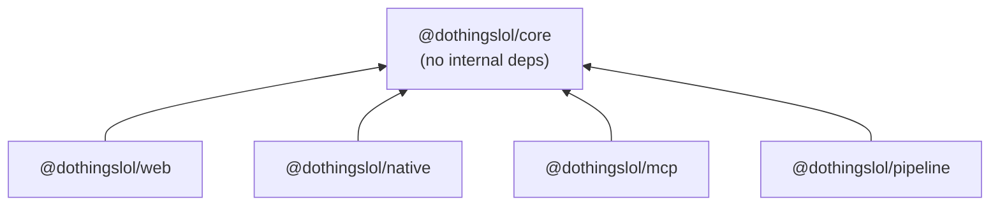

# Eventyr monorepo plan

Status: **revision 2, awaiting your agreement.** It includes your answers of 2026-09-25. No
source files have been moved yet. Discovery was done against `main` at `99b3b62`.

The goal is to turn this single-package repo into a pnpm workspace. A React Native (Expo) app
then gets full feature parity with the website: fetch the published data, display it, filter it,
personalise it and send notifications. Web and native share the logic instead of each keeping a
copy.

The work lands as **two pull requests**, each executed as a series of sub-phases:

- **PR 1, monorepo refactor.** Sub-phases 1.1 to 1.8. Structural only; the site's behaviour doesn't change. It also removes WhatsApp and adds Byron to the weekly run.
- **PR 2, React Native and Expo app.** Sub-phases 2.1 to 2.9. It also carries the web changes the app needs: React 19, the public data feed, device-time display, the taste model v2 and a Settings page.

Each `phase-N.M-*.md` file starts with a handoff block you can paste into a fresh Claude Code
session. A sub-phase session reads only this file and its own sub-phase file.

---

## 0. Decisions (your answers, 2026-09-25)

| # | Question | Decision | Where it lands |
|---|---|---|---|
| D1 | LLM provider | Keep Gemini for most work (it's cheaper). Making provider switching easy is out of scope. **This refactor must not change functionality.** | PR 1 is behaviour-preserving. The pipeline's internal reorganisation is deferred to `followup-pipeline-boundaries.md`, which is also the groundwork for provider switching later. |
| D2 | WhatsApp | Remove it | 1.6 |
| D3 | Server push | No. Only local notifications, scheduled from events the user has liked | 2.8. Server-push infrastructure is dropped from the plan. |
| D4 | Platforms and ID | iOS and Android together, bundle ID `lol.dothings.app` | 2.9 |
| D5 | Byron | Add it to the weekly run | 1.6 |
| D6 | Native storage identity | Key by `eventHash` | 2.4 onwards. Core functions take a key function, so web keeps `eventId` (unchanged) and native passes `eventHash`. |
| D7 | Time zone | Times are always shown in the **device's** time zone | 2.3 (web and core), 2.5 (native). See §8. |
| D8 | Analytics and donations in the app | Neither: no Rybbit, no Buy Me a Coffee | 2.9 (store privacy: "Data not collected") |
| D9 | PR structure | One PR for the monorepo, one for native, with the phases as sub-phases | §4 |
| D10 | Settings | New Settings page: notifications toggle with an explanation, per-tag +/−, theme (System/Light/Dark), a taste profile that likes and dislikes update directly and the user can override, and an opt-out of automatic learning with a privacy note | Spec in §7. Web page in 2.3, native screen in 2.8. |

**My assumption on D10:** the Settings page ships on **both web and native**, in PR 2. The taste
model lives in `@dothingslol/core`. If only native got v2, core would have to carry two taste
models and the platforms would rank events differently, which is exactly the divergence this
refactor exists to prevent. If you want native only, tell me. Sub-phase 2.3 then shrinks to
device-time display only, and core keeps the v1 model for web alongside v2.

---

## 1. Discovery summary

### 1.1 Corrections to the original brief

| The brief said | The code says |
|---|---|
| LLM curation via the Claude API | Curation, ranking, dedupe, venue matching, extraction and annotation all run on **Gemini** (`src/providers/gemini.ts`, `gemini-3.1-flash-lite` / `gemini-3.5-flash`). `@anthropic-ai/sdk` is only an optional web-search provider (`src/providers/anthropic.ts`), and it's off by default (`PROVIDERS=google,perplexity`). This matches D1. |
| WhatsApp notifications | `src/messaging.ts` works, but the `digest.yml` step is `if: false`. The only notifications users get today are browser-local PWA reminders (`app/utils/notifications.ts`, `public/sw.js`). |
| JSON the site reads | The site **never fetches JSON at runtime**. The Astro pages `readFileSync` `data/index.json` and `data/{city}.json` at build time and serialise the events into `<EventApp client:load>` props. The only public JSON is `/ai/*`, and it's lossy: no tags, score, vibes, `venue_name` or image. **There is no URL a native app can fetch today.** Sub-phase 2.2 adds one. |
| Brisbane | Four cities (`brisbane`, `goldcoast`, `sunnycoast`, `byron`). `byron` isn't in `weekly.yml`, so its data is stale. D5 fixes that. |

### 1.2 Modules and import graph

About 13.7k lines of TS/TSX in a single `package.json`. Pipeline scripts run with `tsx` and
`tsconfig.scripts.json` (NodeNext). The site uses `tsconfig.json` (bundler resolution, DOM, and
the alias `@react/*` → `app/*`).

| Cluster | Modules | Notes |
|---|---|---|
| Shared, no Node | `src/shared.ts` (1,115 lines, no imports) | Constants, `eventHash`, `eventSlug`/`eventPath`, `isTopPick`, `eventOverlapsRange`, `costLabel`, `isoWithOffset`, `byScoreThenSoonest`, `KEY_TO_SLUG`, `SITE_URL`. Imported by 16 `app/` files, 5 Astro files, the pipeline (through `common.ts`) and **`workers/mcp` by relative path** (`dothingsClient.ts:6`, `tools.ts:11`). |
| Pipeline hub | `src/common.ts` (33 importers) | Mixes filesystem/YAML config, the path layout (`PROJECT_ROOT` = `dirname(import.meta.url)/..`), the `INTERESTS` prompt, pure date helpers (353–383), fuzzy dedupe (482) and a re-export of `shared.ts`. |
| LLM | `providers/*`, `dedupeClassifier.ts`, `adapters/{annotate,llmExtract,discover}.ts`, parts of `probe.ts` | `gemini.ts` is the only model wrapper, but it's coupled to the pipeline: it uses `DATA_ROOT`, `process.env.CITY` and writes `data/{city}/usage`. |
| Scraping | `adapters/{fetch,feeds,extract,embeddedJson,readableText,dates,candidate,pageAdapter,runner,registry,render,enrichTimes,extractionCache,normalise,types}.ts` | LLM-free apart from `collect.ts` wiring in `llmExtract`. |
| Collect/curate/rank | `collection.ts`, `adapters/collect.ts`, `curate.ts`, `dedupe.ts`, `locality.ts`, `venues.ts`, `rank.ts`, `rankReuse.ts`, `sourceYield.ts`, `text.ts`, `geocode.ts` | `curate.ts:10` imports `adapters/annotate.ts`, and through it `@google/genai`, just for one regex. |
| Publish | `markdown.ts`, `ical.ts`, `rss.ts`, `pages.ts`, `ai.ts` | Clean: they import only `common.ts`. They write into `public/` and the repo root via `PROJECT_ROOT`. |
| Source maintenance | `add_city.ts`, `adapters/{probe,discover,render,triage,testUrl}.ts` | `add_city.ts:21,67` regex-edits `.github/workflows/digest.yml`. |
| Notify | `messaging.ts` | Removed in 1.6 (D2). |
| Web build helper | `src/organizers.ts` | Reads `sources/{key}.yml` through `process.cwd()`. |

Coupling that matters for this refactor:

1. **`src/pages/[city]/[timeframe].astro:10` imports `common.ts`.** That pulls `node:fs` and js-yaml into the Astro build, breaking the rule `shared.ts` exists for. Fixed in 1.2.
2. **`workers/mcp` imports `../../../src/shared.ts` and `../../../app/utils/dates.ts`.** Any move breaks it silently, because CI never builds it. Fixed in 1.1–1.3 and 1.7.
3. **Knots inside the pipeline:**
   - `common.ts` is a grab-bag.
   - `providers/base.ts` doubles as the utility module.
   - `gemini.ts` depends on pipeline state.
   - `curate` reaches into the scraper.

   These block a later `scraper`/`llm` split, but not this refactor. They're deferred per D1 (`followup-pipeline-boundaries.md`).

### 1.3 Event types and schemas

- **The pipeline event has no type.** Every stage uses `Record<string, unknown>`, and the shape is implicit in `adapters/normalise.ts:188-215`.
- **`app/types.ts` is the only full declaration,** and it differs from real output. `score` is required and the vibes are optional there. `City` uses `key`/`name` where the payload uses `city_key`/`city`; `pages.ts:95` renames between them.
- **Types are declared more than once:**
  - The payload is re-declared in `rss.ts:22` and `ai.ts:77/90`.
  - `CompactEvent` (`ai.ts:100`) is copied verbatim into `workers/mcp/src/dothingsClient.ts:10-65`.
  - The source config has three separate views: `common.ts:133`, `adapters/types.ts:36` and `shared.ts:1089`.
- **Runtime validation is hand-rolled** in a few places. zod appears only in the MCP Worker.
- **Two identities.**
  - `eventHash` (frozen, pinned by `shared.test.ts`) is used for iCal UIDs, RSS guids, share URLs and `#cal=` links.
  - The web app's saved/hidden/disliked sets use `eventId()` = title + `datetime_iso` (`app/context.tsx:63`). D6: native uses `eventHash`, and web stays as it is.
- **Displayed times.** The web shows the pipeline's human `datetime` string, which is in city-local time (`app/utils/dates.ts:116` `displayDatetime`). "Today" uses the device date. D7 changes display to the device time zone (§8).
- **Two week conventions,** both intentional: `getWeekRange` (Sunday → next week) is the collection schedule, and `startOfWeek` (Sunday → previous Monday) is the calendar display.
- **Two ICS builders:** `src/ical.ts` for the feeds and `app/utils/ics.ts` for client export. A test asserts their UIDs match. Merging them is out of scope.

### 1.4 Data: written, committed, published

- **What the pipeline writes.** `data/{city}.json` (1.7 MB for Brisbane), `data/index.json`, and per-city working state under `data/{city}/`.
  - Everything is committed except `data/_raw`, `data/_cache`, `data/_probe` and `data/*/adapters/rejected/`.
  - In total that's about 8 MB across 405 files. `.git` is 8 MB.
- **Generated and committed**, because `deploy.yml` only runs `astro build` from a checkout:
  - `public/{cityKey}.ics`
  - `public/{slug}/e/*.ics`
  - `public/{slug}/feed.xml`
  - `public/sitemap.xml`
  - `public/ai/**`
  - `public/llms.txt`
  - the root `{CITY}.md` files
- **Hand-authored in `public/`:** `sw.js`, `manifest.webmanifest`, `CNAME` (`www.dothings.lol`), `robots.txt`, `ai/openapi.yaml`, `.well-known/api-catalog`, `skill/`, `icons/` and `fonts/`.
- **Public URLs:** `https://www.dothings.lol/ai/index.json`, `/ai/{slug}/{date}.json`, `/ai/{slug}/week-{monday}.json`, `/{slug}/feed.xml` and `/{cityKey}.ics`. None of them has a schema version.

### 1.5 GitHub Actions

| Workflow | Trigger | What it does |
|---|---|---|
| `weekly.yml` | cron `0 20 * * 6` (Sunday 06:00 AEST), dispatch | Runs brisbane → goldcoast → sunnycoast in sequence via `uses: ./.github/workflows/digest.yml`, `secrets: inherit`. **Byron is added in 1.6.** |
| `digest.yml` | `workflow_call` + dispatch (city list edited by `add_city.ts`) | 1. pnpm 9 / Node 22, install, then `tsc` twice and the tests. 2. Restores the caches `data/_cache`/`_raw`. 3. setup-chrome, then collect-adapters, collect, curate, dedupe-venues. 4. `src/rank.ts`, `src/geocode.ts`, `src/markdown.ts`, `src/ical.ts`, rss, `src/pages.ts`, build-ai, build. 5. `git add` of the paths in §1.4, then commit, then `git pull --rebase -X theirs origin main && git push` (3 tries). The WhatsApp step is `if: false`, and the `WHATSAPP_*` secrets are declared `required: true`. Runs with `concurrency: digest` and `TZ=Australia/Brisbane`. |
| `digest-manual.yml` | dispatch (free-text city, `recipient`) | Calls `digest.yml` |
| `add-city.yml` | dispatch | `src/add_city.ts`, then `discover-sources --apply`, then `probe-sources --apply`, then commits `sources/` (and `digest.yml` if `ADD_CITY_PAT` is set), then calls `digest.yml` |
| `reprobe.yml` | cron `0 3 3 * *`, dispatch | Loops the probe over `ls sources/*.yml`, runs `src/adapters/triage.ts` and `render-sources`, then commits `sources/` |
| `deploy.yml` | push to `main`, dispatch, `workflow_run` of the weekly digest, cron `18 18 * * *` | `withastro/action@v3` (`pnpm@9`, `TZ=Australia/Brisbane`), then `actions/deploy-pages@v4` |

There is no PR/CI workflow; `pnpm check` only runs inside `digest.yml`. Pushes from `digest-manual`
and `add-city` use `GITHUB_TOKEN`, so they don't trigger a deploy until the daily cron.

### 1.6 Tooling

- **Versions.** Node 22.14.0 (`.tool-versions`), pnpm 9 (lockfile v9.0; no `packageManager`, no workspace). TS 5.9.3, Astro 6.3.7, `@astrojs/react` 5, React 18.3.1, Biome 2.4.15, tsx 4.22.
- **`workers/mcp`** has its own lockfile.
- **Tests** use `node:test` through `tsx`: 29 files under `src/`, 13 under `app/`, 2 in `workers/mcp`.
- **`src/locality.test.ts:181-229`** writes into the real `DATA_ROOT`.
- **Pre-commit hook** (`.githooks/pre-commit`): runs `pnpm build` when `app/`, `src/pages/`, `src/layouts/` or `astro.config.mjs` are staged.
- **Hard-coded paths that a move breaks:**
  - `PROJECT_ROOT` in `common.ts:9-17`.
  - `process.cwd()` in 7 page files and `organizers.ts:19`.
  - Writes into `public/`: `ai.ts:69,563,581,617,654`, `ical.ts:212,258`, `rss.ts:174`, `pages.ts:129`.
  - `add_city.ts:21`.
  - Every `package.json` script, and the workflow paths listed above.
  - `astro.config.mjs:12,17`, the `tsconfig*` includes, the `biome.json` includes and the hook's path list.
- **Main guards keyed on file basename** survive a directory move, but not a rename.

### 1.7 Where I'm unsure

- Whether `force=false` digest runs skip *every* paid call. CLAUDE.md says collect, curate and rank honour the weekly check; collect-adapters and venues are unconfirmed.
- Whether any legacy `data/{goldcoast,sunnycoast}/*/raw/*.json` writer still exists (probably not).
- Whether GitHub Pages serves an extensionless `/.well-known/apple-app-site-association` with a content type iOS accepts (2.9).
- Hermes `Intl`/`URL` behaviour for core's date and URL code (checked in 2.4).
- Whether expo-router passes URL fragments (`#cal=`) through deep links (2.7).

---

## 2. Package layout

### 2.1 Compared with the original proposal

| Proposed | Verdict | Why |
|---|---|---|
| `web` | Keep, as `apps/web` | Clean boundary |
| `native` | Keep, as `apps/native` | — |
| `scraper`, `llm` | **Directories inside `apps/pipeline`, not packages** | Their only consumer is a single process, and it has to share one fetcher, one extraction cache and one Gemini budget. Package boundaries would add configuration without adding reuse. The follow-up plan makes extracting them mechanical if provider switching or a second consumer ever justifies it. |
| `collection` | **Rename to `apps/pipeline`** | It also publishes and maintains sources. It's an executable, not a library. |
| `data` | **Not a package.** It stays as the `data/` directory on `main`. | Nothing imports it. The cron commits it, curate's carry-forward reads it from the checkout, and web reads it at build time. Native reads a new public feed instead (2.2). |
| *(missing)* | **Add `packages/core`** (`@dothingslol/core`) | Shared types, schemas, identity, dates, filters, search, grouping, taste, calendar and reminders. No React, no Node. |
| *(missing)* | **Add `apps/mcp`** (from `workers/mcp`) | An existing consumer of the shared code, currently outside CI |

### 2.2 End state

```
eventyr/
├── apps/
│   ├── web/        @dothingslol/web       Astro site → GitHub Pages (app/, src/pages, src/layouts, src/lib, public/)
│   ├── pipeline/   @dothingslol/pipeline  collect/curate/rank/publish/source-maintenance CLIs (was src/**)
│   ├── mcp/        @dothingslol/mcp       Cloudflare Worker (was workers/mcp)
│   └── native/     @dothingslol/native    Expo app (PR 2)
├── packages/
│   └── core/       @dothingslol/core      node-free, React-free TS source package
├── data/  sources/  BRISBANE.md …         unchanged locations
├── scripts/        setup-hooks.mjs, site-fingerprint.sh, filter-parity.mjs, check-boundaries.mjs
├── package.json    root: scripts only (check + proxies so `pnpm collect` etc. still work)
├── pnpm-workspace.yaml  tsconfig.base.json  biome.json
```

`packages/core/src` modules, with the sub-phase that creates each:

| Module | What it holds | Sub-phase |
|---|---|---|
| `shared.ts` | moved as-is, plus `toISODate` | 1.2 |
| `schema.ts` | types from `app/types.ts`, plus zod schemas | 1.2, zod in 2.2 |
| `identity.ts` | `eventId` | 1.3 |
| `dates.ts`, `search.ts`, `grouping.ts`, `timeOfDay.ts`, `vibes.ts`, `tagSpecificity.ts`, `weekLayout.ts`, `savedLink.ts`, `calendarLinks.ts`, `ics.ts` | pure utilities moved from `app/utils` | 1.3 |
| `taste.ts`, `tagPrefs.ts` | pure halves of the taste code | 1.3, replaced by `tasteProfile.ts` in 2.3 |
| `reminders.ts` | reminder calculations | 1.3 |
| `storageKeys.ts` | storage key constants | 1.3 |
| `filters.ts` | filtering | 1.4 |
| `aiFeed.ts` | AI feed types | 1.7 |
| `feed.ts` | native data-feed contract | 2.2 |
| `when.ts` | device-time event formatting | 2.3 |

Core has **no React**. Each app keeps its own hooks and components and calls core's pure
functions, so the React version can never be duplicated through a shared package. A Biome
override bans `node:` imports under `packages/core/src` (`noNodejsModules`).

### 2.3 Dependency direction



Core depends on nothing internal, and no app depends on another app. The graph has depth 1, so
it can't contain a cycle. `scripts/check-boundaries.mjs`, added in 1.2 and run in `pnpm check`,
fails when:

- a package lists another workspace package it shouldn't;
- an app lists another app;
- a relative import crosses a package root.

Runtime data flow is not a package dependency:

- pipeline → `data/` and `apps/web/public/…`, through one constant, `WEB_PUBLIC_DIR`;
- web ← `data/` and `sources/` at build;
- native ← `https://www.dothings.lol/data/v1/*`;
- mcp ← `https://www.dothings.lol/ai/*`.

---

## 3. Tooling decisions

| Decision | Pick | Trade-offs and evidence |
|---|---|---|
| Package manager | **pnpm 11.x**, pinned via `packageManager`, with workspaces and catalogs | Already on pnpm. 12.6 is current but is a Rust rewrite that has been stable only since 2026-08-26; its settings and lockfile carry over from 11, so moving up later is cheap. pnpm 11 moves settings into `pnpm-workspace.yaml`, replaces `onlyBuiltDependencies` with `allowBuilds`, fails on unapproved build scripts, and defaults `minimumReleaseAge` to one day. 1.1 absorbs all of that before any structural change. (pnpm.io 11.0/12.0 posts; npm registry) |
| Linker | **`isolated`** (the default), falling back to `hoisted` only if an RN library needs it | Expo documents isolated installs as supported since SDK 54 (docs.expo.dev/guides/monorepos) |
| Versions | **pnpm catalogs** for react/react-dom/@types, typescript, tsx, zod | One place to bump. React is pinned exactly to the Expo SDK's version from 2.1 onwards. |
| Task runner | **None.** Use `pnpm -r` / `--filter` | The expensive work is paid LLM calls and one `astro build`, and Turbo can't cache source-only packages (turborepo.dev TS guide). Adopt Turbo if PR CI regularly exceeds ~5 minutes. |
| TypeScript | **Stay on 5.9.x.** `tsconfig.base.json` plus one tsconfig per package. **No project references.** Core is a just-in-time source package: `exports` point at `.ts`, no build step. | TS 7 is GA but has no API, so Astro's TS tooling doesn't support it (withastro/astro#16112). Both configs already allow `.ts` imports. tsx, Vite and Metro treat symlinked workspace packages as source. 1.2 verifies tsx and Vite; 2.4 verifies Metro. |
| React Native | **Expo managed with CNG, expo-router, EAS Build.** Use the latest stable SDK when 2.1 runs. Today that's SDK 57 (RN 0.86.3, React 19.2.3). | Metro auto-configures for monorepos (SDK 52+). Nothing on the parity list needs custom native code. Local notifications work in Expo Go. **Never set RN or React versions by hand**: use `expo install --fix`, and CI runs `expo install --check` and `expo-doctor`. |
| React on web | **React 19.2.x** (2.1), matching Expo | `@astrojs/react@5` and `lucide-react@0.469` already accept `^19`. Astro 7 is out of scope. |
| Lint/format | **One root `biome.json`** with widened includes and a `noNodejsModules` override for core | — |
| Deploy | **Explicit steps** instead of `withastro/action` (1.1). Pages artifact from `dist`, then `apps/web/dist` after 1.5. | `withastro/action` looks for the lockfile inside `path`, so it misses a root lockfile. **The Pages artifact must keep dotfiles** (`/.well-known/api-catalog`). |
| PR CI | **New `ci.yml`** (1.1): `pnpm check` plus the web build plus the MCP dry run. Native job added in 2.4. | There's no PR gate today, and both PRs rely on one. |

---

## 4. Delivery: two PRs, sub-phases, branch rules

### 4.1 PR 1: monorepo refactor (branch `monorepo/refactor`)

Behaviour-preserving (D1), except for the two requested workflow changes in 1.6.

| Sub | File | Summary |
|---|---|---|
| 1.1 | `phase-1.1-workspace-tooling.md` | Open the branch and draft PR. pnpm 11, `pnpm-workspace.yaml` (root + `workers/mcp`), catalogs, `allowBuilds`, `ci.yml`, explicit deploy steps, and `site-fingerprint.sh` baseline. No moves. |
| 1.2 | `phase-1.2-core-package.md` | Create `packages/core`. `git mv` `src/shared.ts` and `app/types.ts` into it and rewire all importers. Fix the `[timeframe].astro` → `common.ts` leak. Add the boundary check. |
| 1.3 | `phase-1.3-core-utils.md` | `git mv` the pure `app/utils/*` modules and their tests to core, splitting the mixed files into pure and browser halves. Retarget the MCP Worker. |
| 1.4 | `phase-1.4-core-filters.md` | Browser-level characterisation (`filter-parity.mjs`), then extract the filtering and sectioning in `context.tsx` into `core/filters.ts`, using a `keyOf` parameter (D6). |
| 1.5 | `phase-1.5-web-move.md` | `git mv` the site into `apps/web`. Add a repo-root data resolver. Point pipeline writes at `apps/web/public`. Update the `digest.yml` add-list, deploy path and hook. |
| 1.6 | `phase-1.6-pipeline-move.md` | Remove WhatsApp (D2). `git mv` the rest of `src/` into `apps/pipeline`, re-anchor `PROJECT_ROOT`, and add root proxy scripts. Workflows call `pnpm <script>`. Add Byron to `weekly.yml` (D5). |
| 1.7 | `phase-1.7-mcp-move.md` | `git mv workers/mcp apps/mcp` and share the AI-feed types through core. |
| 1.8 | `phase-1.8-merge-and-verify.md` | Merge `main` in, re-run every check against `main`, mark ready, merge, then run the post-merge runbook (deploy, a manual digest, and the first weekly run with Byron). |

### 4.2 PR 2: React Native and Expo app (branch `native/app`, from `main` after PR 1 merges)

| Sub | File | Summary |
|---|---|---|
| 2.1 | `phase-2.1-react-19.md` | Web to the Expo SDK's React 19, pinned in the catalog. The parity script proves no behaviour change. |
| 2.2 | `phase-2.2-data-feed.md` | zod schemas and `toFeed()` in core. Astro static endpoints `/data/v1/index.json` and `/data/v1/{slug}.json` with `schema_version`. |
| 2.3 | `phase-2.3-shared-behaviour-web.md` | Three things, one commit each: (a) device-time display in core and web (§8); (b) taste model v2 in core, with web migration from v1 (§7); (c) the web `/settings/` page. |
| 2.4 | `phase-2.4-native-scaffold.md` | Expo app, core spike under Hermes, feed client (ETag, file cache, zod), city picker, plain list, native CI job |
| 2.5 | `phase-2.5-native-display.md` | Sections and grouping, event card, detail screen, save (by `eventHash`), share, maps, add to calendar, theme |
| 2.6 | `phase-2.6-native-filters.md` | Every filter, search, active strip, presets and deep links |
| 2.7 | `phase-2.7-native-personalisation.md` | Like/dislike feeding taste v2, hide/unhide, action sheet, swipe mode, saved week calendar, `#cal=` links and QR, ICS export |
| 2.8 | `phase-2.8-native-settings-notifications.md` | Settings screen (§7) and local notifications for liked events (§6) |
| 2.9 | `phase-2.9-native-release-and-merge.md` | `app.config.ts` (`lol.dothings.app`), EAS, OTA, universal and app links, store metadata, release workflow, then merge and the post-merge runbook |

Follow-up, not in either PR: `followup-pipeline-boundaries.md`. It untangles the pipeline's
internal coupling and is the groundwork for provider switching (D1).

### 4.3 Branch rules for every sub-phase session

- **Work on the PR branch named in the handoff**, even if the session environment suggests another. If it can't push there, stop and ask.
- **Start by syncing:**
  ```bash
  git fetch origin && git checkout <branch> && git pull --ff-only
  git -c merge.directoryRenames=true merge origin/main
  ```
  `main` keeps receiving weekly data commits. Once 1.5 has moved `public/`, `merge.directoryRenames=true` puts files that `main` *added* under `public/` into `apps/web/public/`, instead of raising a conflict. Where a generated file (feeds, `.ics`, `ai/*`, `data/*`) still conflicts, take `main`'s content at the branch's path. Never hand-merge generated output.
- **Commits.** One commit per numbered step where the step says so. Pure `git mv` commits carry no content changes, so rename detection stays at 100%.
- **Report.** Post verification results as a **comment on the PR**, and tick the sub-phase's box in the PR description checklist.
- **Undoing a sub-phase.** Use `git revert` on its commits. Don't force-push once a reviewer has looked at the PR.
- **Merging.** Use **"Create a merge commit"**, not squash. Squashing folds the pure-rename commits into edits and loses `git log --follow` history on the heavily edited files. The PR as a whole reverts with `git revert -m 1 <merge>`.

### 4.4 Merge windows

- **PR 1:** merge between Sunday (after that week's digest *and* its deploy are green) and Friday. **Never between Saturday 18:00 and 23:00 UTC:** the weekly run starts at 20:00 UTC, and a run that checked out old paths and then rebased onto the moved tree is how a week of data gets lost (R1). Confirm the `digest` concurrency group is idle before merging.
- **PR 2:** touches no pipeline paths, so any time outside that same Saturday window is fine.

### 4.5 What "working state" means per sub-phase

Nothing reaches `main` until a PR merges, so `main` can't break mid-PR. Each sub-phase still has
to leave the branch working: `pnpm check` green, the site building, CI green, and the
sub-phase's own verification passing. The deploy and the cron can only be exercised after the
merge, so each PR's last sub-phase has a post-merge runbook. Every sub-phase's local checks are
built to predict that runbook: identical site fingerprints, identical publish output, and
actionlint-clean workflows.

---

## 5. Feature parity checklist

The **Native** column gives the sub-phase that delivers each item. "Web-only" items are
deliberately left out, with the reason given. Web paths are shown as they are before the move.

### Data and navigation
- [ ] City list from the index (all four cities, Byron included once weekly). **2.4**
- [ ] Per-city events for the published week. **2.4**
- [ ] "Updated …" freshness, since native may show a cached feed. **2.4**
- [ ] Offline: last cached feed with a notice. **2.4** (web: `sw.js` network-first)
- [ ] Category pages (`/[city]/[category]/`) → filter preset plus deep link. **2.6**
- [ ] Timeframe pages (`/[city]/today|tomorrow|this-weekend/`) → preset plus deep link. **2.6**
- [ ] Event detail (`/[city]/e/[event]/`):
  - breadcrumbs, title
  - image, hidden on error
  - When / Where (maps) / Cost / Source
  - description, vibes
  - "Event website", add to calendar, share

  **2.5**
- [ ] Universal links for `https://www.dothings.lol/{slug}/e/{eventSlug}/` and `/{slug}/#cal=…`. Custom scheme from **2.5**, universal links **2.9**

### List, sections, grouping
- [ ] Sections in order: Saved, then Picks, then All. Picks is at most 9, needs score ≥7, must *start* inside the window, and is ordered by taste. **2.5**
- [ ] Group by:
  - **Date:** Today / Tomorrow / "Wednesday 24 Sep" / Ongoing / Later / TBC
  - **Category:** fixed order
  - **None**

  Strong tag preferences sort as a tier above everything (§7). **2.5**
- [ ] "X of Y events match" plus date range. **2.6**
- [ ] Event card, all fields:
  - category chip and icon
  - cost (free highlighted)
  - title link
  - date, including "On now — until …", **in device time (§8)**
  - venue plus address, maps link
  - description expanding over 240 chars
  - score badge, vibe chips, up to 5 tag chips tinted by preference
  - past styling, ✦ for top picks

  **2.5**
- [ ] Card actions:
  - add to calendar, share, like (+): **2.5**
  - not interested (−): **2.7**
- [ ] Long-press action sheet with haptics (Save/Unsave, Not interested, calendar options, Share, Cancel). **2.7**
- [ ] Tapping the venue, a vibe or a tag on a card toggles that filter. **2.6**

### Filters and search (logic in `core/filters.ts` from 1.4)
- [ ] Category, single select. **2.6**
- [ ] When: Any / Today / Tomorrow / Weekend, plus a custom range bounded by the week, with overlap semantics. **2.6**
- [ ] Time of day: Morning 5–12, Afternoon 12–17, Evening 17–29, multi-select. Untimed events drop out once a band is set. **2.6**
- [ ] Past: Upcoming / Include / Only. **2.6**
- [ ] Minimum score Any(4)/6+/7+/8+ (unscored events never hidden), plus the per-group "N below X hidden — Show them". **2.6**
- [ ] Vibes, multi-select, with counts, disabled at zero. **2.6**
- [ ] Tags: top 18, typeahead to 60, vibe-named tags excluded. **2.6**
- [ ] Venue with counts. **2.6**
- [ ] Search: diacritic-insensitive, token AND, one typo for tokens of ≥4 chars, live count. **2.6**
- [ ] Active filter strip and "Clear all". **2.6**
- [ ] "Unhide N hidden". **2.7**
- *Not on the web:* price filter, map view. Not part of parity.

### Personalisation and saved
- [ ] Like/unlike (saved), persisted, keyed by `eventHash`. **2.5**
- [ ] Not interested (dislike), which hides the event, reversibly. Persisted from **2.6**, UI in **2.7**
- [ ] Taste profile v2: likes and dislikes update visible, overridable weights, and auto-learning can be switched off (§7). **2.7** (signals), **2.8** (Settings UI)
- [ ] Swipe mode:
  - the deck is filtered events minus saved ones, ordered by taste
  - right = like, left = dislike
  - skip, undo and save buttons
  - progress indicator, end screen

  **2.7**
- [ ] Saved week calendar: Mon–Sun, previous/next, all-day and multi-day bars, timed events placed by hour. **2.7**
- [ ] Saved share link (`#cal=`) and QR (≤60 events); "Save all (N)" when opened from a link. **2.7**
- [ ] Export saved events as `.ics`. **2.7**

### Calendar and sharing
- [ ] Add to calendar. Native uses the device calendar via `expo-calendar`, plus the Google link and a shared `.ics` file. Same duration rules as the web. **2.5**
- [ ] Share the event URL `SITE_URL/{slug}/e/{eventSlug}/`. **2.5**

### Settings (new, D10; web in 2.3, native in 2.8)
- [ ] Notifications on/off, with an explanation of exactly what is sent. **2.8** (web: 2.3)
- [ ] Taste profile: tags, vibes and categories, each with its weight, whether it was learned or set by the user, +/− and reset. **2.8** (web: 2.3)
- [ ] "Learn from likes and dislikes" toggle with the privacy note. **2.8** (web: 2.3)
- [ ] Theme: System / Light / Dark. **2.8** (web: 2.3)

### Notifications (local only, D3)
- [ ] Permission requested on the first like, or from the Settings toggle. **2.8**
- [ ] Reminder 1 hour before each liked event (08:00 for date-only events). **2.8**
- [ ] 08:00 summary of today's liked events. **2.8**
- [ ] "Send test notification". **2.8**
- [ ] Tapping a notification opens the event or the saved screen. **2.8**

### Presentation
- [ ] Theme follows the system, with an override. **2.5**, setting in **2.8**
- [ ] `lucide-react` → `lucide-react-native`. **2.5**
- [ ] Accessibility labels, selected state, live-region count. **2.5–2.7**

### Web-only (deliberately not in the app)
- SEO intro blurb, FAQ, JSON-LD, sitemap and OG tags.
- The `/ai` page, the MCP Connect button, `llms.txt` and the Skill. Native can link to `/ai` from Settings → About.
- PWA install tip, service worker and manifest.
- Keyboard shortcuts and the right-click calendar menu (replaced by long press).
- RSS and iCal subscription feeds.
- Rybbit and Buy Me a Coffee (D8).

---

## 6. Notification architecture (decided: local only)

There is no backend (D3). Every notification is scheduled on the device from events the user
has liked, using data the device already holds. This matches what the web does today.

- **Pure policy** lives in `@dothingslol/core/reminders`:
  - `calculate1hReminderTime`, `filterEventsForMorningDigest`, `formatMorningDigest`, `formatEventTime`
  - the new `planSchedule(liked, now, { cap, timeZone })`

  Web and native share these, so both platforms agree on timing and wording.
- **Web** keeps the Notification API and service worker as they are today, plus the Settings toggle (2.3).
- **Native** (`apps/native/src/notifications/`) uses `expo-notifications` `DATE` triggers:
  - It reconciles on launch, on foreground, on every like or unlike, and on feed refresh.
  - It cancels only its own ids, then schedules from `planSchedule`.
  - The digest is one dated notification per day for the next 7 days, each with that day's content. A repeating trigger would freeze the content.
- **Constraints:**
  - iOS keeps only the 64 soonest pending notifications (per Apple's forums, not official documentation), so the cap is 60.
  - Android 12+ needs `SCHEDULE_EXACT_ALARM` for exact timing. Inexact is acceptable here, so the plan doesn't request that permission.
  - Android 13+ needs runtime permission for notifications, which expo-notifications handles.
- **Dropped:**
  - WhatsApp (D2).
  - Expo Push and any token store (D3).
  - Background refresh (`expo-background-task`). It's best effort on iOS, and reconciling on launch and foreground covers the realistic case. It's listed as a follow-up in case event times change often between opens.
- **No new infrastructure.** Release (2.9) still needs an Apple Developer Program membership, a Google Play Console account and an Expo account, for store builds only.

---

## 7. Settings and taste model v2 (spec for 2.3 and 2.8)

### 7.1 Today (v1), for reference

- **`eventyr:taste`**: counts keyed `tag:`, `vibe:` and `cat:`.
  - Save is +1, unsave is −1, and a share or calendar add is +1 once per event.
  - A dislike weights tags by −1 × IDF specificity (floored at 0.1) and bumps an internal `cat:__disliked__`.
  - Unhide reverses the dislike exactly.
  - The resulting boost is capped at ±4, with group weights tag 0.55 / vibe 0.25 / cat 0.2 and a 1.5 curve, and only applies after 3 or more saves (`MIN_SIGNAL`).
- **`eventyr:tag-prefs`**: separate, user-stated tri-state per tag (+1/−1). "More" tags sort as a tier above everything and "less" tags below everything (`prefTier` in `utils/grouping.ts:123`). Stated prefs also feed `effectiveTaste`.
- **The problem:** the user can't see the learned counts, and stated preferences are a second, disconnected mechanism.

### 7.2 v2 model (core `tasteProfile.ts`, replacing `taste.ts` and `tagPrefs.ts`)

```ts
type TasteKey = `tag:${string}` | `vibe:${VibeKey}` | `cat:${string}`;
interface TasteEntry { learned: number; override: number | null }   // effective = override ?? learned
interface TasteProfileV2 {
  version: 2;
  autoLearn: boolean;                                   // default true
  entries: Partial<Record<TasteKey, TasteEntry>>;
  applied: Record<string, Partial<Record<TasteKey, number>>>; // `${signal}:${eventHash}` → deltas added to `learned`, for exact reversal
}
```

- **One source of truth.** Likes and dislikes write directly into the entries the Settings page shows. This is what you asked for: the profile is visible, and it can be overridden.
- **Learning** (only when `autoLearn` is on). It uses the same increments as v1, so ranking for existing users stays close:
  - Like: +1 on every tag, vibe and category key of the event.
  - Share or calendar add: +1, once per event per signal.
  - Dislike: tags −1 × specificity (IDF, floor 0.1), exactly as in v1.
  - Deltas are recorded in `applied`, so unlike and unhide reverse exactly what was added.
- **Override.** Settings +/− steps the **effective** weight by 1 within **−3…+3** and stores it as `override`.
  - "Reset" clears the override, and the learned value shows again.
  - Learning keeps updating `learned` underneath an override, so a reset reveals up-to-date learning.
- **Auto-learn off.** Likes and dislikes still save or hide events, but `learned` stops changing. Existing values stay until the user edits or resets them.
- **Ranking.** `tasteBoost` runs over effective weights, with the same cap, group weights and curve as v1.
  - `MIN_SIGNAL` applies to learned signal only. Any override counts as enough signal.
  - **Tier sort** is kept, but only for tags with `override === +3` (sorted first) or `override === −3` (sorted last). That's exactly what v1's more/less did, so migrated users see no change.
- **Internal keys.** `cat:__disliked__` stays internal and is never shown.
- **Web migration (2.3), which runs once on load when `eventyr:taste-profile` is absent:**
  - `learned` comes from `eventyr:taste`.
  - `override` comes from `eventyr:tag-prefs`: +1 becomes +3, −1 becomes −3.
  - `autoLearn` is set to true.
  - `applied` starts empty. Unliking an event that was liked before migration recomputes its deltas with the v1 formula, which is exact for likes and approximate for dislikes if the tag corpus has changed.
  - The old keys are **left in place** for one release, so reverting PR 2 loses only changes made after the migration.
- **Native** starts directly on v2, with the same key name and shape (via `storageKeys.ts`).

### 7.3 Settings page (web `/settings/` in 2.3; native screen in 2.8)

1. **Notifications.** A toggle with this copy:
   > "Reminders for events you've liked: one hour before they start (8:00 am on the day for all-day events), plus an 8:00 am summary of today's liked events. They're scheduled on this device — nothing is sent to a server."

   Turning it off cancels everything already scheduled. On the web, the existing auto-prompt on first save respects the toggle.
2. **Your taste.**
   - The privacy note sits at the top:
     > "Your taste profile is stored only on this device and is never sent to any server."

     Deliberately scoped to taste data. On the web, Rybbit page analytics still runs, so "nothing is ever sent anywhere" would be false there.
   - The "Learn from likes and dislikes" toggle, with the note:
     > "When on, liking or hiding an event adjusts the weights below."
   - **Tags** section. The top 150 tags by frequency, plus search. Each row shows:
     - the weight on a −3…+3 bar
     - a "learned" or "set by you" badge
     - − and + buttons
     - reset
   - **Vibes** (4) and **Categories** (6), with the same rows.
   - "Reset all learning" and "Clear all overrides". Each needs a confirmation.
3. **Appearance.** System / Light / Dark. Web keeps the `theme` key: removing it means System.
4. **About** (native): a link to the website and `/ai`, plus the version.

On the web, this page **replaces the `PreferencesPane` dialog**. The header gets a Settings (gear)
link. The existing header theme toggle and the saved-section `NotificationPrompt` stay as shortcuts.

---

## 8. Time display rule (D7)

Show times in the **device's** time zone, always, on both platforms.

- **Timed events:** format from `datetime_iso` / `datetime_end_iso` with `Intl.DateTimeFormat` and no `timeZone` option (the device zone).
  - If an ISO string has no offset, it is interpreted in the **city's** time zone from the feed or payload, then shown in device time.
  - The pipeline's human `datetime` string is used only when there is no parseable ISO.
- **Date-only events** (no time component) are calendar dates and never shift across zones.
- **"Today / Tomorrow / Weekend"** use the device date. That's the web's current behaviour, and native matches it.
- **Visible effect:** none for devices in Brisbane. For a device in Sydney during daylight saving, timed events show one hour later, which is correct for that user. ICS and calendar links are already absolute.
- **Implementation:** core `when.ts` (`formatWhen(event, { now, cityTimeZone })`) replaces the fallback path in `displayDatetime`, and `EventCard`, the detail page and reminders all call it. Web adopts it in 2.3.
  - **Prerendered HTML can't know the viewer's zone.** The static event pages keep the city-local string plus the city's time-zone label ("7:00 pm AEST"), and the island reformats after hydration.

---

## 9. Risks

| # | Risk | Mitigation |
|---|---|---|
| R1 | An in-flight digest rebases onto the moved tree at PR 1 merge, recreates old paths or fails its push, and that week's data is lost | Merge window (§4.4), check `digest` is idle, manual digest dispatch straight after merge (1.8) |
| R2 | `PROJECT_ROOT`-relative writes land in the wrong place: "success" with stale feeds | 1.5 and 1.6 compare publish output with a `main` worktree, byte for byte. 1.8 repeats the comparison after the final merge from `main`. |
| R3 | pnpm 11 install fails on build scripts or on `minimumReleaseAge` | 1.1 does the upgrade on its own, with a documented `allowBuilds` |
| R4 | Two copies of React or RN in the native bundle | Core is React-free, the catalog pins React to the SDK (2.1), CI runs `expo install --check` and `expo-doctor`, `hoisted` is the fallback |
| R5 | Metro can't resolve core's `.ts` exports | 2.4's first commit is a spike with `expo export` in CI |
| R6 | Feed too large for mobile (Brisbane raw is 1.7 MB) | `toFeed` strips internal fields. Pages serves gzip and ETag. 2.2 reports gzip size and warns over 400 KB. |
| R7 | Hermes `Intl`/`URL` differs from browsers | 2.4 runs core self-tests on both platforms. Phase 1.3 lists every `URL`/`btoa` use. |
| R8 | The MCP Worker breaks silently | CI dry-run from 1.1. Imports retargeted in 1.2 and 1.3. Move in 1.7. |
| R9 | The long-lived PR 1 branch conflicts with weekly bot commits | Every sub-phase merges `main` in with `merge.directoryRenames=true` (§4.3). Keep 1.5 → 1.8 inside one working week. |
| R10 | **PR 2's feed isn't live until PR 2 merges**, but native development needs it | The native feed base URL is configurable (`EXPO_PUBLIC_FEED_BASE_URL`). During PR 2 it points at `pnpm --filter @dothingslol/web preview` on the LAN, and CI uses fixtures. The trade-off of D9 is that the web Settings page, device-time display and React 19 also wait for the app to be ready. |
| R11 | Taste v2 migration changes ranking for existing web users | The same increments and tier semantics as v1 (§7.2). 2.3 tests migrate→rank equivalence on fixture profiles. The old keys are kept for rollback. |
| R12 | Pages serves the `apple-app-site-association` content type wrongly, or drops dotfiles | 1.1 keeps dotfiles in the artifact. 2.9 checks through Apple's CDN, and falls back to the custom scheme. |
| R13 | `locality.test.ts` writes into real data or a stray `data/` | Isolated in 1.6 via `EVENTYR_DATA_ROOT` |
| R14 | `add_city.ts` regex stops matching `digest.yml` after workflow edits | 1.1 and 1.6 run it against a scratch worktree |

---

## 10. Remaining open questions

1. **D10 scope.** Settings (and taste v2) on web as well as native, which is the assumption above? Or native only?
2. **Merge method.** Is "Create a merge commit" enabled for this repo (§4.3)? If only squash is allowed, the per-file history through the moves is lost. I'd enable merge commits for these two PRs.
3. **Taste v2 details.** Are the −3…+3 override range and "±3 = hard tier" rule (§7.2) acceptable? They're chosen so existing web users see no ranking change on migration.
4. **Byron cost.** Adding Byron makes the weekly run about a third more expensive in API spend, and the first run does a full collection because Byron's data is stale. Confirm that's expected.

## 11. Follow-ups deliberately left out

- `followup-pipeline-boundaries.md`: untangling the pipeline's internal coupling, the groundwork for provider switching (D1).
- Astro 7 and TypeScript 7 upgrades.
- Moving web's saved/hidden keys from `eventId` to `eventHash`, with a migration.
- Merging `publish/ical.ts` with `core/ics.ts`.
- Generating RSS, ICS and `/ai` at build time instead of committing them. This removes R1 entirely.
- Background refresh of scheduled reminders on native.
- Turborepo, once CI time justifies it.
- CI deploy for `apps/mcp`.
- Filter state in web URLs.
- Web label bug: the card action sheet says "Pin to Top Picks" but the action saves the event.
