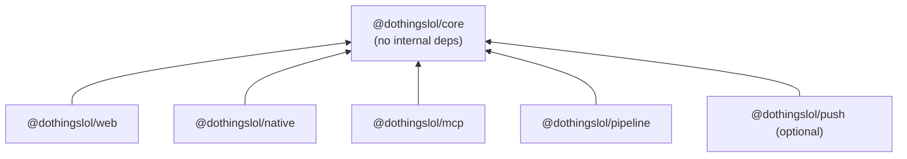

# Eventyr monorepo plan

Status: **draft for review**. Nothing has moved yet. Written 2026-09-24 against `main` at `99b3b62`.

Goal: turn this single-package repo into a pnpm workspace so that a React Native app can reach
full feature parity with the website (fetch published data, display, filter, notify) without
the web and native code diverging. Every phase ends with the weekly cron, the Pages deploy,
and `pnpm check` all working.

How to use this directory: each `phase-NN-*.md` begins with a handoff block you can paste into a
fresh Claude Code session. A phase session reads only this file and its own phase file.

---

## 1. Discovery summary

### 1.1 Corrections to the brief

These change the plan, so they come first.

| Brief said | Code says |
|---|---|
| LLM curation uses the Claude API | **All curation, ranking, dedupe, venue canonicalisation, extraction and annotation run on Gemini** (`src/providers/gemini.ts`, models `gemini-3.1-flash-lite` and `gemini-3.5-flash`). `@anthropic-ai/sdk` appears only in `src/providers/anthropic.ts`, an optional web-search provider that `weekly.yml` leaves off (default `PROVIDERS=google,perplexity`). Even Claude's search output is curated by `GoogleProvider.curate` (`src/collection.ts:18-19`). |
| WhatsApp Cloud API notifications | `src/messaging.ts` exists and works against `graph.facebook.com/v19.0`, but the "Send WhatsApp digest" step in `digest.yml` is **`if: false`**, so nothing runs it. `digest.yml`'s `workflow_call` still declares `WHATSAPP_TOKEN`/`WHATSAPP_PHONE_ID`/`WHATSAPP_RECIPIENT` as `required: true`. The only notifications users receive today are **PWA local notifications** in the browser (`app/utils/notifications.ts`, `public/sw.js`). |
| JSON data files the site reads | The site **never fetches JSON at runtime**. Astro pages `readFileSync` `data/index.json` and `data/{city}.json` at build time and serialise the events into the HTML as `<EventApp client:load>` island props. `data/` is not served. The only public JSON is `/ai/*` (built by `src/ai.ts`), which is deliberately lossy: no tags, score, vibes, `venue_name` or image. **As things stand, a native app has no URL to fetch the data from.** Phase 08 adds one. |
| Brisbane events aggregator | It covers four cities (`brisbane`, `goldcoast`, `sunnycoast`, `byron`), with slugs from `KEY_TO_SLUG` in `src/shared.ts`. `byron` is **not** in `weekly.yml`: its data is stale (week of 2026-09-07) and it has no `/ai/byron/` files, but its pages still build. |

### 1.2 Modules and the import graph

About 13.7k lines of TS/TSX. One `package.json` at the root. Scripts run under `tsx` with
`tsconfig.scripts.json` (NodeNext). The site uses `tsconfig.json` (bundler resolution, DOM, alias
`@react/*` pointing to `app/*`).

| Cluster | Modules | Notes |
|---|---|---|
| Shared, node-free | `src/shared.ts` (1,115 lines; no imports) | Holds constants, `eventHash`, `eventSlug`/`eventPath`, `isTopPick`, `eventOverlapsRange`, `costLabel`, `isoWithOffset`, `byScoreThenSoonest`, `KEY_TO_SLUG`, `SITE_URL`, and the `OrganizerSource` type. It is imported by 16 `app/` files, 5 Astro pages/layouts, the pipeline via `common.ts`, and **`workers/mcp` by relative path** (`workers/mcp/src/dothingsClient.ts:6`, `tools.ts:11`). |
| Pipeline hub | `src/common.ts` (33 importers) | Mixes filesystem/YAML config (`loadCityConfig`), the path layout (`PROJECT_ROOT` = `dirname(import.meta.url)/..`, `DATA_ROOT`, `SOURCES_ROOT`), the `INTERESTS` prompt, pure date helpers (`getWeekRange`, `toISODate`, `fmtDate` at 353-383), fuzzy dedupe (`dedupeEvents` at 482) and a re-export of `shared.ts`. There is one harmless cycle: `common` → `sourceYield` → `common`, type-only. |
| LLM | `providers/{base,gemini,google,anthropic,openai,perplexity}.ts`, `dedupeClassifier.ts`, `adapters/{annotate,llmExtract,discover}.ts`, parts of `adapters/probe.ts` | `gemini.ts` is the one model wrapper (concurrency, 429 backoff, budget, cost accounting for **every** provider). It is coupled to the pipeline: it imports `DATA_ROOT`/`getWeekRange`, reads `process.env.CITY` (`:344`), and writes `data/{city}/usage/*.json`. |
| Scraping (deterministic) | `adapters/{fetch,feeds,extract,embeddedJson,readableText,dates,candidate,pageAdapter,runner,registry,render,enrichTimes,extractionCache,normalise,types}.ts` | These are LLM-free except where `collect.ts` wires `llmExtract` in as the last rung of the ladder. `adapters/dates.ts` hard-codes Brisbane +10 (`:23`). |
| Collect/curate/rank | `collection.ts`, `adapters/collect.ts`, `curate.ts`, `dedupe.ts`, `locality.ts`, `venues.ts`, `rank.ts`, `rankReuse.ts`, `sourceYield.ts`, `text.ts`, `geocode.ts` | `curate.ts:10` imports `adapters/annotate.ts`, and through it `@google/genai`, just for the regex `isRetiredTemplateDescription`. The week window is implemented twice (`collect.ts:83`, `curate.ts:66`). |
| Publish | `markdown.ts`, `ical.ts`, `rss.ts`, `pages.ts`, `ai.ts` | These are clean: they import only `common.ts`. They write into `public/` and the repo root via `PROJECT_ROOT`. |
| Source maintenance | `add_city.ts`, `adapters/{probe,discover,render,triage,testUrl}.ts` | `add_city.ts:21` edits `.github/workflows/digest.yml` with a regex that depends on indentation (`:67`). |
| Notify | `messaging.ts` | Imports only `common.ts`. Disabled in CI. |
| Web build-time helper | `src/organizers.ts` | Reads `sources/{key}.yml` via `process.cwd()`. Used by `Base.astro:14` and `[event].astro:28`. |

**Coupling that blocks a package split** (worst first):
1. `common.ts` is a grab-bag that every module imports.
2. `providers/base.ts` is also the general utility module. `mapWithConcurrency`, `chunkArray` and `parseJsonArray` are imported from the search-provider base class by `enrichTimes.ts:39`, `collect.ts:28`, `discover.ts:40`, `locality.ts:38`, `venues.ts:39` and `rank.ts:14`. At the same time, `BaseProvider.collect` writes pipeline files (`base.ts:195-231`).
3. `gemini.ts` depends on pipeline paths and env (see the LLM row above).
4. `curate.ts` reaches into the scraper's `annotate.ts` and `normalise.ts`.
5. **Node code leaks into the site build**: `src/pages/[city]/[timeframe].astro:10` imports `SITE_URL`/`toISODate` from `common.ts`, which pulls `node:fs` and js-yaml into the Astro build. This goes against the rule that `shared.ts` exists to enforce.
6. **`workers/mcp` imports `../../../src/shared.ts` and `../../../app/utils/dates.ts` by relative path.** Any move breaks the Worker silently, because nothing in CI builds it.

### 1.3 Event types and schemas

- **The pipeline event has no type.** Every stage treats it as `Record<string, unknown>` (`markdown.ts:13`, `messaging.ts:23`, `geocode.ts:16`, `rank.ts:70`, `rankReuse.ts:8`). Its shape exists only implicitly, in `adapters/normalise.ts:188-215` (16 snake_case keys) and the prompt example at `providers/base.ts:278`. Later stages add `venue` (the *tier*, `curate.ts:425`), `venue_name` (`venues.ts:477`), `score` (`rank.ts`), and `location_url` (`geocode.ts:72`).
- **The only full declaration is `app/types.ts`** (`Event`, `City`, `CityIndex`, `CityData`). It differs from the pipeline's actual output in several ways:
  - `score` is required (rank defaults it to 5).
  - The vibe booleans are optional.
  - `CityData` lacks `ranked_at`/`geocoded_at`.
  - `City` uses `key`/`name` where the payload uses `city_key`/`city`; the renaming happens at `pages.ts:95-96`.
- **The payload is re-declared locally** in `rss.ts:22` (`Payload`) and `ai.ts:77/90` (`RawEvent`, `CityPayload`).
- **`CompactEvent` (the AI feed, `ai.ts:100`) is copied verbatim** into `workers/mcp/src/dothingsClient.ts:10-65`, together with `DayFile`, `WeekFile` and `AiIndex`.
- **Source config has three views of one YAML**: `common.ts:133` `SourceEntry`, `adapters/types.ts:36` `SourceDefinition`, and `shared.ts:1089` `OrganizerSource`.
- **Runtime validation**: the pipeline has no schema library. The checks it has are hand-rolled, in `annotate.ts:84` (category/tags) and `registry.ts`. AI-search events never have their category validated in `curate.ts` (moderate confidence). zod 4 is used only in `workers/mcp/src/tools.ts`.
- **Two identities for one event**:
  - `eventHash` (`shared.ts`, frozen, pinned by `shared.test.ts`) feeds iCal UIDs, RSS guids, share URLs and `#cal=` links.
  - The web app's saved/hidden/disliked sets are keyed by `eventId()` = title + `datetime_iso` (`app/context.tsx:63`).
- **Two week conventions**: `getWeekRange` (`common.ts:353`) maps Sunday to the *next* week, which is the collection schedule. `startOfWeek` (`app/utils/dates.ts:39`) maps Sunday to the *previous* Monday, which is the calendar display. Both are intentional, but their names don't say so.
- **Two "today" definitions**: the web's `todayIso()` uses the **device** time zone, while the MCP Worker resolves against the **city's** time zone. For native users who travel, device time is wrong.
- **Two ICS builders**: `src/ical.ts` (the city feed plus per-event files) and `app/utils/ics.ts` (client export). The client builder's test asserts that UIDs match the feed's.

### 1.4 Data: where it is written, committed and published

- The pipeline writes `data/{city}.json` (the final payload, 1.7 MB for Brisbane), `data/index.json`, and per-city working state in `data/{city}/`. That state includes provider/tier curated files, `adapters/curated/*.json` (146 for Brisbane), `barren.json`, `usage/`, `locations.json`, `venues.json` and `source-yield.json`. Everything is committed except `data/_raw`, `data/_cache`, `data/_probe` and `data/*/adapters/rejected/`. About 8 MB in total, 405 files.
- **Generated and committed into `public/`**:
  - `public/{cityKey}.ics`
  - `public/{slug}/e/*.ics` (per event)
  - `public/{slug}/feed.xml`
  - `public/sitemap.xml`
  - `public/ai/**`
  - `public/llms.txt`
  - Generated root files `BRISBANE.md`, `GOLDCOAST.md`, `SUNNYCOAST.md` and `BYRON.md`.

  These are committed because `deploy.yml` only runs `astro build` from a checkout.
- **Hand-authored in `public/`**: `sw.js`, `manifest.webmanifest`, `CNAME` (`www.dothings.lol`), `robots.txt`, `ai/openapi.yaml`, `.well-known/api-catalog`, `skill/`, `icons/` (from `scripts/generate-icons.mjs`) and `fonts/`.
- **Public URLs**:
  - `https://www.dothings.lol/ai/index.json`
  - `/ai/{slug}/{YYYY-MM-DD}.json`
  - `/ai/{slug}/week-{monday}.json`
  - `/ai/{slug}/week-{monday}/{category}.json` (only when over 200 KB)
  - `/{slug}/feed.xml`
  - `/{cityKey}.ics`

  None of these carries a schema version. Freshness is signalled only by `data_as_of`/`generated_at`.

### 1.5 GitHub Actions

| Workflow | Trigger | What it does | Paths it depends on |
|---|---|---|---|
| `weekly.yml` | cron `0 20 * * 6` (Sun 06:00 AEST), dispatch | Chains brisbane, then goldcoast, then sunnycoast through `uses: ./.github/workflows/digest.yml`, `secrets: inherit` | — |
| `digest.yml` | `workflow_call` + dispatch (city choice list edited by `add_city.ts`) | pnpm 9 / Node 22, then install, then tsc ×2 plus tests, then restore `data/_cache`/`data/_raw`, then setup-chrome, then collect-adapters, collect, curate, dedupe-venues, `src/rank.ts`, `src/geocode.ts`, `src/markdown.ts`, `src/ical.ts`, rss, `src/pages.ts`, build-ai, `pnpm build`. It then does `git add` of the paths in 1.4, commits, and runs `git pull --rebase -X theirs origin main && git push` (3 tries). The WhatsApp step is `if: false`. It has `concurrency: digest` and `TZ=Australia/Brisbane`. | `src/*.ts` by path (lines 207-227, 275), `tsconfig*.json`, `data/_cache`, `data/_raw`, the git add list (247-251), `main` |
| `digest-manual.yml` | dispatch (free-text city) | Calls `digest.yml` | — |
| `add-city.yml` | dispatch | `src/add_city.ts`, `discover-sources --apply`, `probe-sources --apply`, then commits `sources/{key}.yml` (and `digest.yml` when using `ADD_CITY_PAT`), then calls `digest.yml` | `src/add_city.ts`, `sources/`, `.github/workflows/digest.yml` |
| `reprobe.yml` | cron `0 3 3 * *`, dispatch | Probe loop over `ls sources/*.yml`, then `src/adapters/triage.ts`, then `render-sources`, then probe again, then commits `sources/` | `sources/*.yml`, `src/adapters/triage.ts` |
| `deploy.yml` | push to `main`, dispatch, `workflow_run` of "Events — Weekly Digest", cron `18 18 * * *` (daily, for `/today/` pages) | `withastro/action@v3` (Node 22, `pnpm@9`, `TZ=Australia/Brisbane`), then `actions/deploy-pages@v4`, environment `github-pages` | The whole repo root (the action's default `path: .`, output `./dist`) |

Chaining gap: `digest-manual`/`add-city` push with `GITHUB_TOKEN`, which doesn't trigger
`deploy.yml`'s `push`. Their data only goes live at the next daily cron. There is no PR/CI
workflow: `pnpm check` only runs inside `digest.yml`, and `workers/mcp` is never built in CI.

### 1.6 Tooling

- `.tool-versions`: `nodejs 22.14.0`.
- pnpm 9, `lockfileVersion: '9.0'`. There is no `packageManager` field, no `pnpm-workspace.yaml` and no `.npmrc`.
- `workers/mcp` has its **own** `pnpm-lock.yaml` and is not a workspace member.
- Versions:
  - TypeScript 5.9.3 (locked)
  - Astro 6.3.7 with `@astrojs/react` 5 (accepts React 17 to 19)
  - React 18.3.1
  - Biome 2.4.15 (root `biome.json`, `files.includes` lists `src/`, `app/`, `scripts/` and `workers/`)
  - `tsx` 4.22
- Tests use `node:test` via `tsx --test`:
  - 29 files under `src/`
  - 13 under `app/`
  - 2 in `workers/mcp`

  `pnpm check` runs both `tsc` passes, `biome check src app` and both test globs. `src/locality.test.ts:181-229` writes into the real `DATA_ROOT`.
- Git hook: `prepare` sets `core.hooksPath .githooks`. `.githooks/pre-commit` runs `pnpm build` when `app/`, `src/pages/`, `src/layouts/` or `astro.config.mjs` are staged.
- **Hard-coded paths a move breaks:**
  - `PROJECT_ROOT` (`common.ts:9-17`)
  - `process.cwd()` reads in every page (`index.astro:10,13`, `[city].astro:12,21`, `[category].astro:13,24`, `[timeframe].astro:22,62`, `[event].astro:33,41`, `ai.astro:16`), `organizers.ts:19` and `generate-icons.mjs:114`
  - writes to `public/`: `ai.ts:69,563,581,616,654`, `ical.ts:212,258`, `rss.ts:174`, `pages.ts:129`
  - `markdown.ts:104`
  - `add_city.ts:21`
  - every `package.json` script
  - the workflow paths listed above
  - `astro.config.mjs:12,17`
  - the `tsconfig*` includes
  - `biome.json` includes
  - the pre-commit path list

  **Main guards keyed on file basename** (`ai.ts:664`, `rss.ts:184`, `venues.ts:493`, `discover.ts:52`, `render.ts:436`, `triage.ts:742`, `probe.ts:305`) survive a directory move but not a rename.

### 1.7 Website features

See §5 for the full parity checklist. Every page is prerendered: `/`, `/[city]/`,
`/[city]/[category]/`, `/[city]/[today|tomorrow|this-weekend]/`, `/[city]/e/[event]/`, `/ai/` and `/404`.
All interactivity lives in a single React island (`app/EventApp.tsx` → `app/context.tsx`). Filter
state is **not** written to the URL. The only URL state is `#cal=<hash>.<hash>…`, the shared saved
calendar. Persistence:

- localStorage keys `eventyr:starred`, `eventyr:hidden`, `eventyr:disliked`, `eventyr:taste`, `eventyr:taste-noted`, `eventyr:tag-prefs`, `theme` and `hideCityIntro`
- IndexedDB `eventyr-pwa` v1 (`starred_events`, `meta`)

### 1.8 Where I'm uncertain

- Whether `force=false` digest runs skip *all* paid calls. CLAUDE.md says collect/curate/rank honour the "already done this week" check; I didn't confirm this for `collect-adapters`/`venues`.
- Whether GitHub enforces `required: true` secrets for `secrets: inherit` callers. It evidently doesn't block today's runs.
- Whether the legacy `data/{goldcoast,sunnycoast}/{anthropic,gemini}/raw/*.json` files still have a writer. They appear not to.
- Whether GitHub Pages serves an extensionless `/.well-known/apple-app-site-association` with a content type iOS accepts. This matters in phase 15.
- Hermes `Intl.DateTimeFormat` `timeZone` support on both platforms. `costLabel`/`isoWithOffset` depend on it; checked in phase 10.

---

## 2. Recommended package layout

### 2.1 How I evaluated your split

| Your package | Verdict | Reasoning |
|---|---|---|
| `web` | **Keep** as `apps/web` | Clear boundary: `app/`, `src/pages`, `src/layouts`, `public/` and `astro.config.mjs`. |
| `native` | **Keep** as `apps/native` | — |
| `scraper` | **Fold into `pipeline`**, as a directory with an enforced boundary | Its only consumer is the pipeline, which runs as one process sharing one fetcher, one extraction cache and one Gemini budget (CLAUDE.md: "share the client that enforces limits"). A package boundary would add a `package.json`, `exports` and a tsconfig per package, and would force every deep import (`adapters/types.ts` has 15 importers) through a public surface. Nothing would get reuse it doesn't already have. You can extract it later if a second consumer appears; phase 07 makes that a mechanical step. |
| `llm` | **Fold into `pipeline`**, same treatment | Same reasoning. The "providers" are collection strategies (they build prompts from `INTERESTS` and write curated files), not a reusable LLM layer. The one reusable piece, `gemini.ts`, must stay a single shared instance per process. |
| `collection` | **Rename to `pipeline`** (`apps/pipeline`) | It holds collect, curate, venues, rank, geocode, publish (markdown/ical/rss/pages/ai), source maintenance (probe/discover/add-city) and notify. "Collection" undersells that, and CLAUDE.md already calls it "the pipeline". It is an executable, so it goes under `apps/`. |
| `data` | **Not a package.** It stays as the `data/` directory at the repo root | See 2.4. |
| *(missing)* | **Add `packages/core`** (`@dothingslol/core`) | You were right. Without it, web and native would each copy `app/types.ts`, the filter predicate in `context.tsx`, search, grouping, taste ranking, time-of-day bands, calendar links, ICS and reminder formatting. The MCP Worker already imports `shared.ts` by relative path, which shows the need. |
| *(missing)* | **Add `apps/mcp`** (from `workers/mcp`) | It is an existing consumer of the shared code, currently outside the workspace and outside CI. |

### 2.2 Directory tree (end state)

```
eventyr/
├── apps/
│   ├── web/                 @dothingslol/web       Astro site → GitHub Pages
│   │   ├── app/             (was app/)             React island, components, hooks, browser-only utils
│   │   ├── src/pages/       (was src/pages/)       incl. new src/pages/data/v1/*.json.ts endpoints (phase 08)
│   │   ├── src/layouts/     (was src/layouts/)
│   │   ├── src/lib/         organizers.ts (was src/organizers.ts), paths.ts (repo-root resolver)
│   │   ├── public/          (was public/)          hand-authored + pipeline-generated feeds
│   │   ├── scripts/         generate-icons.mjs
│   │   └── astro.config.mjs, tsconfig.json, package.json
│   ├── pipeline/            @dothingslol/pipeline  all CLIs run by digest/reprobe/add-city (was src/**)
│   │   └── src/             config/ llm/ scrape/ enrich/ sources/ collect/ curate/ publish/ notify/ util/  (phase 07)
│   ├── mcp/                 @dothingslol/mcp       Cloudflare Worker (was workers/mcp)
│   └── native/              @dothingslol/native    Expo app (phase 10+)
├── packages/
│   └── core/                @dothingslol/core      node-free, React-free TS source package
│       └── src/             shared.ts (moved as-is), schema.ts, feed.ts, identity.ts, dates.ts,
│                            filters.ts, search.ts, grouping.ts, timeOfDay.ts, vibes.ts,
│                            tagSpecificity.ts, taste.ts, tagPrefs.ts, weekLayout.ts, savedLink.ts,
│                            calendarLinks.ts, ics.ts, reminders.ts, storageKeys.ts (+ *.test.ts)
├── data/                    unchanged: generated, committed by digest.yml
├── sources/                 unchanged: per-city source YAML (read by pipeline and web)
├── scripts/                 setup-hooks.mjs, site-fingerprint.sh, check-boundaries.mjs
├── docs/monorepo/
├── BRISBANE.md …            unchanged: generated digests
├── package.json             root: private, scripts only (check, per-app proxies)
├── pnpm-workspace.yaml      packages, catalogs, allowBuilds
├── tsconfig.base.json       shared compiler options
└── biome.json               single root config with overrides
```

`packages/core` is **one** package with subpath exports (`@dothingslol/core/filters`, and so on). It
is not split into schema/utils/ui packages, because every consumer needs most of it and each extra
package costs config. It contains **no React**: web runs React 19 via Astro and native runs React
19 via Expo, and a shared package that imports React is the classic way to get two copies of React
into one bundle. Each app owns its own hooks and components and calls core's pure functions.

### 2.3 Answers to your specific questions

**Where do shared types, filter/sort logic and date/format helpers live?** In `@dothingslol/core`:

| Concern | Core module | Comes from |
|---|---|---|
| Event, payload and index types (one declaration, used by pipeline output, web, native and mcp) | `schema.ts` (TS types + zod schemas) | `app/types.ts`, `ai.ts:77-100`, `rss.ts:22`, `workers/mcp/src/dothingsClient.ts:10-65` |
| Native data-feed contract | `feed.ts` (`toFeed()`, `FEED_SCHEMA_VERSION`) | new, phase 08 |
| Identity | `shared.ts` (`eventHash`, `eventSlug`, `eventPath`), plus `identity.ts` (`eventId`, moved out of `context.tsx`) | `src/shared.ts`, `app/context.tsx:63` |
| Filtering, sections and facets | `filters.ts` (`applyFilters`, `splitSections`, `facetCounts`, `DEFAULT_FILTERS`) | the `useMemo` bodies in `app/context.tsx` |
| Search, grouping, time of day, vibes, tag specificity, week layout | same-named modules | `app/utils/*` |
| Taste and tag preferences (pure half) | `taste.ts`, `tagPrefs.ts` | `app/utils/taste.ts`, `app/utils/tagPrefs.ts`. Storage stays per app. |
| Dates | `dates.ts` (city-time-zone-aware `todayIso(tz?)`), `toISODate` | `app/utils/dates.ts`, `common.ts:378` |
| Calendar | `calendarLinks.ts`, `ics.ts` (pure build) | `app/utils/*`. The download/Blob code stays in web. |
| Reminder and digest formatting | `reminders.ts` | the pure half of `app/utils/notifications.ts` |
| Storage key names | `storageKeys.ts` | the literals in `app/utils/taste.ts` and `hooks/useStoredSet.ts` |

`getWeekRange` stays in the pipeline, because it is the collection schedule, not a display
concern. `src/ical.ts` is not merged with `core/ics.ts` in this refactor; the existing UID-parity
test keeps the two consistent. Merging them is listed under follow-ups.

A Biome override bans `node:` imports (`noNodejsModules`) under `packages/core/**`. That turns
the comment-enforced rule behind `shared.ts` into a lint error.

**Should `data` be a workspace package?** No. A workspace package is for code that other packages
import, and nothing should import `data/`. Three options:

- **A: keep the `data/` directory on `main` (recommended).** The cron already commits it, `curate.ts`'s carry-forward reads the previous `data/{city}.json` from the checkout, and the web build reads it from disk. The whole tree is 8 MB, and `.git` is 8 MB, so history bloat isn't a problem yet. The only change is that path resolution goes through one resolver per app (`apps/pipeline/src/config/paths.ts`, `apps/web/src/lib/paths.ts`) instead of `process.cwd()` and `PROJECT_ROOT`, with `EVENTYR_DATA_ROOT` still honoured.
- **B: an orphan `data` branch.** It keeps bot commits out of `main`'s history. The cost is that every workflow needs two checkouts, the web build needs the branch too, and carry-forward and the cache logic have to learn about it. Revisit this only if bot-commit noise becomes a real complaint.
- **C: a published artifact (Release asset or R2).** Only worth it once the data outgrows git, which it hasn't.

The native app never reads `data/`. It reads a **new public feed** that the web build emits
(phase 08): `https://www.dothings.lol/data/v1/index.json` and `/data/v1/{slug}.json`. These are
generated by Astro static endpoints from `data/*.json` at build time, so **no additional files are
committed** and the deploy workflow doesn't change. Each file carries `schema_version` and is
validated against the core zod schema on both ends. The `/ai/*` feed is not reused, because it
is size-tuned for LLM context and lacks the fields the filters need.

**Where does notification logic belong?** It is split by where it runs. §6 has the full options analysis.

- **Pure policy** goes in `@dothingslol/core/reminders`: when a reminder fires, which saved events go in the 08:00 digest, and message text.
- **Web delivery** stays in `apps/web/app/utils/notifications.ts` and `public/sw.js`.
- **Native delivery** goes in `apps/native/src/notifications/` (expo-notifications local scheduling).
- **WhatsApp** moves with the pipeline to `apps/pipeline/src/notify/whatsapp.ts`, still disabled (see open question 2).
- **Remote push**, only if you choose it, would be a new `apps/push` Worker plus a `notify:push` pipeline script (phase 16, optional).

**Dependency direction:**



Runtime data flows, which are not package dependencies:

- `pipeline` writes `data/` and `apps/web/public/{ai,*/feed.xml,*.ics,sitemap.xml,llms.txt}`.
- `web` reads `data/` and `sources/` at build time.
- `native` fetches `https://www.dothings.lol/data/v1/*`.
- `mcp` fetches `https://www.dothings.lol/ai/*`.

**No cycles.** `core` depends on nothing internal, and no app depends on another app, so the
graph has depth 1 and cannot contain a cycle. `scripts/check-boundaries.mjs` (added in phase 01)
enforces this in CI. It fails if any `apps/*/package.json` lists another app, if `packages/core`
lists any workspace package, or if any file imports across a package root by relative path
(`../../packages/…`, `../../../src/…`). The one filesystem coupling, the pipeline writing into
`apps/web/public`, goes through a single constant, `WEB_PUBLIC_DIR` in
`apps/pipeline/src/config/paths.ts`.

---

## 3. Tooling decisions

| Decision | Pick | Trade-offs | Verified against |
|---|---|---|---|
| Package manager | **pnpm 11.x**, pinned via `packageManager`, with workspaces and catalogs | You already use pnpm. pnpm 12.6 is current but is a Rust rewrite that has been stable only since 2026-08-26, and its settings and lockfile carry over from 11, so the move from 11 to 12 is cheap later. pnpm 11 moves settings into `pnpm-workspace.yaml`, replaces `onlyBuiltDependencies` with `allowBuilds`, fails installs on unapproved build scripts (`strictDepBuilds: true`), and defaults `minimumReleaseAge` to 1 day. Phase 00 absorbs all of that before any structure changes. npm and yarn offer nothing here that pnpm lacks. | pnpm.io 11.0/12.0 release posts; npm registry (`pnpm@12.6.0`, 11.27.1 maintained) |
| Linker | **`nodeLinker: isolated`** (the default) | Expo documents isolated installs as supported since SDK 54, and pnpm's own "RN needs hoisted" note is older than that. The fallback, if a native library misbehaves, is `nodeLinker: hoisted` for the whole workspace. That is safe for Astro and the pipeline, just less strict. | docs.expo.dev/guides/monorepos |
| Version alignment | **pnpm catalogs** for `react`, `react-dom`, `@types/react*`, `typescript`, `zod`, `tsx` | One place to bump. React is pinned to exactly what the Expo SDK bundles, because Expo says duplicate React in one app breaks at runtime. | pnpm.io/catalogs |
| Task runner | **None**: `pnpm -r` / `pnpm --filter` from root scripts | The expensive steps are paid LLM calls and network, which can't be cached, plus one `astro build`. Typecheck and tests take seconds. Turborepo 2.11 would add a config file and a cache that its own docs say can't cache just-in-time source packages. **Adopt Turbo when** CI regularly exceeds about 5 minutes for PR checks, or EAS/native builds need affected-only gating. | turborepo.dev TS guide; npm (`turbo@2.11.4`, `nx@23.2.1`) |
| TypeScript | **Stay on 5.9.x** (catalog). `tsconfig.base.json` plus one `tsconfig.json` per package. **No project references.** `packages/core` is a just-in-time source package (`exports` points at `.ts`, no build step) | TS 7.0 (Go) is GA but ships no API, so `@astrojs/check` and Astro tooling don't support it yet. Upgrade TS separately once Astro and Expo do. Project references are unnecessary with source packages; Turborepo's docs recommend against them, and dropping `composite` removes `tsbuildinfo` churn. Every consumer already handles `.ts` imports (`allowImportingTsExtensions` is on in both configs). Workspace packages resolve to real paths outside `node_modules`, so `tsx`, Vite (Astro) and Metro all treat them as source. Phase 01 verifies this for `tsx` and Vite, and phase 10 for Metro. | devblogs.microsoft.com (TS 7.0 GA 2026-07-08); withastro/astro#16112; turborepo.dev internal-packages; vite.dev SSR externals; metrobundler.dev package-exports |
| React Native | **Expo, managed with Continuous Native Generation (CNG) and expo-router.** Use the latest stable SDK at the time of phase 10: SDK 57 today (RN 0.86.3, React 19.2.3), SDK 58 in preview. EAS Build for store binaries | Bare RN would mean owning `ios/` and `android/` and configuring Metro for pnpm by hand. Since SDK 52, Expo auto-configures Metro for monorepos (don't hand-write `watchFolders`), and since SDK 55 it enables `autolinkingModuleResolution` automatically. Nothing on the parity list needs custom native code. Development builds (not Expo Go) are required for any remote push; local notifications work in Expo Go. **Never pick RN or React versions by hand**: use `npx expo install --fix`, and gate CI on `npx expo install --check` and `npx expo-doctor`. | expo.dev changelog SDK 57; docs.expo.dev monorepos, notifications |
| React on web | **Upgrade web to React 19.2.x** (phase 09) to match Expo | `@astrojs/react` 5 (the current dependency) already accepts `^19`, as does `lucide-react` 0.469. That gives one React version in the workspace and no need for named catalogs. **Astro 7 is out of scope**: it is a separate upgrade and doesn't block anything here. | npm peerDependencies for `@astrojs/react@5`, `lucide-react@0.469.0` |
| Lint/format | **Biome, one root `biome.json`**, with `files.includes` widened to `apps/**`, `packages/**` and `scripts/**`, and an `overrides` entry for `packages/core/**` enabling `noNodejsModules` | Nested configs (`extends: "//"`) aren't needed while one style applies everywhere. | biomejs.dev big-projects guide |
| Deploy action | **Replace `withastro/action@v3`** with explicit `pnpm/action-setup` → `actions/setup-node` → `pnpm install` → `pnpm --filter @dothingslol/web build` → `actions/upload-pages-artifact` (done in phase 00, before anything moves) | `withastro/action` looks for the lockfile inside `path`, so it misses a root lockfile when `path: apps/web`. Explicit steps also let the deploy use the same pnpm version as everything else. | github.com/withastro/action action.yml |
| CI for PRs | **New `.github/workflows/ci.yml`** (phase 00): `pnpm install --frozen-lockfile`, `pnpm check`, `pnpm --filter @dothingslol/web build`. Native checks are added in phase 10 | There is currently no PR gate. Every later phase relies on this one. | — |

Node stays at 22.x (`.tool-versions` 22.14.0 meets pnpm 11's Node 22 minimum and Astro's 22.12).

---

## 4. Phase list

Each phase is one PR against `main`, squash-merged. Merge windows:

- **Never merge a phase that touches workflows, `public/`, the pipeline or paths between Saturday 18:00 and 23:00 UTC.** The weekly digest starts at 20:00 UTC, and an in-flight digest rebasing onto moved paths is the main way this refactor could lose a week of data (see R1).
- Check the `digest` concurrency group is idle before merging.

| # | File | Summary | Touches cron? | Touches deploy? |
|---|---|---|---|---|
| 00 | `phase-00-workspace-tooling.md` | pnpm 11 plus `pnpm-workspace.yaml` (root + `workers/mcp`), catalogs, `allowBuilds`, `packageManager`; PR CI workflow; explicit deploy steps; `scripts/site-fingerprint.sh` baseline. No file moves. | pnpm version | yes |
| 01 | `phase-01-core-package.md` | Create `packages/core`, `git mv src/shared.ts` into it, and move types from `app/types.ts` into `core/schema.ts`. Rewire all importers to `@dothingslol/core/*`. Fix the `[timeframe].astro` → `common.ts` leak. Add the boundary check. | tests only | build only |
| 02 | `phase-02-core-utils.md` | `git mv` the pure `app/utils/*` modules and their tests into core. Split taste/tagPrefs/ics/notifications into pure (core) and browser (web) halves. Retarget `workers/mcp`'s relative imports. | no | build only |
| 03 | `phase-03-core-filters.md` | Add characterisation tests for `context.tsx` filtering and sectioning, then extract them into `core/filters.ts`. `context.tsx` becomes a thin hook. | no | build only |
| 04 | `phase-04-web-move.md` | `git mv` `app/`, `src/pages`, `src/layouts`, `src/env.d.ts`, `public/`, `astro.config.mjs` and `tsconfig.json` into `apps/web`. Use a repo-root data resolver. Update pipeline writes to `apps/web/public`, the `digest.yml` git add list, the hook and deploy. | git add paths | yes |
| 05 | `phase-05-pipeline-move.md` | `git mv` the rest of `src/` into `apps/pipeline/src`. Fix `PROJECT_ROOT`, move the scripts into the pipeline's `package.json` (root proxies keep `pnpm collect` and friends working), and change the workflow `src/*.ts` invocations to `pnpm <script>`. Update `add_city.ts`. | yes | no |
| 06 | `phase-06-mcp-move.md` | `git mv workers/mcp apps/mcp`, switch to `@dothingslol/core` imports, dedupe the `CompactEvent` types, and add mcp typecheck/test and `wrangler deploy --dry-run` to CI. Deploy stays manual. | no | no |
| 07 | `phase-07-pipeline-boundaries.md` | *Optional; doesn't block native.* Split `common.ts`, move the utilities out of `providers/base.ts`, decouple `gemini.ts` from `DATA_ROOT`/`CITY`, and reorganise `apps/pipeline/src` into `config/ llm/ scrape/ …`, with the boundary check enforcing that `scrape/` does not import `llm/`. This is where a later `scraper`/`llm` package split becomes mechanical. | yes | no |
| 08 | `phase-08-data-feed.md` | Add the zod schema and `toFeed()` in core. Add the Astro static endpoints `/data/v1/index.json` and `/data/v1/{slug}.json` with `schema_version`. Add tests and a post-deploy smoke check. | no | yes (new URLs) |
| 09 | `phase-09-react-19.md` | Web to React 19.2.x through catalog entries pinned to the Expo SDK's React. | no | yes |
| 10 | `phase-10-native-scaffold.md` | Expo app in `apps/native` with expo-router. Fetch, validate and cache the feed (ETag + file cache). City picker and plain event list. Native checks in CI. Verify Metro, core and Hermes `Intl`. | no | no |
| 11 | `phase-11-native-display.md` | Event list with Saved/Picks/All sections and grouping by date/category/none, event card parity, event detail screen, deep links for `/{slug}/e/{eventSlug}/`, share, maps, add to calendar, theme. | no | no |
| 12 | `phase-12-native-filters.md` | All filters, search, active filter strip, score floor note, persistence of starred/hidden/disliked. | no | no |
| 13 | `phase-13-native-personalisation.md` | Taste profile, dislike, tag preferences pane, swipe mode, saved week calendar, `#cal=` share links and QR, ICS export. | no | no |
| 14 | `phase-14-native-notifications.md` | Local notifications: reminder 1 h before (08:00 for date-only events), 08:00 digest of saved events, permission flow, reschedule on change/launch, optional background refresh. | no | no |
| 15 | `phase-15-native-release.md` | `app.config.ts`, bundle IDs, icons/splash, EAS profiles, universal/app links (AASA + `assetlinks.json` in `apps/web/public/.well-known`), expo-updates, store metadata, release workflow. | no | yes (well-known files) |
| 16 | `phase-16-remote-push.md` | *Optional, gated on open question 3.* Expo Push, a Cloudflare Worker + D1 token store, and a pipeline push step after a successful deploy. | yes | no |

Critical path to a native app with parity: 00 → 01 → 02 → 03 → 04 → 05 → 08 → 09 → 10 → 11 →
12 → 13 → 14 → 15. Phases 06 and 07 can run any time after 05. Phase 16 comes after 15, if at all.
Phases 08 and 09 can also run right after 04 if you want native work to start sooner, since
neither depends on the pipeline move.

---

## 5. Feature parity checklist

The **Native** column gives the phase that delivers each feature. "Web-only" means deliberately
out of scope for native, with the reason given. Web file paths are shown before the move
(`app/…` becomes `apps/web/app/…` in phase 04).

### Data and navigation
- [ ] City list from the index (all cities in `data/index.json`, including stale `byron`; see Q5). **Native: 10.** Web: `Header.tsx` select plus Base nav.
- [ ] Per-city events for the published week. **10.** Web: build-time props.
- [ ] Freshness shown ("updated …" from `generated_at`/`ranked_at`). **10.** The web doesn't show this prominently. Native needs it because it may be showing a cached feed.
- [ ] Offline: show the last cached feed. **10.** Web: `sw.js` network-first with cache fallback.
- [ ] Category deep pages (`/[city]/[category]/`) → a category filter pre-applied via deep link. **12.**
- [ ] Timeframe pages (`/[city]/today|tomorrow|this-weekend/`) → a When filter pre-applied via deep link. **12.**
- [ ] Event detail page (`/[city]/e/[event]/`): breadcrumbs, title, image (hidden on error), When/Where (maps)/Cost/Source, description, vibe chips, "Event website", add to calendar, share. **11.**
- [ ] Universal/app links for `https://www.dothings.lol/{slug}/e/{eventSlug}/` and `/{slug}/#cal=…`. **15** (the router handles these as custom-scheme links from **11**).

### List, sections and grouping
- [ ] Sections: Saved (starred) → Picks (≤9, score ≥7, *starting* inside the window, ordered by `rankByTaste`) → All events. **11.**
- [ ] Group by Date (Today / Tomorrow / "Wednesday 24 Sep" / Ongoing / Later / Date to be confirmed), Category (fixed `CATEGORIES` order), or None. Stated tag preferences sort above everything. **11.** Web: `utils/grouping.ts`, `GroupByFilter.tsx`.
- [ ] Results header "X of Y events match" plus the date range. **12.**
- [ ] Event card: category chip and icon, cost label (free highlighted), title linking to the source, date including "On now — until 5 Oct", canonical venue plus address, maps link, description expanding over 240 chars, score badge, vibe chips, up to 5 tag chips (tinted by preference), past-event styling, ✦ on top picks. **11.** Web: `EventCard.tsx`.
- [ ] Card actions: add to calendar, share, "−" not interested, "+" save. **11** (save/share/calendar), **13** (not interested).
- [ ] Long press opens an action sheet (Pin/Remove pin, Not interested, calendar options, Share, Cancel) with haptic feedback. **13.** Web: `CardActionSheet.tsx`, `useLongPress.ts`.
- [ ] Tapping the venue, a vibe or a tag on a card toggles that filter. **12.**

### Filters and search
All ANDed; logic in `core/filters.ts` after phase 03.
- [ ] Category, single select. **12.**
- [ ] When: Any / Today / Tomorrow / Weekend, plus a custom From–To range bounded by `dateMin`/`dateMax`, with overlap semantics. **12.**
- [ ] Time of day: Morning 5–12, Afternoon 12–17, Evening 17–29, multi-select; untimed events are dropped once a band is chosen. **12.**
- [ ] Past: Upcoming (default) / Include past / Past only. **12.**
- [ ] Minimum score Any(4) / 6+ / 7+ / 8+ (unscored events never hidden), plus a per-group "N below X hidden — Show them" note. **12.**
- [ ] Vibes (Stimulating, Creative, Hands On, Social), multi-select, with live counts and disabled at zero. **12.**
- [ ] Tags: multi-select, top 18 shown, typeahead reveals up to 60, tags duplicating a vibe excluded. **12.**
- [ ] Venue (`venue_name`) select with counts. **12.**
- [ ] Free-text search: diacritic-insensitive, all tokens in any order, one typo allowed for tokens of 4+ chars, over title/location/category/source/tags/description, with a live count. **12.** Web: `utils/search.ts`.
- [ ] Active filter strip with removable chips and "Clear all". **12.**
- [ ] "Unhide N hidden". **13.**
- *Not on web:* price/free filter, map view. Not part of parity.

### Personalisation and saved
- [ ] Save/unsave (starred), persisted. **11.**
- [ ] Hide / not interested (dislike), persisted and reversible. **12** (persistence), **13** (UI).
- [ ] Inferred taste profile: tag/vibe/category counts; save +1 and unsave −1; share or calendar add +1 once per event; dislike weighted by tag IDF; ±4 cap; weights 0.55/0.25/0.2; minimum 3 signals. **13.** Web: `utils/taste.ts`, `tagSpecificity.ts`.
- [ ] Stated tag preferences pane (top 150 tags, cycling none/more/less, "Clear N preferences"). **13.** Web: `PreferencesPane.tsx`, `utils/tagPrefs.ts`.
- [ ] Swipe mode: deck = filtered minus saved, ordered by `rankByTaste`; right saves, left dislikes; skip/undo/save buttons, progress, date line, category and vibe chips, end screen with counts. **13.** Web: `SwipeMode.tsx`. Keyboard shortcuts are web-only.
- [ ] Saved calendar: Mon–Sun week grid, previous/next week, all-day and multi-day bars, timed events placed by hour, items open event detail. **13.** Web: `SavedCalendar.tsx`, `utils/weekLayout.ts`.
- [ ] Saved calendar share link (`#cal=hash.hash…`) and QR (≤60 events), "Save all (N)" when opened from a shared link. **13.** Web: `utils/savedLink.ts`, `SavedCalendarQr.tsx` (`qrcode-generator` is pure JS and reusable with `react-native-svg`).
- [ ] Export saved events to calendar (`.ics`). **13.** Native uses the share sheet with an `.ics` file.

### Calendar and sharing
- [ ] Add to calendar. Web offers Google / Apple (static `.ics` URL) / Outlook / download `.ics`, with a 2 h default duration and date-only events as all-day. **11.** Native: device calendar via `expo-calendar` as the primary option, plus the Google link and `.ics` share. `core/calendarLinks.ts` must prepend `SITE_URL` to the Apple link, which is currently relative.
- [ ] Share the event URL `SITE_URL/{slug}/e/{eventSlug}/`. **11.** Native: RN `Share`.

### Notifications
- [ ] Permission prompt on first save, plus a "Get reminders" entry point. **14.**
- [ ] Reminder 1 h before each saved event, or 08:00 for date-only events. **14.**
- [ ] 08:00 digest of today's saved events. **14.**
- [ ] "Send test notification". **14.**
- [ ] Tapping a notification opens the saved section or the event. **14.**

### Presentation
- [ ] Light/dark theme following the system, with a manual override persisted (`theme`). **11.**
- [ ] Icons: `lucide-react` → `lucide-react-native`. **11.**
- [ ] Accessibility: labelled icon buttons, pressed state on toggles, live-region equivalents (`accessibilityLiveRegion`) for the search count. **11–13.**

### Web-only, deliberately not in native parity
- SEO intro blurb (`Intro.tsx`), FAQ, JSON-LD, sitemap, OG tags: web discovery concerns.
- The `/ai` page, MCP "Connect" button, `llms.txt`, Skill install: aimed at AI assistants on desktop. Native could link out to `/ai` from an About screen.
- PWA install tip, service worker, manifest.
- Keyboard shortcuts (`/`, swipe keys, Esc) and the right-click calendar menu (replaced by long press).
- RSS/iCal subscribe feeds. They could be links in an About screen, but that is not a parity requirement.
- Rybbit analytics and the Buy Me a Coffee widget. Both need a decision (Q8), since App Store rules restrict external donation links.

---

## 6. Notification architecture

**What exists today:** browser-local reminders for saved events and an 08:00 digest of the day's
saved events. Both are computed on the device from data it already has. WhatsApp is a disabled
operator broadcast. There is **no server-side component**. GitHub Pages is static, and no device
tokens or user identities are stored anywhere.

### Options

| Option | What it delivers | Infrastructure needed | Trade-offs |
|---|---|---|---|
| **A. On-device local notifications** (expo-notifications `DATE` triggers), optionally refreshed by `expo-background-task` | Full parity with today's web: 1 h reminders and the 08:00 saved digest. Optionally a fixed "this week's picks are up" notification on Sunday mornings, scheduled locally because the publish schedule is known (weekly cron at Sun 06:00 AEST). | **None.** Works in Expo Go. | iOS keeps only the 64 soonest pending notifications (Apple forums, not official docs), so schedule at most about 60 and reconcile on every launch and save. A background refresh can update content if events change, but iOS decides when it runs (BGTaskScheduler) and Android's minimum is 15 min, so treat it as best effort. Can't announce anything unscheduled. Android 12+ exact timing needs `SCHEDULE_EXACT_ALARM`; inexact is fine for these use cases. |
| **B. Expo Push + a minimal token store** (`apps/push` Cloudflare Worker + D1; the pipeline sends after deploy) | Everything in A, plus server-initiated broadcasts ("new week published", per-city) and the ability to reach users who haven't opened the app. | A **paid Apple Developer Program** membership (APNs key) and a Google Play Console account. A Firebase project (FCM v1 service account). An Expo account and EAS project. A **Cloudflare D1** database; the Cloudflare account and domain already exist for `mcp.dothings.lol`. GitHub secrets `EXPO_ACCESS_TOKEN` and `PUSH_ADMIN_TOKEN`. A privacy policy covering device tokens. | Expo Push is free (600 notifications/s, 100 per request). D1's free tier (100k row writes/day) is ample; KV's 1k writes/day is too tight for token upserts. Costs: a public registration endpoint that needs rate limiting; receipt processing, which must delete tokens on `DeviceNotRegistered` ("every automated promotion needs an automated demotion"); and a pipeline step that has to wait for `deploy.yml` to finish, or pushes point at a stale site. Personalised push would mean uploading the taste profile, which I don't recommend. Remote push also needs a development build (it doesn't work in Expo Go since SDK 53). |
| **C. Revive WhatsApp for users** | A weekly text digest. | Meta business verification, approved message templates for business-initiated messages, and per-conversation pricing. | Doesn't scale to app users and can't be personalised. The disabled step suggests it was abandoned; I didn't verify why. |
| **D. Silent/data push that triggers local computation** | Personalised notifications without uploading the profile. | Everything B needs. | iOS throttles background pushes heavily, so delivery isn't reliable. Not worth building. |

### Recommendation

**Ship A for parity (phase 14). Defer B to optional phase 16, and build it only if you want
announcements the device can't predict.** A matches everything the web does today, needs no new
infrastructure, and keeps the app as static as the site. The only thing B adds is broadcast
reach, and for a weekly schedule known in advance, a locally scheduled Sunday notification covers
most of that.

Placement:
- `packages/core/src/reminders.ts`: `calculateReminderTime`, `filterEventsForMorningDigest`, `formatMorningDigest`, `formatEventTime`, and the new `planSchedule(saved, now, cap)`. Pure and shared, so web and native agree on timing and wording.
- `apps/web`: the existing Notification API/service worker delivery, unchanged.
- `apps/native/src/notifications/`: permission, `reconcileSchedule()` (cancel ours, then schedule from `planSchedule`), response handler into router deep links, optional background task.
- `apps/pipeline/src/notify/whatsapp.ts`: the moved `messaging.ts`, still disabled.
- Phase 16 only: `apps/push` (Worker + D1) and `apps/pipeline/src/notify/push.ts`.

**Flagged: needs infrastructure the project doesn't have.** Phase 15, release, needs an Apple
Developer Program membership, a Google Play Console account, and an Expo/EAS account, whatever
you decide about push. Phase 16 additionally needs Firebase/FCM, D1 and two new Actions secrets.

---

## 7. Risks

| # | Risk | Likelihood / impact | Mitigation |
|---|---|---|---|
| R1 | An in-flight digest run (checked out before a move) runs `git pull --rebase -X theirs` onto a `main` where `public/` or `src/` has moved. It recreates the old paths or fails the push after 3 tries, and **that week's data is lost** with the runner. | Medium / high | Merge windows (§4). Check that the `digest` concurrency group is idle before merging. Phases 04/05 verify with a manual `digest.yml` dispatch right after merging. |
| R2 | `PROJECT_ROOT`-relative writes land in the wrong directory after the move. Output generation "succeeds", the site deploys stale feeds, and nothing is red. | Medium / high | Phases 04/05 run the deterministic publish stages locally (no API keys) and assert `git status` shows changes only under `apps/web/public` and `data/`. `site-fingerprint.sh` compares the built site before and after. |
| R3 | The pnpm 11 install fails on unapproved build scripts (esbuild, sharp, @biomejs/biome, workerd…) or on `minimumReleaseAge`. | High / low | Phase 00 does the upgrade alone and records every `allowBuilds` entry with the reason. |
| R4 | Duplicate React or RN in the native bundle. | Medium / medium | Core stays React-free. React is pinned by catalog to the SDK's version. Phase 09 aligns web first. CI runs `expo install --check` and `expo-doctor`. Fallback is `nodeLinker: hoisted`. |
| R5 | Metro fails to resolve `.ts` extension imports or `exports` subpaths inside `@dothingslol/core`. | Low / medium | Phase 10's first step is a spike that imports every core subpath in the app and runs `expo export` in CI. The fallback is an `exports` map with explicit conditions, or dropping `.ts` extensions inside core only. |
| R6 | The native feed is too large for mobile (Brisbane payload 1.7 MB raw). | Medium / low | `toFeed()` strips internal fields (`_provider`, `venue` tier, `source` if unused). GitHub Pages serves gzip and ETags. Phase 08 records the gzipped size per city and adds a 400 KB-gzipped budget test. |
| R7 | Hermes `Intl` time-zone support differs from browsers, affecting `costLabel` and `isoWithOffset`. | Low / medium | Phase 10 runs core's date tests inside the app (a debug screen) on both platforms. |
| R8 | The MCP Worker breaks silently, since nothing in CI builds it and it uses relative imports into moved files. | High until phase 06 / medium | Phases 01 and 02 retarget its imports explicitly and run `wrangler deploy --dry-run`. Phase 06 adds it to CI. |
| R9 | `add_city.ts` regex-edits `digest.yml`. If a workflow edit changes indentation, add-city silently stops registering cities. | Low / low | Phases 00/05 re-run `add_city.ts` against a scratch copy (verification step). |
| R10 | `locality.test.ts` writes into the real `DATA_ROOT`, and after a move it could write to a new stray `data/` under `apps/pipeline`. | Medium / low | Phase 05 points it at a temp dir via `EVENTYR_DATA_ROOT` in the test. |
| R11 | GitHub Pages content type for `apple-app-site-association`. | Unknown / medium (universal links only) | Phase 15 verifies with `curl -I`. The fallback is custom-scheme links plus `assetlinks.json` on Android, with iOS web fallback. |

---

## 8. Open questions (answer before phase 00)

1. **LLM premise.** Curation runs on Gemini, not Claude. Is that expected, or is moving curation to Claude a goal? This plan treats it as out of scope either way.
2. **WhatsApp.** It has been disabled (`if: false`) with `required: true` secrets still declared. Should phase 05 (a) move it as-is and keep it dormant (the plan's default), (b) delete `messaging.ts`, the step and the secrets, or (c) revive it?
3. **Remote push.** Is there any requirement for server-initiated notifications beyond what the web does today? "No" removes phase 16 and all push infrastructure.
4. **Store accounts.** Do you have, or will you get, an Apple Developer Program membership, a Google Play Console account and an Expo account? What bundle/package ID do you want (suggestion: `lol.dothings.app`)? Is the target iOS + Android, or one first?
5. **Byron.** It isn't in `weekly.yml`, so its data is stale and its pages still build. Should native list it? Should it be added to weekly or removed from `data/index.json`?
6. **Saved-event identity.** The web keys saved/hidden by `title + datetime_iso` and shares by `eventHash`. Should native use `eventHash` everywhere (recommended; it survives description edits), with the web migrating in a follow-up? Or should native mirror the web's `eventId` exactly?
7. **"Today" time zone.** Should core compute today/tomorrow/weekend in the **city's** time zone (recommended, matching the MCP Worker) for both web and native? Or should the web keep device-local, with only native changing?
8. **Analytics and donations in native.** Carry Rybbit over (it needs an RN SDK or event endpoint), or leave native without analytics? Drop Buy Me a Coffee in the app?
9. **Workflow for landing phases.** One PR per phase with the new `ci.yml` as the gate (assumed), or direct pushes to `main` as today?
10. **Phase 07.** Do you want the pipeline's internal reorganisation at all, now that `scraper`/`llm` are directories rather than packages? It improves maintainability but isn't needed for native.

## 9. Follow-ups deliberately left out

- Astro 7 upgrade and TS 7 upgrade: separate, after the refactor.
- Merging `apps/pipeline/src/publish/ical.ts` with `core/ics.ts`.
- Generating RSS, ICS and `/ai` at Astro build time instead of committing them. This would remove most bot-commit churn and R1 entirely, but it is a behavioural change to the publish path.
- Turborepo, when the trigger in §3 fires.
- A CI deploy for `apps/mcp` (currently manual `wrangler deploy`).
- Filter state in the URL on the web. Native deep links will want it, and web parity is the natural follow-up.
