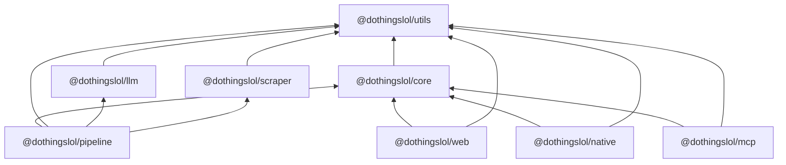

# Eventyr monorepo plan

Status: **revision 3. Awaiting your agreement.** It includes your answers of 2026-09-25 and the
package split you asked for (utils / llm / scraper / pipeline). No source files have been moved.
Discovery was done against `main` at `99b3b62`.

The goal is to turn this single-package repo into a pnpm workspace with a clean, acyclic package
graph. A React Native (Expo) app then gets full parity with the website (fetch, display, filter,
personalise, notify), and it shares logic with the web instead of keeping its own copy.

The work lands as **two pull requests**, each executed as a series of sub-phases:

- **PR 1, monorepo refactor (1.1–1.13).** Workspace tooling, then the shared packages (`core`, `utils`, `llm`, `scraper`), then moving the web, pipeline and MCP into `apps/`, then restructuring the pipeline around a config file and exported stage functions.
  - **No functional change** (D1), except the requested workflow changes in 1.10: WhatsApp removed, Byron added.
  - Model calls and scraper output are proven identical by parity harnesses.
- **PR 2, React Native and Expo app (2.1–2.9).** Also carries the web changes the app depends on: React 19, the public data feed, device-time display, taste model v2, and a Settings page.

Each `phase-N.MM-*.md` file starts with a handoff block you can paste into a fresh Claude Code
session. A sub-phase session reads only this file and its own sub-phase file.

---

## 0. Decisions

| # | Topic | Decision | Where it lands |
|---|---|---|---|
| D1 | LLM providers | Keep Gemini for most work, because it is cheaper. **The refactor must not change functionality.** Every stage keeps its current model, prompt and parameters; D11 only makes switching a config edit. | Parity harness in 1.6 and 1.7 |
| D2 | WhatsApp | Remove it | 1.10 |
| D3 | Server push | None. Only local notifications, for events the user has liked | 2.8 |
| D4 | Platforms, bundle ID | iOS and Android together, `lol.dothings.app` | 2.9 |
| D5 | Byron | Add it to the weekly run | 1.10 |
| D6 | Native storage identity | Keyed by `eventHash`. Web keeps `eventId`, and core functions take a `keyOf` | 1.4, 2.5+ |
| D7 | Time zone | Always shown in the device's time zone | 2.3, 2.5 (§8) |
| D8 | Analytics and donations in the app | Neither | 2.9 |
| D9 | PR structure | One PR for the monorepo, one for native, each with sub-phases | §4 |
| D10 | Settings | Notifications toggle with an explanation, per-tag +/−, theme, a visible taste profile you can override, and an auto-learn opt-out with a privacy note | §7. Web 2.3, native 2.8 |
| D11 | **Package split** (new request) | `@dothingslol/utils`, `@dothingslol/llm` (one `ask()` for every provider), `@dothingslol/scraper` (`scrape()` plus `/parsers`), and `@dothingslol/pipeline` (exported stage functions, `config/` YAML for models and tunables). No relative imports across packages. Files may be split. | §2, 1.5–1.8, 1.11 |
| D12 | **Byron time zone** (my proposal, needs your OK) | `sources/byron.yml` says `timezone: Australia/Brisbane`, and `src/adapters/dates.ts:23` hard-codes UTC+10. Byron Bay is in NSW, which switches to daylight saving on 4 Oct 2026. Once Byron is in the weekly run, every scraped Byron time would be an hour off for half the year. Fix this in 1.10: set `Australia/Sydney` and make parsing DST-aware. It only changes Byron, because the Queensland cities have no DST, and the parity harness proves that. | 1.10 |

**Assumption on D10:** Settings and taste v2 ship on **both** web and native. The taste model lives in `core`, and running v1 and v2 side by side would rank events differently per platform. Tell me if you want native-only.

---

## 1. Discovery summary

### 1.1 Corrections to the original brief

| The brief said | The code says |
|---|---|
| LLM curation uses the Claude API | Curation, ranking, dedupe, venue matching, extraction and annotation all run on **Gemini** (`src/providers/gemini.ts`). `@anthropic-ai/sdk` is only an optional search provider, and it is off by default (`PROVIDERS=google,perplexity`). |
| WhatsApp notifications | `src/messaging.ts` works, but the `digest.yml` step is `if: false`. The only notifications users get today are browser-local PWA reminders. |
| JSON that the site reads | The site **never fetches JSON at runtime**. Astro `readFileSync`s `data/*.json` at build time into island props. The only public JSON is `/ai/*`, and it is lossy (no tags, score, vibes, `venue_name` or image). **There is no URL a native app can fetch today** (fixed in 2.2). |
| Brisbane only | Four cities. `byron` isn't in `weekly.yml`, so its data is stale, and its time zone is wrong (D12). |

### 1.2 Modules, the import graph, and why it's spaghetti

About 13.7k lines of TS/TSX, with a single `package.json`. Pipeline scripts run with `tsx` +
`tsconfig.scripts.json` (NodeNext). The site uses `tsconfig.json` (bundler resolution, alias
`@react/*` → `app/*`).

| Hub or knot | Evidence | Resolution |
|---|---|---|
| `src/common.ts` (33 importers) | Mixes filesystem/YAML config, the path layout (`PROJECT_ROOT` = `dirname(import.meta.url)/..`), the `INTERESTS` prompt, pure date helpers (353–383), fuzzy dedupe (482), and a re-export of `shared.ts` | Dissolved in 1.11 into `pipeline/config/*`, `config/interests.md`, `core`, `utils` |
| `src/providers/base.ts` (15 importers) | It's the search-provider base class, and also the general utility module. `mapWithConcurrency`, `chunkArray` and `parseJsonArray` are imported from it by `enrichTimes.ts:39`, `collect.ts:28`, `discover.ts:40`, `locality.ts:38`, `venues.ts:39` and `rank.ts:14`. Its `collect()` writes pipeline files (`:195-231`). | Utilities → `utils` (1.5), JSON repair → `llm` (1.6), search strategies → `pipeline/search` (1.7/1.11) |
| `src/providers/gemini.ts` (15 importers) | The only model wrapper: limiter, 429 backoff, `GEMINI_MAX_CALLS` budget, a price table covering all four providers, usage accounting. It also imports `DATA_ROOT`/`getWeekRange`, reads `process.env.CITY` (`:344`), and writes `data/{city}/usage/*.json`. | The generic parts → `llm`. Usage persistence → `pipeline`, through an injected sink (1.6) |
| Nine `geminiText(ai, {...})` call sites | `providers/google.ts:30,102`, `venues.ts:372`, `rank.ts:189`, `adapters/discover.ts:212`, `adapters/llmExtract.ts:105`, `adapters/annotate.ts:117`, `adapters/probe.ts:1526`, `dedupeClassifier.ts:64`. Model literals are scattered across 9 files. Options used: `systemInstruction`, `search` (Google grounding), `maxOutputTokens`, `temperature`, `extraConfig` (`responseMimeType: application/json`, `thinkingBudget: 0`, `thinkingLevel: low`). Each call returns the text. | All of them become `ask()`/`askJson()` (1.6). Models move to `pipeline.yml` (1.11). |
| Three other SDKs | `anthropic.ts` (`claude-sonnet-5`, `web_search_20250305` tool), `openai.ts` (`gpt-5-mini`, with a `gpt-5` branch, `web_search` tool with `search_context_size: low`), `perplexity.ts` (`sonar-pro` through the openai SDK at `api.perplexity.ai`) | Their transport → `llm/providers/*`. Their prompts and parsing → `pipeline/search/*` (1.7) |
| `src/adapters/` mixes scraping, LLM and domain code | Deterministic scraping (fetch, feeds, JSON-LD, hydration JSON, readable text, dates, render) sits next to LLM steps (`llmExtract`, `annotate`, `discover`, parts of `probe`) and domain mapping (`normalise`, `registry`) | Scraping → `scraper` (1.8). LLM and domain code → `pipeline` |
| Curate reaches into the scraper | `curate.ts:10` imports `adapters/annotate.ts` (and so `@google/genai`) for one regex. `curate.ts:11-16` uses `normalise.ts`. The publishing window is implemented twice (`collect.ts:83`, `curate.ts:66`). | 1.11 |
| Node code leaks into the site | `src/pages/[city]/[timeframe].astro:10` imports `common.ts` (and so `node:fs` and js-yaml) | 1.2 |
| The MCP Worker uses relative imports | `workers/mcp` imports `../../../src/shared.ts` and `../../../app/utils/dates.ts`. CI never builds it. | 1.2, 1.3, 1.12 |
| CLI and library are mixed | Every stage is a script with top-level work or a basename-keyed main guard (`ai.ts:664`, `rss.ts:184`, `venues.ts:493`, …). Some read `CITY` from the environment at import time. | Stage functions plus thin `cli/` entrypoints (1.11) |

### 1.3 Event types and schemas

- **No pipeline event type.** Every stage uses `Record<string, unknown>`. The shape is implicit in `adapters/normalise.ts:188-215`.
- **`app/types.ts` is the only full declaration**, and it drifts from what the pipeline really produces: `score` is marked required and vibes optional, and `City` uses `key`/`name` where the payload uses `city_key`/`city`.
- **Re-declared types:**
  - The payload is re-declared in `rss.ts:22` and `ai.ts:77/90`.
  - `CompactEvent` is copied into `workers/mcp/src/dothingsClient.ts:10-65`.
  - Source config has three separate views: `common.ts:133`, `adapters/types.ts:36`, `shared.ts:1089`.
- **Validation** is hand-rolled. zod appears only in the MCP Worker.
- **Two identities:**
  - `eventHash` is frozen. It feeds iCal UIDs, RSS guids, share links and `#cal=`.
  - The web's saved sets use `eventId()` = title + `datetime_iso`.
- **Display** uses the pipeline's city-local `datetime` string (`app/utils/dates.ts:116`). "Today" uses the device date.
- **Two week conventions,** both intentional: `getWeekRange` (Sunday → next week) and `startOfWeek` (Sunday → previous Monday).
- **Two ICS builders:** `src/ical.ts` and `app/utils/ics.ts`, with UIDs pinned equal by a test.

### 1.4 Data

- **Written by the pipeline:** `data/{city}.json` (1.7 MB for Brisbane), `data/index.json`, and working state under `data/{city}/`.
- **Committed:** all of the above, except `_raw`, `_cache`, `_probe` and `adapters/rejected/`. About 8 MB in total; `.git` is also 8 MB.
- **Generated and committed**, because `deploy.yml` only runs `astro build`:
  - `public/{cityKey}.ics`, `public/{slug}/e/*.ics`, `public/{slug}/feed.xml`
  - `public/sitemap.xml`, `public/ai/**`, `public/llms.txt`
  - root `{CITY}.md`
- **Public URLs:** `/ai/index.json`, `/ai/{slug}/{date}.json`, `/ai/{slug}/week-{monday}.json`, `/{slug}/feed.xml`, `/{cityKey}.ics`. None of them carry a schema version.

### 1.5 GitHub Actions

| Workflow | Trigger | Summary |
|---|---|---|
| `weekly.yml` | cron `0 20 * * 6` (Sunday 06:00 AEST), dispatch | Runs `digest.yml` for brisbane → goldcoast → sunnycoast (Byron is added in 1.10) |
| `digest.yml` | `workflow_call` + dispatch | 1. pnpm 9 install, tsc ×2, tests<br>2. Cache `data/_cache`/`_raw`, set up chrome<br>3. collect-adapters, collect, curate, dedupe-venues<br>4. `src/rank.ts`, `src/geocode.ts`, `src/markdown.ts`, `src/ical.ts`, rss, `src/pages.ts`, build-ai, build<br>5. `git add` the paths in §1.4, commit, `pull --rebase -X theirs` + push (3 tries)<br>WhatsApp step is `if: false`. `concurrency: digest`, `TZ=Australia/Brisbane` |
| `digest-manual.yml` | dispatch | Calls `digest.yml` (has a `recipient` input) |
| `add-city.yml` | dispatch | `src/add_city.ts` → discover → probe → commit `sources/` (and `digest.yml` with `ADD_CITY_PAT`) → digest |
| `reprobe.yml` | cron `0 3 3 * *` | Probe loop, `src/adapters/triage.ts`, render-sources, commit `sources/` |
| `deploy.yml` | push to `main`, dispatch, `workflow_run` (weekly), cron `18 18 * * *` | `withastro/action@v3` (`pnpm@9`), then `deploy-pages@v4` |

There is no PR CI. `pnpm check` only runs inside `digest.yml`.

### 1.6 Tooling

- Node 22.14.0, pnpm 9 (lockfile v9), TypeScript 5.9.3, Astro 6.3.7, React 18.3.1, Biome 2.4.15, tsx 4.22. `workers/mcp` has its own lockfile.
- Tests use `node:test` via tsx: 29 under `src/`, 13 under `app/`, 2 in `workers/mcp`. `src/locality.test.ts:181-229` writes into the real `DATA_ROOT`.
- The pre-commit hook runs `pnpm build` when web paths are staged.
- **Hard-coded paths:**
  - `PROJECT_ROOT` (`common.ts:9-17`)
  - `process.cwd()` in 7 page files and `organizers.ts:19`
  - writes into `public/`: `ai.ts:69,563,581,617,654`, `ical.ts:212,258`, `rss.ts:174`, `pages.ts:129`
  - `add_city.ts:21`
  - every `package.json` script and the workflow paths listed above
- There are **211** module-level SCREAMING_CASE constants across the pipeline, not counting prompts, regexes and prices (§2.6).

### 1.7 Uncertain

- Whether `force=false` digests skip *every* paid call. collect-adapters and venues are unconfirmed.
- Whether any legacy `*/raw/*.json` writer still exists.
- Whether GitHub Pages serves AASA with a content type that iOS accepts (2.9).
- How Hermes handles `Intl` and `URL` (2.4).
- Whether expo-router passes URL fragments (`#cal=`) through (2.7).
- The exact per-provider concurrency today: the Gemini limiter clearly covers `geminiText`, but whether the other three SDKs share it is still to be inventoried in 1.6.

---

## 2. Package layout

### 2.1 Your proposed split, evaluated

| Proposed | Verdict | Adjustments and reasoning |
|---|---|---|
| `@dothingslol/utils` | **Adopt**, with a strict scope | Generic, domain-free, **Node-free** helpers only: concurrency, chunking, sleep and backoff, text and URL cleaning, time-zone offsets. The risk is that `utils` becomes the new `common.ts`, so the rule is: *if it knows what an event, a city, a source or a model is, it doesn't belong here.* Enforced in review, plus a Biome `noNodejsModules` override. |
| `@dothingslol/llm` with `ask()` | **Adopt**, with an extended options object (§2.4) | `ask(prompts, { provider, model })` alone can't express what the nine call sites use today: system prompt, search grounding, JSON mode, thinking level, output cap, temperature, the accounting stage. Without those, the parity guarantee in D1 fails. So the options object is `LLMProvider & AskOptions`. String in, string out stays exactly as you sketched, because that's what every call site consumes today. |
| `@dothingslol/scraper` with `scrape()` and `/parsers` | **Adopt**, LLM-free | `scrape()` runs the deterministic ladder: feed, then JSON-LD, then hydration JSON. The **LLM rung is injected** as a `fallback` callback that the pipeline wires to `llm`. That keeps the scraper testable without keys and makes "deterministic before model" structural. The parser names map to what exists (§2.5). There's no RSS parser today, so `parseRss` isn't invented; adding it would be new functionality. |
| `@dothingslol/pipeline` with stage functions and `config/*.yml` | **Adopt** | Stage functions take a `RunContext`, and thin `cli/` files replace the basename main guards. `config/pipeline.yml` holds models per stage plus operator tunables. **Not every constant moves**; §2.6 gives the rule and the reasoning. |
| "Node-specific things live in pipeline" | **Refined** | `llm` and `scraper` are Node-only too: API keys, `got-scraping`'s TLS/HTTP2 fingerprinting, Playwright. The real rule is **web and native may depend only on `core` and `utils`**. That is enforced by the dependency table below and by `noNodejsModules` on those two packages. |
| *(from revision 2)* `@dothingslol/core` | **Keep** | This is the domain package that web, native, MCP and the pipeline share: event schema, identity, filters, search, grouping, taste v2, dates/`when`, calendar/ICS, reminders, the feed contract, and the source-config schema. It is one package with subpath exports. Splitting it further (schema/taste/filters) would add configuration without adding independent consumers. |

### 2.2 End state

```
eventyr/
├── packages/                         (libraries)
│   ├── utils/     @dothingslol/utils     node-free, domain-free helpers
│   ├── core/      @dothingslol/core      node-free, React-free domain logic shared by web/native/mcp/pipeline
│   ├── llm/       @dothingslol/llm       ask()/askJson()/askMany(), providers, limiter, budget, pricing, replay
│   └── scraper/   @dothingslol/scraper   scrape(), fetcher, parsers, render (optional Playwright)
├── apps/                             (deployables / executables)
│   ├── pipeline/  @dothingslol/pipeline  stage functions + cli/ + config/pipeline.yml + config/interests.md
│   ├── web/       @dothingslol/web       Astro site → GitHub Pages
│   ├── mcp/       @dothingslol/mcp       Cloudflare Worker
│   └── native/    @dothingslol/native    Expo app (PR 2)
├── data/  sources/  BRISBANE.md …    unchanged locations (data is not a package)
├── scripts/       setup-hooks.mjs, site-fingerprint.sh, filter-parity.mjs, llm-parity.mjs, scrape-parity.mjs, check-boundaries.mjs
├── package.json   root: scripts only (check + proxies so `pnpm collect` etc. still work)
└── pnpm-workspace.yaml  tsconfig.base.json  biome.json
```

### 2.3 Allowed dependencies. This is the only graph `check-boundaries.mjs` accepts

| Package | May depend on (workspace) | Runtime |
|---|---|---|
| `utils` | — | any (no `node:`) |
| `core` | `utils` | any (no `node:`, no React) |
| `llm` | `utils` | Node |
| `scraper` | `utils` | Node |
| `pipeline` | `core`, `utils`, `llm`, `scraper` | Node |
| `web` | `core`, `utils` | browser + Astro build |
| `native` | `core`, `utils` | Hermes |
| `mcp` | `core`, `utils` | Workers |



**The graph has no cycles.** `utils` is the only sink. `core`, `llm` and `scraper` depend only on `utils`, and no app depends on another app.

`scripts/check-boundaries.mjs` (added in 1.2, extended as each package appears) fails on three things:
- any dependency that isn't in this table
- any relative import that crosses a package root
- any deep import past a package's `exports`

The only non-package coupling is data flow:
- pipeline → `data/` and `apps/web/public/…`, through one constant (`WEB_PUBLIC_DIR`)
- web ← `data/`, `sources/` at build time
- native ← `https://www.dothings.lol/data/v1/*`
- mcp ← `/ai/*`

### 2.4 `@dothingslol/llm` API

```ts
export type GeminiModel = "gemini-3.1-flash-lite" | "gemini-3.5-flash";
export type AnthropicModel = "claude-sonnet-5" | "claude-haiku-4-5";
export type OpenAIModel = "gpt-5" | "gpt-5-mini";
export type PerplexityModel = "sonar-pro";
// Unions are derived from the price table (one source of truth), so an unpriced model can't be selected.
export type LLMProvider =
  | { provider: "gemini"; model: GeminiModel }
  | { provider: "anthropic"; model: AnthropicModel }
  | { provider: "openai"; model: OpenAIModel }
  | { provider: "perplexity"; model: PerplexityModel };

export interface AskOptions {
  stage?: string;               // usage-accounting bucket ("rank", "probe/extract"); default "default"
  system?: string;              // stable instructions → the provider's system prompt
  search?: boolean;             // Gemini googleSearch · Anthropic web_search · OpenAI web_search · Perplexity (always on)
  json?: boolean;               // JSON output mode where the provider has one
  thinking?: "off" | "low" | "default";   // gemini: thinkingBudget 0 / thinkingLevel "low"
  maxOutputTokens?: number;
  temperature?: number;
  cache?: { version: string };  // content-addressed response cache (store injected via configureLLM); was adapters/extractionCache
  providerOptions?: Record<string, unknown>;  // verbatim escape hatch (e.g. anthropic max_uses, openai search_context_size)
}

export function ask(prompts: string | string[], opts?: LLMProvider & AskOptions): Promise<string>;
// default: { provider: "gemini", model: "gemini-3.1-flash-lite" }
export function askJson<T>(prompts: string | string[], opts: LLMProvider & AskOptions & { schema?: ZodType<T> }): Promise<T>;
// json: true + truncation-tolerant parse (was parseJsonArray) + optional zod validation; an empty answer to a
// non-empty prompt is a failure and retried once (CLAUDE.md "An empty result is not an answer")
export function askMany(batch: (string | string[])[], opts: LLMProvider & AskOptions): Promise<PromiseSettledResult<string>[]>;
// independent prompts through the same shared limiter, results in input order

export function configureLLM(c: {
  keys?: Partial<Record<LLMProvider["provider"], string>>;        // default: GOOGLE_API_KEY, ANTHROPIC_API_KEY, …
  concurrency?: Partial<Record<LLMProvider["provider"], number>>;
  maxCalls?: number;                                               // was GEMINI_MAX_CALLS
  usage?: UsageSink;                                               // pipeline persists to data/{city}/usage
  cacheStore?: CacheStore;                                         // pipeline provides a file store under data/_cache
  replay?: { dir: string; mode: "record" | "replay" };             // offline parity/test harness
}): void;
export const MODELS: readonly LLMProvider[];       // runtime registry, used to validate pipeline.yml
export { PRICES, estimateUsd, BudgetExhaustedError, LLMUnavailableError };
```

Your sketch is kept: `ask()` takes prompts and resolves to a string, it defaults to Gemini Flash Lite, and you import it with `import { ask, type LLMProvider } from '@dothingslol/llm'`. Design points:

- **One shared client per process.** The module-level singleton behind `ask` owns the per-provider limiters, the budget and the usage counters. CLAUDE.md says "caps that cannot see each other add up", and a single instance is what makes the caps real. `configureLLM` is called once by the pipeline's CLI bootstrap.
- **`prompts: string[]`** means ordered parts of **one** request, stable parts first and the variable payload last:
  - Gemini: `parts[]`
  - Anthropic: content blocks, with a `cache_control` breakpoint after the last stable part
  - OpenAI: input parts
  - Perplexity: joined

  **In PR 1 every call site passes a single string**, because that's what they send today, and the parity harness requires identical content. Splitting prompts into parts to earn cache hits is a per-call-site follow-up that can be measured. If you meant `prompts[]` as a *batch* of separate questions, that is `askMany`.
- **Prompt caching and batching.** Gemini and OpenAI cache identical prefixes implicitly, and Anthropic needs explicit breakpoints (added from the `string[]` form). Batching is already done the CLAUDE.md way: several items per prompt, concurrent batches under the limiter.
  - Provider **Batch APIs** (async, up to about 24 hours) don't fit a 20-minute digest job, so they are left out.
- **Degrade, don't die.** A missing key throws `LLMUnavailableError`, and callers keep their current fallback behaviour.
- **The provider stays swappable, but not for free.** Changing `models.rank` to Claude is a one-line config edit. The prompts, though, were tuned against Gemini, so any switch needs its own evaluation. D1 keeps every stage where it is.

### 2.5 `@dothingslol/scraper` API

```ts
export function scrape(url: string, opts: ScrapeOptions): Promise<ScrapeResult>;
export interface ScrapeOptions {
  timeZone: string;                          // IANA; replaces the hard-coded +10 (D12). Default "Australia/Brisbane"
  strategy?: "html" | "jsonld" | "render";   // from sources/{city}.yml
  fetcher?: Fetcher;                         // default: shared got-scraping fetcher (rate limits, conditional GET)
  fallback?: (page: PageText) => Promise<RawCandidateFields[]>;  // LLM rung, injected by pipeline
  maxEvents?: number;                        // hostile-input cap, default 2500 (was MAX_EVENTS_PER_FEED)
}
export interface ScrapeResult {
  url: string; finalUrl: string;
  status: "ok" | "not-modified" | "blocked" | "failed";      // "nothing there" ≠ "failed to look"
  via: "feed" | "jsonld" | "embedded" | "fallback" | null;
  candidates: CandidateEvent[]; rejected: Rejected[]; diagnostics: Diagnostics;
}
export { createFetcher, type Fetcher, type HttpCacheStore } from "./fetch";   // cache store injected (pipeline: data/_cache)
export { enrichFromDetailPage } from "./enrich";
// @dothingslol/scraper/parsers — pure, no network:
export { parseFeed, parseIcal, parseTrumbaJson, parseTrumbaAtom, parseJsonLd, parseEmbeddedJson,
         htmlToText, feedUrlsFromHtml, parseDateRange, parseDateTime } from "./parsers";
// @dothingslol/scraper/render — Playwright as an optional peer, loaded lazily; absent → degrade with a warning (as today)
```

`CandidateEvent` is the scraper's own generic type. Mapping it onto the domain `Event` (`normalise.ts`)
is the pipeline's job. The scraper doesn't know about `data/`, cities, `sources/*.yml` or the
environment. Everything it needs comes in through options.

### 2.6 `@dothingslol/pipeline`: stage functions and config

```ts
// apps/pipeline/src/index.ts: every stage is a function; cli/*.ts are thin wrappers (env/argv → RunContext → stage)
export interface RunContext { city: CityConfig; week: WeekRange; paths: Paths; config: PipelineConfig; force: boolean; log: Logger }
export { collectScraped } from "./stages/collectScraped";   // was adapters/collect.ts  (scrape() per scraper source)
export { collectSearch } from "./stages/collectSearch";     // was collection.ts        (ask({search:true}) per tier)
export { curate } from "./stages/curate";
export { dedupe } from "./stages/dedupe";
export { annotate } from "./stages/annotate";
export { canonicaliseVenues } from "./stages/venues";
export { rank } from "./stages/rank";
export { geocode } from "./stages/geocode";
export { publishMarkdown, publishIcal, publishRss, publishPages, publishAiFeed } from "./publish";
export { addCity, discoverSources, probeSources, renderSources, triage, testUrl } from "./sources";
```

There is no per-URL `collectLLM(url)`, because LLM collection today is one grounded web search per
source tier and not one per URL. Per-URL LLM extraction is the scraper's injected `fallback`. The
names above describe what each function actually does.

**`apps/pipeline/config/pipeline.yml`.** It is validated with zod at load, and model entries are
checked against `llm`'s `MODELS`. The values below are today's, taken from the call sites:

```yaml
models:
  search:            # collectSearch, per provider
    google:     { provider: gemini,     model: gemini-3.1-flash-lite }
    anthropic:  { provider: anthropic,  model: claude-sonnet-5 }
    openai:     { provider: openai,     model: gpt-5-mini }
    perplexity: { provider: perplexity, model: sonar-pro }
  searchCurate:  { provider: gemini, model: gemini-3.1-flash-lite }   # GoogleProvider.curate over every provider's output
  extract:       { provider: gemini, model: gemini-3.1-flash-lite }   # scraper fallback (llmExtract)
  annotate:      { provider: gemini, model: gemini-3.1-flash-lite }
  dedupe:        { provider: gemini, model: gemini-3.1-flash-lite }
  probe:         { provider: gemini, model: gemini-3.1-flash-lite }
  venues:        { provider: gemini, model: gemini-3.5-flash }
  rank:          { provider: gemini, model: gemini-3.5-flash }
  discover:      { provider: gemini, model: gemini-3.5-flash }
llm:        { concurrency: { gemini: …, … }, maxCalls: … }     # values copied from gemini.ts / providers in 1.11
scrape:     { … per-host rate limit, timeouts, retries … }
stages:     { rank: { batchSize: … }, dedupe: { … }, … }
publish:    { aiWeekSplitBytes: 200000, … }
```

Environment variables that workflows already set (`PROVIDERS`, `ANTHROPIC_TIERS`, `GEMINI_MAX_CALLS`,
`FORCE`, `CITY`, `CHROME_PATH`) keep working. They override the config, so `digest.yml`'s interface
doesn't change. `INTERESTS` moves to `config/interests.md`, loaded byte-for-byte. It is the cached
prompt prefix and the input to rank-reuse keys, so a whitespace change would invalidate caches.

**Which of the 211 constants move to config.** A constant moves if an operator might tune it
without changing code:

- models
- concurrency ceilings
- call budgets
- batch sizes
- timeouts
- retry counts
- per-host rate limits
- cost-driving top-N limits
- the publishing window

A constant **stays in code**, next to its "why" comment, if it is any of:

- a safety cap against hostile input (`MAX_EVENTS_PER_FEED`, response-size caps)
- a format or protocol fact (API field names, tool versions like `web_search_20250305`)
- a regex or prompt
- a value shared with web or native (`TOP_PICK_THRESHOLD`, `LOW_SCORE_THRESHOLD`, `CATEGORIES`). These live in `core`, because the browser bundle can't read a pipeline YAML.

Moving all 211 would separate each threshold from the measurement that justified it, and would make
`llm` and `scraper` depend on pipeline config. Those packages keep code defaults and accept
overrides. 1.11 produces the classified inventory, and a snapshot test proves every moved value is
unchanged.

### 2.7 Where every current module goes

| Today | Target | Sub-phase |
|---|---|---|
| `src/shared.ts`, `app/types.ts` | `core/shared.ts`, `core/schema.ts` | 1.2 |
| `app/utils/*` (pure halves), `eventId` | `core/*` | 1.3 |
| `useMemo` bodies in `app/context.tsx` | `core/filters.ts` | 1.4 |
| `src/text.ts`; `mapWithConcurrency`, `chunkArray` (`providers/base.ts`); sleep/backoff math | `utils/text.ts`, `utils/concurrency.ts`, `utils/time.ts` | 1.5 |
| `providers/gemini.ts` (wrapper, limiter, budget, prices, backoff); `parseJsonArray`; `adapters/extractionCache.ts` (as injected cache) | `llm/*` | 1.6 |
| `usagePath`/`persistUsage`/`reportGeminiUsage` | pipeline `io/usage.ts` (a `UsageSink`) | 1.6 |
| The nine `geminiText` call sites | `ask`/`askJson` | 1.6 |
| SDK transport in `providers/{anthropic,openai,perplexity,google}.ts` | `llm/providers/*` | 1.7 |
| `BaseProvider`, tiers, search prompts, `parseEvents`, curated-file writing | pipeline `search/*` | 1.7 (moved in 1.11) |
| `adapters/{fetch,feeds,extract,embeddedJson,readableText,dates,candidate,pageAdapter,runner,enrichTimes}`, the browser half of `render.ts`, scrape types from `adapters/types.ts` | `scraper/*` | 1.8 |
| `app/`, `src/pages`, `src/layouts`, `public/`, `astro.config.mjs`, `src/organizers.ts` | `apps/web/**` | 1.9 |
| `src/messaging.ts` | deleted | 1.10 |
| All remaining `src/**` | `apps/pipeline/src/**` | 1.10 |
| `common.ts` → `config/{paths,city,week,env}.ts` and `config/interests.md`; source-config schema (three views) → `core/sources.ts`; `registry.ts`, `normalise.ts`, `llmExtract.ts`, `annotate.ts`, `probe`/`discover`/`triage`/`testUrl`, the source-promotion half of `render.ts`, all stages, publish | pipeline `config/`, `stages/`, `search/`, `publish/`, `sources/`, `io/`, `cli/` | 1.11 |
| `workers/mcp` and its copied AI-feed types | `apps/mcp`, `core/aiFeed.ts` | 1.12 |

---

## 3. Tooling decisions

| Decision | Pick | Trade-offs and evidence |
|---|---|---|
| Package manager | **pnpm 11.x**, pinned via `packageManager`; workspaces + catalogs | 12.6 is a four-week-old Rust rewrite whose settings and lockfile carry over from 11. pnpm 11 requires `allowBuilds`, fails on unapproved build scripts, and waits a day before installing new releases; 1.1 deals with all of that before any moves. Sources: pnpm.io release posts, npm registry. |
| Linker | **`isolated`**, falling back to `hoisted` only if an RN library needs it | Expo supports isolated installs from SDK 54 (docs.expo.dev/guides/monorepos). |
| Versions | **Catalogs** for react/react-dom/@types, typescript, tsx, zod | React is pinned exactly to the Expo SDK's version from 2.1. |
| Task runner | **None** (`pnpm -r`, `--filter`) | The costly steps are LLM calls and `astro build`, and Turbo can't cache source-only packages (turborepo.dev). Revisit if PR CI regularly exceeds about 5 minutes. |
| TypeScript | **Stay on 5.9.x.** `tsconfig.base.json` plus one tsconfig per package, **no project references**. All packages are just-in-time source packages: explicit `exports` map to `.ts` files, with no build step. | TS 7 has no API yet, so Astro tooling doesn't support it (withastro/astro#16112). tsx, Vite and Metro compile workspace source. 1.2 verifies tsx and Vite; 2.4 verifies Metro. |
| React Native | **Expo managed + CNG, expo-router, EAS**, on the latest stable SDK when 2.1 runs (SDK 57 today: RN 0.86.3, React 19.2.3) | Metro auto-configures monorepos (SDK 52+). Never pin RN or React by hand; use `expo install --fix`, with `expo install --check` and `expo-doctor` in CI. |
| React on web | **19.2.x** (2.1) | `@astrojs/react@5` and `lucide-react@0.469` accept `^19`. Astro 7 is out of scope. |
| Lint/format | **One root `biome.json`**; `noNodejsModules` override on `utils` and `core` | — |
| Deploy | **Explicit steps** replace `withastro/action` (1.1). The Pages artifact must keep dotfiles (`.well-known`). | `withastro/action` looks for the lockfile inside `path`. |
| PR CI | **New `ci.yml`** (1.1): `pnpm check` + web build + MCP dry run; native job added in 2.4 | — |

---

## 4. Delivery

### 4.1 PR 1: monorepo refactor (branch `monorepo/refactor`)

| Sub | File | Summary |
|---|---|---|
| 1.1 | `phase-1.01-workspace-tooling.md` | Open the draft PR. pnpm 11, workspace, catalogs, `allowBuilds`, `ci.yml`, explicit deploy steps, site fingerprint. No moves. |
| 1.2 | `phase-1.02-core-package.md` | `packages/core` ← `shared.ts`, `app/types.ts`. Fix the Astro → `common.ts` leak. Boundary check encodes §2.3. |
| 1.3 | `phase-1.03-core-logic.md` | Pure `app/utils/*` → core, splitting each file into its pure half and its browser half. Retarget the MCP Worker. |
| 1.4 | `phase-1.04-core-filters.md` | Browser characterisation (`filter-parity.mjs`), then `context.tsx` filters → `core/filters.ts` with `keyOf` |
| 1.5 | `phase-1.05-utils-package.md` | `packages/utils` ← `text.ts`, concurrency, chunking, backoff math. Rewire every importer. |
| 1.6 | `phase-1.06-llm-package.md` | Record/replay seam on the old wrapper, then `packages/llm` (Gemini provider, limiter, budget, prices, cache, replay). Migrate all nine `geminiText` call sites to `ask`/`askJson`. Requests must match byte for byte. |
| 1.7 | `phase-1.07-llm-search-providers.md` | Anthropic, OpenAI and Perplexity transports (plus Gemini grounded search) move into `llm`. `BaseProvider` becomes a search strategy calling `ask({ search: true })`. Requests must match. |
| 1.8 | `phase-1.08-scraper-package.md` | Scraping → `packages/scraper` (`scrape()`, `/parsers`, `/render`), with the LLM rung injected. Output must match on recorded pages. |
| 1.9 | `phase-1.09-web-move.md` | `git mv` the site into `apps/web`. Repo-root resolver. Pipeline writes to `apps/web/public`. Update the digest add-list, deploy path and hook. |
| 1.10 | `phase-1.10-pipeline-move.md` | Remove WhatsApp (D2). `git mv` the rest of `src/` → `apps/pipeline`. Re-anchor `PROJECT_ROOT`. Root proxy scripts; workflows call `pnpm <script>`. Byron joins `weekly.yml` (D5). Byron time-zone fix (D12). |
| 1.11 | `phase-1.11-pipeline-restructure.md` | Dissolve `common.ts`. `config/pipeline.yml` + `interests.md`. Stage functions + `cli/`. Directories `config/ stages/ search/ publish/ sources/ io/ cli/`. Source schema → core. |
| 1.12 | `phase-1.12-mcp-move.md` | `workers/mcp` → `apps/mcp`. Shared AI-feed types in core. |
| 1.13 | `phase-1.13-merge-and-verify.md` | Merge `main` in and run the full parity suite against `main`. Mark the PR ready. Merge, then run the post-merge runbook. |

**Why this order:**
- The shared packages (1.2–1.8) are extracted while the web and pipeline stay where they are, so every extraction is checked against unmoved consumers.
- The two moves that touch bot-written paths (1.9, 1.10) come late, which shortens the window in which weekly data commits to `main` conflict with the branch (R9).

**Size warning.** PR 1 now touches nearly every file. The mitigations:
- Each sub-phase is its own set of commits, with verification results posted on the PR.
- Pure-rename commits are kept separate from edit commits.
- The PR is merged with a merge commit (§4.3), so reviewers can go commit by commit.

If you'd rather review in two halves, the natural cut is after 1.8 (packages) and before 1.9 (moves and restructure). You asked for one PR, so the plan assumes one.

### 4.2 PR 2: React Native + Expo (branch `native/app`, from `main` after PR 1 merges)

| Sub | File | Summary |
|---|---|---|
| 2.1 | `phase-2.01-react-19.md` | Web → the Expo SDK's React 19 |
| 2.2 | `phase-2.02-data-feed.md` | zod schemas and `toFeed()` in core. `/data/v1/index.json` and `/data/v1/{slug}.json` |
| 2.3 | `phase-2.03-shared-behaviour-web.md` | Device-time display, taste v2 plus migration, web `/settings/` |
| 2.4 | `phase-2.04-native-scaffold.md` | Expo app, Hermes core spike, feed client, city picker, native CI |
| 2.5 | `phase-2.05-native-display.md` | Sections/grouping, card, detail, like, share, maps, calendar, theme |
| 2.6 | `phase-2.06-native-filters.md` | Every filter, search, presets and deep links |
| 2.7 | `phase-2.07-native-personalisation.md` | Taste signals, hide/unhide, action sheet, swipe, saved calendar, `#cal=` + QR, ICS export |
| 2.8 | `phase-2.08-native-settings-notifications.md` | Settings screen, local notifications |
| 2.9 | `phase-2.09-native-release-and-merge.md` | Release config, merge, post-merge runbook |

### 4.3 Branch rules for every sub-phase session

- **Stay on the branch.** Work on the PR branch named in the handoff, even if the environment suggests another. If you can't push to it, stop and ask.
- **Sync first:**
  ```bash
  git fetch origin && git checkout <branch> && git pull --ff-only
  git -c merge.directoryRenames=true merge origin/main
  ```
  After 1.9 moves `public/`, `merge.directoryRenames=true` places files that `main` added under `public/` into `apps/web/public/`. Where a generated file (feeds, `.ics`, `ai/*`, `data/*`) still conflicts, take `main`'s content at the branch's path. Never hand-merge generated output.
- **Commits.** Make one commit per numbered step where the step says so. Pure `git mv` commits contain no edits.
- **Report.** Post verification results as a **PR comment** and tick the sub-phase in the PR description.
- **Undo** a sub-phase with `git revert`. Don't force-push after review has started.
- **Merge** with **"Create a merge commit"**, not squash, so the rename history survives. To roll a PR back: `git revert -m 1 <merge>`.

### 4.4 Merge windows

- **PR 1:** merge between Sunday (after that week's digest and its deploy are green) and Friday. Never between **Saturday 18:00 and 23:00 UTC** (weekly run at 20:00 UTC; R1). Confirm the `digest` concurrency group is idle first.
- **PR 2:** any time outside that Saturday window.

### 4.5 Working state per sub-phase

Nothing reaches `main` until a PR merges. Every sub-phase still leaves its branch working:
`pnpm check` green, site builds, CI green, and the sub-phase's own parity checks pass. The deploy and
the cron only run post-merge, so each PR's last sub-phase carries a runbook. The branch-side checks
are designed to predict that runbook:

- identical site fingerprints
- identical filter behaviour
- identical publish output
- identical LLM requests
- identical scrape output
- actionlint-clean workflows

---

## 5. Parity checklist (native)

The number after each item is the sub-phase that delivers it. Web paths are shown as they are
before the moves.

### Data and navigation
- [ ] City list, including Byron. **2.4**
- [ ] Per-city events. **2.4**
- [ ] "Updated …" freshness indicator. **2.4**
- [ ] Offline: last cached feed, with a notice. **2.4**
- [ ] Category pages and timeframe pages become presets with deep links. **2.6**
- [ ] Event detail. **2.5** Contents:
  - title, image (hidden on error)
  - When / Where (maps) / Cost / Source
  - description, vibes
  - "Event website"
  - add to calendar, share
- [ ] Universal links for `/{slug}/e/{eventSlug}/` and `#cal=`. Custom scheme from **2.5**; universal links **2.9**.

### List, sections, grouping
- [ ] Sections: Saved → Picks (≤9, score ≥7, *starts* in the window, taste-ordered) → All. **2.5**
- [ ] Group by Date (Today / Tomorrow / weekday / Ongoing / Later / TBC), Category, or None, with the ±3 tier sort (§7). **2.5**
- [ ] "X of Y events match" plus the range. **2.6**
- [ ] Card. **2.5** Contents:
  - category, cost (free highlighted), title link
  - time in device time (§8), including "On now — until …"
  - venue and address, maps link
  - description expanding past 240 characters
  - score, vibes, up to 5 tags tinted by weight
  - past styling, ✦ marker
- [ ] Card actions: like, share, calendar **2.5**; not interested **2.7**. Long-press action sheet with haptics **2.7**.
- [ ] Tapping the venue, a vibe or a tag toggles that filter. **2.6**

### Filters and search (`core/filters.ts` from 1.4)
- [ ] Category **2.6**
- [ ] When: Any / Today / Tomorrow / Weekend plus a custom range, with overlap semantics **2.6**
- [ ] Time of day: Morning 5–12 / Afternoon 12–17 / Evening 17–29; untimed events drop out when a band is set **2.6**
- [ ] Past: Upcoming / Include / Only **2.6**
- [ ] Minimum score Any(4)/6+/7+/8+ (unscored events never hidden), plus "N below X hidden — Show them" **2.6**
- [ ] Vibes, with counts **2.6**
- [ ] Tags: top 18, typeahead to 60 **2.6**
- [ ] Venue **2.6**
- [ ] Search: diacritic-insensitive, token AND, one typo allowed on tokens of 4+ characters **2.6**
- [ ] Active filter strip and Clear all **2.6**
- [ ] "Unhide N hidden" **2.7**

### Personalisation and saved
- [ ] Like / unlike, persisted by `eventHash` **2.5**
- [ ] Not interested (hides the event; reversible): persisted in **2.6**, UI in **2.7**
- [ ] Taste v2 (§7): signals **2.7**, UI **2.8**
- [ ] Swipe mode **2.7**
- [ ] Saved week calendar **2.7**
- [ ] `#cal=` link plus QR (≤60), and "Save all (N)" **2.7**
- [ ] ICS export **2.7**

### Calendar and sharing
- [ ] Device calendar via `expo-calendar`, plus a Google link and `.ics` sharing, with the web's duration rules **2.5**
- [ ] Share `SITE_URL/{slug}/e/{eventSlug}/` **2.5**

### Settings (D10; web in 2.3, native in 2.8)
- [ ] Notifications on/off with an explanation
- [ ] Taste profile: tags, vibes, categories; weight, learned vs set by you, +/−, reset
- [ ] "Learn from likes and dislikes" toggle with the privacy note
- [ ] Theme: System / Light / Dark

### Notifications (local only, D3). All in **2.8**
- [ ] Permission requested on the first like or from the toggle
- [ ] Reminder 1 hour before the event (08:00 for date-only events)
- [ ] 08:00 summary of today's liked events
- [ ] Test notification
- [ ] Tapping a notification opens the event, or the saved screen for the summary

### Presentation
- [ ] System theme plus override **2.5/2.8**
- [ ] `lucide-react-native` **2.5**
- [ ] Accessibility labels, selected state, live count **2.5–2.7**

### Web-only (deliberately excluded)
- SEO blurb, FAQ, JSON-LD, sitemap, OG
- `/ai` page, MCP button, `llms.txt`, Skill (linked from Settings → About)
- PWA install, service worker
- Keyboard shortcuts and the right-click menu
- RSS/iCal subscribe links
- Rybbit and Buy Me a Coffee (D8)

---

## 6. Notifications (decided: local only)

There's no backend (D3). Notifications are scheduled on the device from liked events.

- **Shared logic.** `core/reminders` holds the pure policy (`calculate1hReminderTime`, `filterEventsForMorningDigest`, `formatMorningDigest`, `formatEventTime`, and the new `planSchedule`), so both platforms agree.
- **Web** keeps the Notification API and service worker and adds the Settings toggle (2.3).
- **Native** uses `expo-notifications` `DATE` triggers:
  - It reconciles on launch, on foreground, on like/unlike, and on feed refresh, and cancels only its own IDs.
  - The summary is one dated notification per day for the next 7 days, each carrying that day's content.
- **Limits:**
  - iOS keeps the soonest 64 pending notifications (per Apple's forums, not official docs), so the cap is 60.
  - Inexact timing on Android, so no `SCHEDULE_EXACT_ALARM`.
  - Android 13+ needs the runtime permission.
- **Dropped:** WhatsApp, Expo Push and token storage, background refresh (a follow-up).
- **No new infrastructure.** Release still needs Apple Developer, Google Play and Expo accounts.

---

## 7. Settings and taste model v2 (2.3 and 2.8)

### 7.1 Today (v1)

- **`eventyr:taste`** holds counts for `tag:`, `vibe:` and `cat:` keys.
  - Save +1, unsave −1.
  - Share or calendar-add +1, once per event.
  - Dislike: tags −1 × IDF specificity (floor 0.1), plus the internal `cat:__disliked__`.
  - Unhide reverses the dislike exactly.
  - Boost is ±4, weighted 0.55/0.25/0.2 with a 1.5 curve, and applies only after at least 3 saves (`MIN_SIGNAL`).
- **`eventyr:tag-prefs`** holds per-tag stated preferences (+1/−1). "More" sorts as a tier above everything and "less" below (`grouping.ts:123`). They also feed `effectiveTaste`.
- The user can't see the learned counts, and the stated preferences are a separate, disconnected mechanism.

### 7.2 v2 (`core/tasteProfile.ts`, replacing `taste.ts` and `tagPrefs.ts`)

```ts
type TasteKey = `tag:${string}` | `vibe:${VibeKey}` | `cat:${string}`;
interface TasteEntry { learned: number; override: number | null }   // effective = override ?? learned
interface TasteProfileV2 {
  version: 2;
  autoLearn: boolean;                                   // default true
  entries: Partial<Record<TasteKey, TasteEntry>>;
  applied: Record<string, Partial<Record<TasteKey, number>>>; // `${signal}:${eventHash}` → deltas, for exact reversal
}
```

- **One profile.** Likes and dislikes write into the entries shown in Settings. The profile is visible, and the user can override it.
- **Learning** (only when `autoLearn` is on) uses v1's increments. Deltas are recorded, so unlike and unhide reverse exactly.
- **Override.** +/− steps the effective weight by 1 within **−3…+3** and stores it as `override`. Reset clears it. Learning continues underneath, so a reset shows up-to-date learned values.
- **Auto-learn off.** Likes and dislikes still save or hide events, but `learned` stops changing.
- **Ranking** uses the v1 formula over effective weights. `MIN_SIGNAL` counts only learned signal; any override counts as enough.
  - **Tier sort** applies only to `override === ±3`, exactly as v1's more/less did. Migrated users see no change.
- **Web migration** (2.3), once, on load:
  - `learned` ← `eventyr:taste`
  - `override` ← `eventyr:tag-prefs` (±1 → ±3)
  - `applied` starts empty; pre-migration reversals are recomputed with the v1 formula
  - **The v1 keys are kept** for one release. Native starts on v2.

### 7.3 Settings page (web `/settings/`, native screen)

1. **Notifications.** A toggle and this text:
   > "Reminders for events you've liked: one hour before they start (8:00 am on the day for all-day events), plus an 8:00 am summary of today's liked events. They're scheduled on this device — nothing is sent to a server."

   Turning it off cancels everything scheduled.
2. **Your taste.**
   - This note:
     > "Your taste profile is stored only on this device and is never sent to any server."

     It is scoped to taste data on purpose: the web still runs Rybbit page analytics.
   - A "Learn from likes and dislikes" toggle.
   - **Tags** (top 150, plus search), **Vibes** and **Categories**. Each row shows a −3…+3 bar, a "learned" or "set by you" badge, −/+ buttons, and reset.
   - "Reset all learning" and "Clear all overrides", each with a confirmation.
3. **Appearance.** System / Light / Dark. System removes the `theme` key.
4. **About** (native): version, and links to the site and `/ai`.

On the web this page replaces the `PreferencesPane` dialog, and the header gains a gear link.

---

## 8. Time display (D7)

- **Timed events** are formatted from `datetime_iso`/`datetime_end_iso` in the **device** zone. An ISO string without an offset is read in the city's zone. The pipeline's `datetime` string is used only when there's no parseable ISO.
- **Date-only events** never shift.
- **Today/Tomorrow/Weekend** use the device date, as today.
- **Implementation:** `core/when.ts` (`formatWhen`). Prerendered pages show the city-local time with a zone label, and the island reformats it after hydration.
- **Relation to D12:** that is about *parsing* source times in the right zone (pipeline). This section is about *displaying* them (clients).

---

## 9. Proving "no functional change" in PR 1

| What | Harness | Sub-phase |
|---|---|---|
| Built site | `site-fingerprint.sh`: normalised hash per file, against `main` | 1.1, re-run at 1.13 |
| Client behaviour | `filter-parity.mjs`: Playwright drives about 20 filter interactions and records counts and order | 1.4, 1.9, 1.13, 2.1 |
| Publish output | Run the deterministic stages (geocode, ical, markdown, rss, pages, build-ai) on the branch and in an `origin/main` worktree, then `diff -r` | 1.10, 1.13 |
| **LLM requests** | **Record/replay.** 1.6 first adds a seam to the *old* wrappers (`geminiText` and the three SDK calls). With `EVENTYR_LLM_REPLAY=record` it writes each normalised request to JSONL; with `=replay` it answers from canned fixtures, with no network. Each LLM-using CLI runs against a small fixture city (a temporary `EVENTYR_DATA_ROOT`) on the old code to produce golden request files. After migration, the same runs must produce **byte-identical request content**: model, system, contents, tools, generation parameters. Only cache-control annotations may differ. No API keys or spend needed. The harness then stays as `llm`'s permanent `replay` mode for offline tests. | 1.6, 1.7, 1.13 |
| **Scraper output** | Page fixtures (HTML/JSON/ICS bodies, trimmed, about 20, one per ladder rung and feed format), captured from `data/_raw` or fetched once. Old `createPageAdapter` and new `scrape()` must produce deep-equal candidates, rejections and provenance. | 1.8, 1.13 |
| Config values | A snapshot test that every constant moved into `pipeline.yml` or `interests.md` equals its old value (and bytes, for `interests.md`) | 1.11 |
| Byron (D12) | The only allowed parity difference: Byron dates during DST. The harness reports it explicitly. Brisbane, Gold Coast and Sunshine Coast must be identical. | 1.10 |

---

## 10. Risks

| # | Risk | Mitigation |
|---|---|---|
| R1 | A digest in flight during the PR 1 merge rebases onto the moved tree, and a week of data is lost | §4.4 window; `digest` idle check; manual digest right after merge (1.13) |
| R2 | Path-relative writes land somewhere wrong, but the run reports success | Publish parity (§9); `WEB_PUBLIC_DIR` in one place |
| R3 | pnpm 11 install fails on build-script approvals or on `minimumReleaseAge` | 1.1 does the upgrade on its own |
| R4 | Two copies of React or RN in the native app | React-free core; catalog pin; `expo install --check` and `expo-doctor` |
| R5 | Metro can't resolve `.ts` exports | 2.4 spike with `expo export` in CI |
| R6 | Feed too large | `toFeed` strips fields; gzip and ETag; 400 KB warning |
| R7 | Hermes `Intl`/`URL` gaps | 2.4 self-tests on both platforms |
| R8 | The MCP Worker breaks silently | CI dry-run from 1.1 |
| R9 | The long-lived PR 1 branch conflicts with weekly data commits | Moves that touch bot-written paths come last (1.9+); `merge.directoryRenames=true`; keep 1.9 → 1.13 within one working week |
| R10 | PR 2's feed isn't live during development | `EXPO_PUBLIC_FEED_BASE_URL` → local preview; fixtures in CI |
| R11 | Taste v2 migration changes web ranking | Same increments and tiers; equivalence tests; v1 keys kept |
| R12 | Pages serves AASA with the wrong content type, or drops dotfiles | Dotfiles check in 1.1; Apple CDN check in 2.9 |
| R13 | Tests write into real `data/` | Isolated in 1.10 |
| R14 | `add_city.ts` regex drifts from the workflow file | Scratch-worktree check in 1.1 and 1.10 |
| R15 | **The LLM abstraction subtly changes requests** (a param dropped, a default added, a different SDK method), altering results without anyone noticing | Byte-level request parity (§9) on every call site; `providerOptions` pass-through for anything provider-specific |
| R16 | **`utils` turns into the next grab-bag** | Scope rule (§2.1) checked in review; node-free lint; nothing domain-aware |
| R17 | **PR 1 review size** | Per-sub-phase commits and verification comments; merge commit; optional split point after 1.8 |
| R18 | Scraper parity fixtures contain third-party page content | Trim fixtures to the minimum that exercises each parser; keep them in the repo only as test data, since they're served nowhere |

---

## 11. Open questions

1. **D10 scope:** Settings and taste v2 on web *and* native (my assumption)?
2. **Merge method:** is "Create a merge commit" enabled for this repo?
3. **Taste v2:** is −3…+3 with ±3 as the hard tier acceptable?
4. **Byron cost:** about a third more weekly API spend, plus a full first collection.
5. **D12 Byron time zone:** fix it in 1.10 (recommended, and Byron-only), or leave it as a separate follow-up and accept wrong Byron times from 4 Oct?
6. **`prompts: string[]` semantics:** ordered parts of one request (my reading, §2.4), with `askMany` for batches. Or did you mean a batch?
7. **Config scope:** OK to move only operator tunables to `pipeline.yml` and leave safety caps, protocol facts and web-shared thresholds in code (§2.6)?

## 12. Follow-ups deliberately left out

- Splitting prompts into cacheable parts per call site, and turning on Anthropic cache breakpoints. Measure each change.
- Evaluating other providers per stage, now just a config change plus an eval.
- Astro 7 and TypeScript 7.
- Moving web's saved keys to `eventHash`.
- Merging the two ICS builders.
- Generating RSS, ICS and `/ai` at build time instead of committing them (removes R1).
- Background refresh of native reminders.
- Turborepo.
- CI deploy for `apps/mcp`.
- Filter state in web URLs.
- Web label bug: "Pin to Top Picks" saves the event instead.
